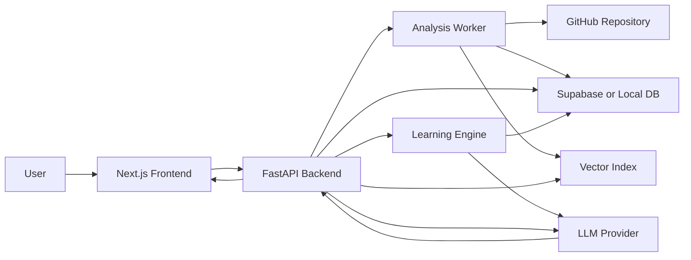

# RepoWise AI 구현 계획서

작성일: 2026년 7월 6일  
프로젝트 유형: AI 융합 웹 애플리케이션, B2D SaaS

## 1. 프로젝트 목표

RepoWise AI는 낯선 코드베이스에 들어온 개발자나 학회 신입 부원이 프로젝트 구조를 빠르게 이해하도록 돕는 인터랙티브 코드베이스 가이드 시스템이다.

핵심 목표는 단순한 코드 Q&A가 아니라, 다음 네 가지를 동시에 제공하는 것이다.

1. 실제 코드 근거 기반 답변
2. 사용자의 이해도에 맞춰 깊이가 조절되는 설명
3. 답변과 코드 뷰어, 파일 트리, 아키텍처 그래프가 연결되는 인터랙티브 UX
4. 코드 문법 단위부터 CS/수학 개념까지 이어지는 체계적 학습 설명

## 2. MVP 범위

처음부터 완성형 SaaS를 만들기보다, 하나의 GitHub 저장소를 분석하고 질문에 답할 수 있는 MVP를 먼저 만든다.

개발은 1인 개발자가 AI 도구를 적극 활용하는 방식으로 진행한다. 따라서 MVP는 유지보수 가능한 작은 모듈을 먼저 만들고, 각 모듈이 실제 화면에서 끝까지 동작하는지 확인하는 방식으로 확장한다.

### MVP에서 반드시 되는 것

- GitHub 저장소 URL 입력
- 저장소 클론 또는 다운로드
- `.gitignore` 기반 불필요 파일 제외
- 파일 트리 생성
- import/export 기반 의존성 그래프 생성
- 함수/클래스 단위 코드 청킹
- 코드 조각별 `file_path`, `start_line`, `end_line`, `symbol_name` 메타데이터 저장
- BM25 + 벡터 검색을 결합한 하이브리드 검색
- LLM 답변에 실제 파일 경로와 라인 번호 인용
- 인용 링크 클릭 시 Monaco Editor에서 해당 파일과 라인으로 이동
- LLM function calling 결과로 화면의 파일/라인 자동 이동
- 사용자 피드백 버튼으로 설명 수준 조정
- 사용자 이해도를 문법, 로직, 아키텍처, CS, 수학 수준으로 나누어 관리
- 질문에 맞는 설명 단계 선택
- 코드와 연결된 문법/개념/수학 설명 제공
- 사용자가 어려워한 개념 기록

### MVP에서 제외해도 되는 것

- 조직/팀 단위 권한 관리
- private repository OAuth 연동
- 실시간 다중 사용자 협업
- 완전 자동 아키텍처 문서 생성
- 모든 언어에 대한 정교한 AST 지원
- 장기 결제/요금제 시스템

MVP는 TypeScript/JavaScript 프로젝트를 1차 지원 대상으로 잡고, 이후 Python, Java, Kotlin 등으로 확장한다.

## 3. 전체 아키텍처



프론트엔드는 사용자의 입력, 코드 뷰어, 그래프, 채팅 UI, 학습 깊이 선택 UI를 담당한다. 백엔드는 저장소 분석, 검색, 프롬프트 조립, LLM 호출, 학습 설명 계획, 화면 제어 명령 생성을 담당한다.

## 4. 기술 스택

| 영역 | 기술 | 역할 |
| --- | --- | --- |
| Frontend | Next.js, TypeScript, Tailwind CSS | 웹 앱, 화면 구성 |
| Code Viewer | Monaco Editor | 파일 표시, 라인 하이라이트, 워프 UI |
| Graph UI | React Flow | 파일/모듈 의존성 그래프 |
| Backend | FastAPI, Python | 분석 API, RAG API, 채팅 API |
| Repository | isomorphic-git 또는 GitHub REST API | 저장소 수집 |
| Parsing | tree-sitter, regex fallback | import/export, 함수/클래스 추출 |
| Retrieval | BM25, vector search | 하이브리드 검색 |
| Vector DB | Chroma MVP, Supabase pgvector 확장 | 코드 임베딩 저장 |
| LLM | Gemini 계열 대용량 컨텍스트 모델 | 답변 생성, function calling |
| Learning Orchestration | JSON schema, prompt templates | 이해도 추적, 설명 단계 선택 |
| Queue | BackgroundTasks MVP, Celery/RQ 확장 | 저장소 분석 비동기 처리 |

MVP에서는 로컬 개발 속도를 위해 Chroma와 SQLite/PostgreSQL 조합으로 시작하고, 배포 단계에서 Supabase pgvector로 이전하는 방식을 추천한다.

## 5. 백엔드 구현 계획

### 5.1 저장소 수집

사용자가 GitHub URL을 제출하면 백엔드가 분석 작업을 생성한다.

처리 순서:

1. GitHub URL 유효성 검사
2. 임시 작업 디렉터리에 저장소 clone/download
3. `.gitignore` 파싱
4. `node_modules`, `.git`, `dist`, `build`, `.next`, binary file 제외
5. 분석 가능한 소스 파일 목록 생성
6. 파일별 원문, 라인 수, 확장자, 크기 저장

초기 지원 확장자:

- `.ts`
- `.tsx`
- `.js`
- `.jsx`
- `.py`
- `.md`
- `.json`

### 5.2 전역 컨텍스트 추출

전역 컨텍스트는 프로젝트의 숲을 보여주는 데이터다.

생성 데이터:

- 디렉터리 트리 JSON
- 파일별 import/export 목록
- 파일 간 dependency edge
- entry point 후보
- package manager 후보
- framework 후보

예시:

```json
{
  "file_path": "src/services/userService.ts",
  "imports": ["axios", "../types/user"],
  "exports": ["login", "logout"],
  "depends_on": ["src/types/user.ts"]
}
```

### 5.3 지역 컨텍스트 추출

지역 컨텍스트는 실제 답변 근거가 되는 코드 조각이다.

청킹 원칙:

- 함수/클래스 단위를 우선한다.
- 너무 큰 함수는 내부 블록 기준으로 다시 나눈다.
- 청크마다 원본 파일 경로와 시작/끝 라인을 보존한다.
- 코드만 저장하지 않고 주변 import, symbol 이름, docstring/comment 일부도 함께 저장한다.

메타데이터 예시:

```json
{
  "repo_id": "repo_001",
  "file_path": "src/services/userService.ts",
  "start_line": 14,
  "end_line": 28,
  "symbol_name": "login",
  "symbol_type": "function",
  "language": "typescript",
  "concept_tags": ["async_await", "http_request", "token_storage"]
}
```

### 5.4 하이브리드 검색

개발자 질문은 두 종류가 섞인다.

- 정확 검색: `userService`, `login`, `src/api/auth.ts` 같은 이름 기반 질문
- 의미 검색: "로그인할 때 토큰 저장하는 흐름이 어디야?" 같은 의도 기반 질문

따라서 검색은 두 결과를 결합한다.

1. BM25로 파일명, 함수명, 코드 토큰 검색
2. 임베딩 벡터로 의미 유사도 검색
3. 점수를 정규화해서 합산
4. 같은 파일/함수의 중복 청크 병합
5. 상위 청크에 dependency graph 인접 파일을 추가

### 5.5 프롬프트 조립

LLM에는 다음 정보를 함께 넣는다.

- 사용자 질문
- 사용자 이해도 상태
- 사용자가 선택한 설명 깊이
- 사용자가 반복해서 어려워한 개념
- 관련 코드 청크
- 각 청크의 파일 경로와 라인 번호
- 디렉터리 트리 요약
- 의존성 그래프 요약
- 답변 형식 규칙

답변 규칙:

- 근거 없는 추측 금지
- 코드 인용 시 반드시 `file_path:start_line-end_line` 포함
- 모르는 내용은 "현재 인덱스에서 확인되지 않음"으로 답변
- 설명 마지막에 다음 행동 버튼 후보 제공
- 필요 시 `open_file` function call 생성

### 5.6 학습 설명 엔진

학습 설명 엔진은 사용자의 질문과 현재 코드 위치를 바탕으로 어떤 깊이의 설명이 필요한지 결정한다.

구성 모듈:

| 모듈 | 역할 |
| --- | --- |
| Learner Model | 사용자 이해도 상태 저장 |
| Concept Mapper | 코드 조각에 필요한 문법/CS/수학 개념 태깅 |
| Explanation Planner | 답변의 설명 순서와 깊이 결정 |
| Feedback Interpreter | 버튼, 후속 질문, 퀴즈 결과로 이해도 갱신 |

설명 깊이:

| 단계 | 설명 대상 |
| --- | --- |
| syntax | 언어 문법, 연산자, 타입, 키워드 |
| logic | 함수 내부 흐름, 조건문, 반복문, 데이터 흐름 |
| architecture | 파일/모듈 관계, 호출 흐름, 책임 분리 |
| cs | 자료구조, 알고리즘, 상태 관리, 캐싱, 그래프 |
| math | 벡터, 유사도, 점수 정규화, 확률/통계 개념 |

예를 들어 RAG 검색 코드를 설명할 때, 사용자가 초보자라면 "리스트에서 후보를 고르는 과정"부터 설명하고, 사용자가 수학 개념 설명을 요청하면 BM25 점수, cosine similarity, score normalization을 코드 라인과 연결해 설명한다.

## 6. 프론트엔드 구현 계획

### 6.1 화면 구성

초기 화면은 랜딩 페이지가 아니라 실제 작업 화면으로 만든다.

기본 레이아웃:

- 왼쪽: 저장소 파일 트리
- 중앙: Monaco 코드 뷰어
- 오른쪽: AI 가이드 채팅
- 하단 또는 별도 탭: React Flow 의존성 그래프
- 코드 뷰어 주변: 학습 깊이 선택 패널과 개념 카드

주요 상태:

- 분석 전: GitHub URL 입력
- 분석 중: 진행 상태 표시
- 분석 완료: 파일 트리, 코드 뷰어, 채팅 활성화
- 질문 중: 검색 중/답변 생성 중 상태
- 오류: 저장소 접근 실패, 분석 실패, LLM 실패 구분

학습 UI 상태:

- 현재 설명 깊이: 문법, 로직, 아키텍처, CS, 수학
- 현재 코드와 연결된 개념 태그
- 사용자가 어려워한 개념 목록
- 다음 추천 학습 버튼

### 6.2 인용 링크 워프 UI

AI 답변 내 인용은 일반 텍스트가 아니라 클릭 가능한 컴포넌트로 렌더링한다.

예시:

```text
로그인 요청은 userService의 login 함수에서 처리됩니다. [src/services/userService.ts:14-28]
```

클릭 시 동작:

1. 해당 파일을 코드 뷰어에 로드
2. 시작 라인으로 스크롤
3. 라인 범위 하이라이트
4. 파일 트리에서 해당 파일 선택 표시
5. 관련 그래프 노드도 강조

### 6.3 Function Calling 화면 제어

LLM 응답은 텍스트와 UI 액션을 함께 반환할 수 있다.

예시:

```json
{
  "message": "이 흐름은 login 함수에서 시작됩니다.",
  "ui_actions": [
    {
      "type": "open_file",
      "path": "src/services/userService.ts",
      "line_number": 14
    }
  ]
}
```

프론트엔드는 `ui_actions`를 받아 코드 뷰어와 그래프 상태를 업데이트한다.

## 7. 사용자 이해도 상태 머신

사용자 이해도는 고정 프로필이 아니라 세션 중 계속 바뀌는 상태로 관리한다. 단순히 beginner/intermediate로 나누지 않고, 사용자가 어느 층위에서 막혔는지를 분리해서 추적한다.

초기 상태:

```json
{
  "syntax_level": "unknown",
  "logic_level": "unknown",
  "architecture_level": "unknown",
  "cs_level": "unknown",
  "math_level": "unknown",
  "preferred_style": "balanced",
  "preferred_depth": "logic",
  "weak_concepts": [],
  "last_feedback": null
}
```

상태 전이 예시:

- 사용자가 "쉽게 설명해줘" 선택: `preferred_style = analogy`
- 사용자가 "코드 한 줄씩" 선택: `preferred_style = line_by_line`
- 사용자가 "문법부터" 선택: `preferred_depth = syntax`
- 사용자가 "수학 개념도" 선택: `preferred_depth = math`
- 사용자가 고급 질문을 반복: 관련 영역 level 상승
- 사용자가 같은 개념을 반복 질문: `weak_concepts`에 추가

응답 하단 버튼:

- 코드 한 줄씩 뜯어보기
- 쉬운 비유로 설명
- 문법부터 설명해줘
- 로직 흐름만 요약해줘
- CS 개념까지 확장해줘
- 수학 개념도 설명해줘
- 연결된 파일 보기
- 이 함수가 호출되는 곳 보기
- 테스트 코드 관점으로 보기

## 8. 데이터 모델 초안

### repositories

| 컬럼 | 설명 |
| --- | --- |
| id | 저장소 ID |
| url | GitHub URL |
| name | 저장소 이름 |
| default_branch | 기본 브랜치 |
| status | pending, analyzing, ready, failed |
| created_at | 생성 시각 |

### files

| 컬럼 | 설명 |
| --- | --- |
| id | 파일 ID |
| repo_id | 저장소 ID |
| path | 파일 경로 |
| language | 언어 |
| content | 원본 내용 |
| line_count | 라인 수 |

### code_chunks

| 컬럼 | 설명 |
| --- | --- |
| id | 청크 ID |
| repo_id | 저장소 ID |
| file_id | 파일 ID |
| content | 코드 조각 |
| start_line | 시작 라인 |
| end_line | 끝 라인 |
| symbol_name | 함수/클래스 이름 |
| embedding | 벡터 |

### dependency_edges

| 컬럼 | 설명 |
| --- | --- |
| id | 엣지 ID |
| repo_id | 저장소 ID |
| source_file | import 하는 파일 |
| target_file | import 되는 파일 |
| import_name | import symbol |

### chat_sessions

| 컬럼 | 설명 |
| --- | --- |
| id | 세션 ID |
| repo_id | 저장소 ID |
| understanding_state | 사용자 이해도 상태 JSON |
| created_at | 생성 시각 |

### learning_profiles

| 컬럼 | 설명 |
| --- | --- |
| id | 학습 프로필 ID |
| session_id | 세션 ID |
| syntax_level | 문법 이해도 |
| logic_level | 구현 로직 이해도 |
| architecture_level | 구조 이해도 |
| cs_level | CS 개념 이해도 |
| math_level | 수학 개념 이해도 |
| weak_concepts | 어려워한 개념 목록 |
| preferred_style | 선호 설명 방식 |

### concept_events

| 컬럼 | 설명 |
| --- | --- |
| id | 이벤트 ID |
| session_id | 세션 ID |
| concept_name | 개념 이름 |
| concept_type | syntax, logic, architecture, cs, math |
| event_type | confused, understood, requested_deeper |
| evidence | 사용자의 버튼/질문/응답 근거 |
| created_at | 생성 시각 |

## 9. API 설계 초안

| Method | Endpoint | 설명 |
| --- | --- | --- |
| POST | `/api/repositories` | GitHub URL 등록 및 분석 시작 |
| GET | `/api/repositories/{repo_id}` | 저장소 분석 상태 조회 |
| GET | `/api/repositories/{repo_id}/tree` | 파일 트리 조회 |
| GET | `/api/repositories/{repo_id}/files` | 파일 목록 조회 |
| GET | `/api/repositories/{repo_id}/files/{file_id}` | 파일 내용 조회 |
| GET | `/api/repositories/{repo_id}/graph` | 의존성 그래프 조회 |
| POST | `/api/chat/sessions` | 채팅 세션 생성 |
| POST | `/api/chat/sessions/{session_id}/messages` | 질문 전송 및 답변 생성 |
| POST | `/api/chat/sessions/{session_id}/feedback` | 이해도 피드백 저장 |
| GET | `/api/chat/sessions/{session_id}/learning-profile` | 학습 프로필 조회 |
| POST | `/api/chat/sessions/{session_id}/concept-events` | 개념 이해/혼란 이벤트 저장 |

## 10. 개발 단계

### 1단계: 프로젝트 골격 구축

목표: 프론트와 백엔드가 통신하는 최소 구조를 만든다.

작업:

- Next.js 앱 생성
- FastAPI 앱 생성
- 공통 `.env.example` 작성
- Docker Compose 초안 작성
- `/health` API 연결
- 프론트에서 API health 확인

완료 기준:

- `npm run dev`와 `uvicorn` 실행 가능
- 브라우저에서 백엔드 연결 상태 확인 가능

### 2단계: 저장소 분석 파이프라인

목표: GitHub URL을 넣으면 파일 트리와 코드 청크가 생성된다.

작업:

- 저장소 clone/download
- ignore rule 적용
- 파일 트리 JSON 생성
- 파일 내용 저장
- TypeScript/JavaScript import 파싱
- 함수/클래스 단위 청킹
- 라인 번호 메타데이터 보존

완료 기준:

- 샘플 repo 분석 후 파일 트리, chunk, dependency edge 확인 가능

### 3단계: 검색/RAG 구현

목표: 질문을 하면 관련 코드 조각을 찾아낸다.

작업:

- BM25 인덱스 생성
- 임베딩 생성 및 저장
- 하이브리드 검색 점수 결합
- 검색 결과 deduplication
- 프롬프트 조립 함수 작성
- LLM 응답 schema 정의

완료 기준:

- 특정 함수명 질문과 의미 기반 질문 모두에서 관련 코드가 검색됨
- 응답에 실제 파일 경로와 라인 번호가 포함됨

### 4단계: 인터랙티브 UI

목표: 답변, 코드 뷰어, 파일 트리, 그래프가 연결된다.

작업:

- 파일 트리 컴포넌트
- Monaco Editor 컴포넌트
- 채팅 패널
- citation link parser
- line highlight
- React Flow dependency graph
- `ui_actions` 처리

완료 기준:

- 답변 속 인용을 클릭하면 해당 파일/라인으로 이동
- LLM 응답의 `open_file` 액션이 실제 화면을 제어

### 5단계: 사용자 이해도 동기화

목표: 사용자의 피드백에 따라 설명 스타일과 설명 깊이가 달라진다.

작업:

- understanding state schema 구현
- learning profile schema 구현
- concept event 저장 구현
- 피드백 버튼 UI
- feedback API
- 프롬프트에 사용자 상태 주입
- 쉬운 설명/라인별 설명/구조 설명 모드 분기
- 문법/로직/CS/수학 설명 모드 분기
- Explanation Planner 구현

완료 기준:

- 같은 질문도 선택한 모드에 따라 답변 깊이와 표현이 달라짐
- 사용자가 어려워한 개념이 세션 상태에 저장됨
- 같은 코드에 대해 문법 설명과 수학 개념 설명을 분리해 생성 가능

### 6단계: 품질 검증 및 데모 준비

목표: 학회 프로젝트 발표에 사용할 수 있는 안정적인 데모를 만든다.

작업:

- 분석 실패 케이스 처리
- 긴 파일/큰 저장소 제한 설정
- citation 정확도 테스트
- 검색 품질 테스트 질문 세트 작성
- 데모용 샘플 repo 선정
- 발표용 시나리오 정리

완료 기준:

- 5분 데모 시나리오가 끊김 없이 동작
- 답변의 citation이 실제 코드 라인과 일치

## 11. 예상 폴더 구조

```text
RepoWiseAI/
  apps/
    web/
      src/
        app/
        components/
        features/
        lib/
    api/
      app/
        main.py
        api/
        core/
        models/
        services/
        workers/
        rag/
        parsers/
        learning/
        prompts/
  packages/
    shared/
      schemas/
  docs/
    architecture.md
    demo-scenario.md
  docker-compose.yml
  README.md
  .env.example
```

## 12. 주요 리스크와 대응

| 리스크 | 설명 | 대응 |
| --- | --- | --- |
| citation 부정확 | 청크 라인 번호가 실제 파일과 어긋날 수 있음 | 저장 시 원본 파일 기준 line offset 테스트 추가 |
| 검색 품질 부족 | BM25와 vector 결과가 엉뚱할 수 있음 | 함수명/파일명 boost, graph 인접 파일 추가 |
| 대형 repo 비용 증가 | 분석/임베딩 비용이 커질 수 있음 | 파일 크기 제한, ignore 강화, incremental indexing |
| LLM 환각 | 코드에 없는 내용을 말할 수 있음 | 답변 schema와 citation 필수 규칙 적용 |
| UI 복잡도 증가 | 채팅, 에디터, 그래프 상태 동기화가 어려움 | 전역 selection state를 명확히 분리 |
| 언어별 파서 차이 | 언어마다 AST 추출 방식이 다름 | TypeScript 우선, regex fallback, parser adapter 구조 |

## 13. 추천 개발 순서

가장 좋은 순서는 다음과 같다.

1. `apps/api` FastAPI 골격 생성
2. `apps/web` Next.js 골격 생성
3. 샘플 저장소를 로컬 fixture로 넣고 분석 파이프라인 먼저 완성
4. 실제 GitHub URL 입력 기능 연결
5. 코드 검색 API 구현
6. 채팅 API 구현
7. 사용자 이해도 상태 머신 추가
8. Explanation Planner와 개념 설명 모드 추가
9. Monaco citation warp 구현
10. React Flow dependency graph 구현
11. 데모 시나리오와 발표 자료 정리

이 순서가 좋은 이유는 RAG 품질과 citation 정확도가 제품의 핵심이기 때문이다. UI를 먼저 예쁘게 만들기보다, 실제 코드 라인을 정확히 찾아 답하는 백엔드 신뢰성을 먼저 확보해야 한다.

## 14. 첫 번째 스프린트 목표

첫 스프린트는 "보이는 데모"보다 "작동하는 분석 코어"에 집중한다.

기간: 1주

결과물:

- FastAPI 서버
- 저장소 분석 작업 API
- 파일 트리 생성기
- TypeScript import 파서
- 함수/클래스 청커
- 청크 메타데이터 JSON 저장
- 간단한 검색 API
- 학습 프로필 JSON schema 초안

첫 스프린트 완료 후에는 아직 LLM이 없어도 다음 질문에 답할 수 있어야 한다.

- 이 저장소에는 어떤 폴더가 있는가?
- 특정 파일은 어디에 있는가?
- 특정 함수는 몇 번째 줄에 있는가?
- 어떤 파일이 어떤 파일을 import 하는가?

## 15. 성공 기준

프로젝트의 성공 기준은 단순히 챗봇이 답하는 것이 아니다.

최소 성공 기준:

- 답변의 모든 주요 주장에 실제 코드 citation이 붙는다.
- citation을 클릭하면 실제 코드 위치로 이동한다.
- 사용자가 "쉽게 설명해줘"와 "라인별로 설명해줘"를 눌렀을 때 답변 방식이 달라진다.
- 사용자가 "문법부터"와 "수학 개념도"를 눌렀을 때 설명 깊이가 달라진다.
- 사용자가 어려워한 개념이 weak concept으로 저장된다.
- 하나의 샘플 repo에 대해 구조 설명, 함수 설명, 호출 관계 설명이 가능하다.

발표용 성공 기준:

- 처음 보는 repo를 입력한다.
- RepoWise AI가 구조를 분석한다.
- 사용자가 "로그인 흐름 설명해줘" 같은 질문을 한다.
- AI가 관련 파일과 함수 라인을 인용하며 답한다.
- 화면이 자동으로 해당 코드 위치로 이동한다.
- 사용자가 쉬운 설명/상세 설명을 선택해 설명 수준을 바꾼다.
- 같은 코드에 대해 문법 설명과 수학 개념 설명을 단계적으로 확인한다.
