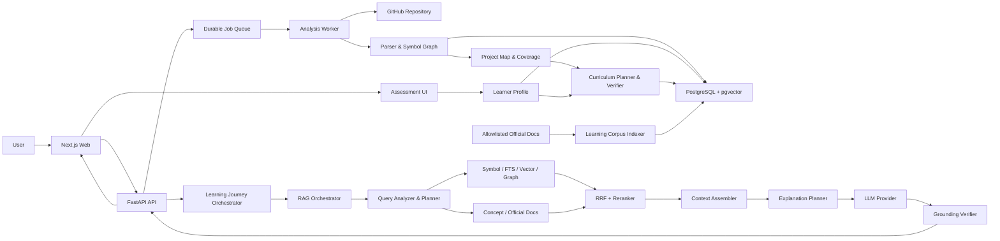
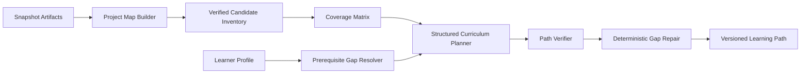

# RepoWise AI 구현 계획서

최초 작성일: 2026년 7월 6일
최종 개정일: 2026년 7월 12일
프로젝트 유형: AI 융합 웹 애플리케이션, B2D SaaS
개발 형태: 1인 AI 보조 개발, 모듈형 모놀리스

## 1. 구현 목표

RepoWise AI는 낯선 코드베이스를 단순히 요약하는 챗봇이 아니라, 배경지식이 없는 사용자와 바이브 코더가 실제 코드를 근거로 프로젝트를 탐색하고 필요한 선수 개념을 함께 학습하도록 돕는 인터랙티브 시스템이다.

구현 목표:

1. 저장소를 특정 commit SHA 기준의 재현 가능한 스냅샷으로 분석한다.
2. AST·심볼·관계·계층형 청크를 이용해 코드 구조를 검색 가능하게 만든다.
3. 저장소 코드와 검증된 학습자료를 서로 다른 코퍼스와 근거 정책으로 관리한다.
4. 질문 유형에 맞춰 정확 검색, full-text, vector, graph 검색을 조합한다.
5. LLM이 경로와 라인을 직접 만들어내지 못하도록 evidence ID 기반 citation을 사용한다.
6. 저장소 분석 중 목표와 배경지식을 짧게 진단하고 concept별 evidence와 confidence로 관리한다.
7. project coverage와 learner profile을 결합해 계층형 curriculum을 생성한다.
8. Start Here, Learning Path, AI 질문, 보충 설명을 하나의 Learning Journey Session으로 연결한다.
9. 검색, citation, curriculum, 학습 적합성, 비용과 지연을 고정된 평가 세트로 검증한다.

### 1.1 설계 원칙

- **Deterministic First**: 파일, 심볼, 라인, 관계는 가능한 한 파서와 조회 결과로 결정한다.
- **Evidence Before Answer**: 답변 생성 전에 근거 묶음과 허용 가능한 주장 범위를 확정한다.
- **Typed Evidence**: 저장소 코드, 저장소 문서, 공식 학습자료, 모델 추론을 구분한다.
- **Snapshot Integrity**: 모든 코드 근거를 repository snapshot과 content hash에 연결한다.
- **Bounded Orchestration**: 무제한 자율 에이전트 대신 제한된 검색 계획과 최대 재검색 횟수를 사용한다.
- **Evaluation First**: 검색 기능과 프롬프트를 추가할 때 평가 질문과 기대 근거를 함께 추가한다.
- **Solo Maintainability**: 논리적 모듈은 분리하되 초기 배포 단위는 API, worker, web, database로 제한한다.

## 2. MVP 범위

### 2.1 MVP 필수 기능

- public GitHub repository URL 등록
- branch와 commit SHA를 고정한 repository snapshot
- `.gitignore`, 기본 제외 정책, 크기·파일 수 제한 적용
- TypeScript/JavaScript 파일 트리와 AST 분석
- 함수, 클래스, 컴포넌트, import/export, route 심볼 추출
- 심볼 테이블과 import graph, 신뢰도 표시가 있는 제한적 call/use edge
- repository·module·file·symbol·block 계층형 청킹
- 심볼 정확 검색, PostgreSQL full-text 검색, pgvector 검색
- RRF 기반 검색 결과 융합과 선택적 reranking
- 질문 유형별 Retrieval Planner
- evidence ID 기반 구조화된 답변과 citation 검증
- Monaco citation warp와 선택 코드 질문
- 분석과 병렬로 진행하는 5~8문항 목표·배경지식 진단
- 4~8개 module과 약 15~40개 step의 계층형 curriculum
- Start Here·경로·AI 질문의 공유 Learning Journey Session
- AST statement 기반 코드 한 줄씩 설명과 remediation branch
- 공식 JavaScript/TypeScript·웹 자료 중심의 Learning Corpus
- 핵심 Concept Graph 30~50개
- Start Here 안내, 개념 카드, 확인 질문
- 개념별 숙련도와 근거 이벤트 저장
- 검색·citation·grounding 평가 세트와 trace

### 2.2 MVP 제외 기능

- private repository OAuth와 조직 권한
- 임의 웹 전체를 대상으로 한 실시간 검색
- 모든 언어의 정교한 semantic analysis
- 완전한 call graph와 런타임 동작 보장
- 코드를 실행하거나 저장소에 자동 반영하는 기능
- PR diff 리뷰, 자동 문서 생성, 팀 workspace
- 결제, 요금제, 장기 학습 추천 모델
- 멀티에이전트 협업 구조

### 2.3 언어 지원 등급

지원 여부를 파일 열람과 의미 분석으로 구분한다.

| 등급 | 지원 범위 |
| --- | --- |
| Tier 1 | TypeScript, TSX, JavaScript, JSX: AST·심볼·관계·청킹·검색 |
| Tier 2 | Markdown, JSON, YAML: 문서·설정 검색과 citation |
| View Only | 그 외 텍스트 파일: 파일 열람과 제한적 full-text 검색 |
| Excluded | 바이너리, 생성물, 대용량 파일, 비밀키 의심 파일 |

Python, Java, Kotlin의 AST 지원은 parser adapter를 추가하는 후속 범위로 둔다.

## 3. 전체 아키텍처



### 3.1 배포 단위

MVP 배포 단위는 다음 네 개로 제한한다.

1. `web`: Next.js 사용자 화면
2. `api`: FastAPI 요청, 세션, 검색 오케스트레이션
3. `worker`: 저장소 수집, 파싱, 청킹, 임베딩 작업
4. `postgres`: 메타데이터, full-text, vector, 학습 상태

개발 환경에서 durable worker를 위해 Redis와 RQ를 추가한다. FastAPI `BackgroundTasks`는 짧은 후처리에만 사용하고 저장소 분석처럼 오래 걸리는 작업에는 사용하지 않는다.

## 4. 기술 스택과 선택 기준

| 영역 | 기술 | 역할과 선택 이유 |
| --- | --- | --- |
| Frontend | Next.js, TypeScript, Tailwind CSS | 앱 화면, 타입 안전한 UI 개발 |
| Code Viewer | Monaco Editor | 파일 표시, 선택 범위, 라인 하이라이트 |
| Graph UI | React Flow | 심볼·파일 관계 시각화 |
| Client State | Zustand 또는 React context | 현재 snapshot, file, symbol, selection 상태 |
| Backend | FastAPI, Pydantic, SQLAlchemy, Alembic | API, 구조화 schema, DB migration |
| Worker | RQ + Redis | 재시도 가능한 저장소 분석 작업 |
| Repository Fetch | GitHub archive API 또는 제한된 shallow clone | Python 백엔드에서 안전하게 공개 저장소 수집 |
| Ignore Rules | pathspec | `.gitignore` 호환 규칙 처리 |
| Parsing | tree-sitter + language adapter | 오류가 있는 코드도 구조적으로 파싱 |
| Lexical Search | PostgreSQL `tsvector` + GIN | 메타데이터와 함께 운영 가능한 full-text 검색 |
| Vector Search | pgvector | 동일 DB에서 embedding 검색 |
| Rank Fusion | SQL 또는 Python RRF | 서로 다른 검색 점수 척도 결합 |
| Reranking | Provider adapter, 초기에는 선택적 LLM rerank | 상위 후보만 비용 제한적으로 재정렬 |
| Generation | OpenAI Responses API adapter | Structured Outputs 기반 설명 생성 |
| Embedding | 교체 가능한 embedding adapter | 코드 검색 평가에 따라 모델 교체 가능 |
| Storage | Supabase PostgreSQL 또는 로컬 PostgreSQL | 로컬·배포 스키마 일치, migration 감소 |
| Observability | 구조화 로그 + OpenTelemetry 확장 | retrieval trace, 비용, 지연 추적 |
| Test | Pytest, Vitest, Playwright | 분석 로직, UI, 사용자 흐름 검증 |

### 4.1 저장소 선택

Chroma에서 pgvector로 나중에 이전하는 경로는 1인 개발자에게 이중 구현 부담을 만든다. MVP부터 PostgreSQL의 `tsvector`와 pgvector를 함께 사용하여 키워드·벡터 검색, 메타데이터와 migration을 한곳에서 관리한다.

문서에서는 실제 BM25 엔진을 쓰지 않는 한 검색 방식을 “BM25”라고 단정하지 않고 “full-text lexical search”라고 표기한다. 추후 평가 결과 BM25가 필요하면 `LexicalRetriever` adapter 뒤에서 OpenSearch 또는 BM25 지원 엔진을 교체한다.

### 4.2 모델 선택

생성 모델과 임베딩 모델 이름을 도메인 코드에 하드코딩하지 않는다.

```text
LLMProvider
  ├─ generate_structured()
  ├─ call_tools()
  └─ count_tokens()

EmbeddingProvider
  ├─ embed_documents()
  ├─ embed_query()
  └─ model_metadata()
```

인덱스에는 `provider`, `model`, `model_version`, `dimension`, `input_template_version`을 저장한다. 임베딩 공간이 달라지는 모델 변경 시 새 `index_version`으로 전체 재임베딩한다.

## 5. 오프라인 저장소 분석 파이프라인

### 5.1 저장소 수집과 스냅샷

처리 순서:

1. GitHub URL과 허용된 host 검증
2. repository와 branch 메타데이터 조회
3. commit SHA 확정
4. GitHub archive 다운로드 또는 `--depth=1 --no-recurse-submodules` shallow clone
5. 압축 해제 경로와 symlink의 workspace 이탈 여부 검사
6. 파일 필터와 크기 제한 적용
7. snapshot과 파일 content hash 저장
8. 분석 job 상태와 진행률 기록

`repository_snapshots`는 같은 URL이라도 commit이 다르면 별도 분석 단위로 취급한다.

### 5.2 안전한 파일 필터

필터는 다음 규칙을 순서대로 적용한다.

1. 서비스 기본 제외 목록
2. 저장소 `.gitignore`
3. 선택적 `.repowiseignore`
4. 지원 언어와 텍스트 판별
5. 파일별·전체 크기와 파일 수 제한
6. 비밀키·인증서·환경 파일 패턴 제외

기본 제외 예시:

- `.git`, `node_modules`, `.next`, `dist`, `build`, `coverage`
- lockfile을 제외한 대형 생성물과 minified bundle
- 이미지, 영상, archive, 실행 파일
- `.env`, private key, certificate

MVP 기본 제한 예시:

- 파일당 1 MB
- 분석 텍스트 총량 30 MB
- 분석 파일 5,000개
- 압축 해제 후 총량과 압축 비율 제한
- 분석 job timeout 10분

실제 값은 fixture와 비용 측정 후 설정으로 조정한다.

### 5.3 AST와 심볼 추출

Tree-sitter query를 language adapter로 캡슐화한다.

추출 대상:

- import, export
- function, method, class
- interface, type alias
- React component와 hook 사용
- route handler와 API endpoint 후보
- call expression과 symbol reference 후보
- 테스트 block과 대상 심볼 후보

심볼 예시:

```json
{
  "symbol_id": "sym_01J...",
  "snapshot_id": "snap_01J...",
  "file_path": "src/services/userService.ts",
  "qualified_name": "userService.login",
  "kind": "function",
  "start_line": 14,
  "end_line": 28,
  "signature": "login(email: string, password: string)",
  "content_hash": "sha256:..."
}
```

### 5.4 Symbol Graph

대표 관계:

| Relation | 생성 방법 | 기본 confidence |
| --- | --- | --- |
| `DEFINES` | AST 위치 | 1.0 |
| `IMPORTS` / `EXPORTS` | import/export AST + 경로 해석 | 0.95~1.0 |
| `CALLS` | call expression + 로컬 심볼 해석 | 0.6~0.95 |
| `USES` | identifier reference 추정 | 0.5~0.9 |
| `EXTENDS` | class/interface AST | 0.95 |
| `ROUTES_TO` | 프레임워크 adapter | 0.7~0.95 |
| `TESTS` | 테스트 파일 규칙과 import | 0.6~0.9 |

각 edge는 `analysis_method`, `confidence`, `source_location`을 가진다. UI와 답변은 추정 관계를 확정 관계처럼 표현하지 않는다.

MVP의 call graph는 동일 파일과 정적으로 해석 가능한 import 범위로 제한한다. TypeScript의 완전한 타입 해석이 필요해지면 후속 단계에서 TypeScript Compiler API 또는 `ts-morph` 기반 analyzer를 별도 adapter로 추가한다.

### 5.5 계층형 청킹

고정 글자 수 기반 청킹보다 AST 계층을 우선한다.

```text
Repository Summary
  └─ Module Summary
      └─ File Summary
          └─ Symbol Chunk
              └─ Block Chunk
```

청킹 규칙:

- 함수·클래스·컴포넌트는 symbol chunk로 저장한다.
- 큰 심볼만 statement/block 경계에서 child chunk로 나눈다.
- child chunk에는 parent symbol ID를 저장한다.
- 검색용 텍스트에는 경로, 심볼, signature, 인접 import와 제한된 주석을 포함한다.
- 원문 라인 범위는 별도 필드에 저장하고 검색용 prefix와 섞지 않는다.
- 자동 생성 summary는 근거 chunk ID와 생성 모델·프롬프트 버전을 기록한다.

코드 청크 예시:

```json
{
  "chunk_id": "chk_01J...",
  "snapshot_id": "snap_01J...",
  "file_id": "file_01J...",
  "symbol_id": "sym_01J...",
  "parent_chunk_id": null,
  "chunk_type": "symbol",
  "start_line": 14,
  "end_line": 28,
  "language": "typescript",
  "content_hash": "sha256:...",
  "concept_candidates": ["async_await", "http_request"]
}
```

### 5.6 저장소 요약

Start Here와 구조 질문을 위해 계층 요약을 만든다.

- file summary: 파일의 책임과 주요 export
- module summary: 폴더의 역할과 주요 진입점
- repository summary: 프로젝트 목적, 실행 경로, 주요 기능 후보

요약은 검색 결과를 보조할 뿐 원본 코드보다 높은 신뢰도를 갖지 않는다. 모든 요약에는 사용한 chunk IDs를 저장하며 답변 생성 시 필요하면 원본 근거를 다시 조회한다.

### 5.7 임베딩 생성

문서 임베딩 입력은 코드 원문만 넣지 않고 검색 목적에 맞게 구성한다.

```text
title: src/services/userService.ts#login
language: typescript
kind: function
signature: login(email: string, password: string)
text: <symbol source>
```

질의 임베딩과 문서 임베딩은 모델이 요구하는 code retrieval 또는 retrieval query/document 형식을 일관되게 적용한다. 배치 크기, rate limit, retry와 실패한 chunk의 재처리를 job 단위로 기록한다.

## 6. Learning Corpus 파이프라인

### 6.1 출처 정책

MVP의 학습 출처 우선순위:

1. 언어·프레임워크·라이브러리 공식 문서
2. MDN과 표준 문서
3. 프로젝트 내부 README와 문서
4. 서비스가 직접 검수한 개념 카드

임의 블로그, 검색 결과 요약, 출처가 불분명한 문서는 기본 코퍼스에 포함하지 않는다.

### 6.2 수집 메타데이터

- source URL과 canonical URL
- 문서 제목과 publisher
- framework 또는 language version
- 확인일과 마지막 갱신일
- 언어와 난이도
- license 또는 저장 허용 범위
- concept IDs
- content hash와 index version

저작권과 최신성 위험을 줄이기 위해 MVP에서는 긴 문서를 통째로 복제하지 않고, 검색에 필요한 짧은 발췌·자체 개념 카드·원문 링크를 중심으로 저장한다.

### 6.3 개념 매핑

Concept Mapper는 다음 신호를 함께 사용한다.

- AST node와 language construct
- import된 framework·library
- 심볼 이름과 signature
- rule 기반 concept mapping
- LLM이 제안한 concept candidate

LLM이 제안한 개념은 Concept Graph에 존재하는 ID만 채택한다. 새로운 문자열을 바로 사용자 숙련도 키로 저장하지 않는다.

## 7. 온라인 RAG 파이프라인

### 7.1 Context Resolver

질문을 분석하기 전에 화면과 대화의 지시 대상을 해석한다.

입력:

- `snapshot_id`
- 현재 file, symbol, selected line range
- 최근 메시지와 마지막 citation
- 사용자가 선택한 학습 목표
- 선호 설명 방식

“이 함수”, “여기”, “아까 말한 파일” 같은 표현을 실제 ID로 해석하지 못하면 사용자에게 대상을 선택하도록 안내한다.

### 7.2 Query Analyzer

구조화 출력 예시:

```json
{
  "intent": "flow_tracing",
  "target_symbols": ["login"],
  "target_files": [],
  "concepts_requested": [],
  "needs_repository_evidence": true,
  "needs_learning_evidence": false,
  "desired_depth": "logic",
  "ambiguity": null
}
```

지원 intent:

- `exact_lookup`
- `code_explanation`
- `flow_tracing`
- `project_orientation`
- `concept_learning`
- `change_impact`
- `test_understanding`
- `unsupported_or_ambiguous`

### 7.3 Retrieval Planner

Retrieval Planner는 intent를 deterministic policy로 검색 계획에 매핑하고, LLM은 필요한 키워드와 목표 심볼을 보조 추출한다.

| Intent | Retrieval Plan |
| --- | --- |
| exact_lookup | path/symbol exact → lexical fallback |
| code_explanation | selected range → parent symbol → imports/types |
| flow_tracing | symbol exact → route/call graph → lexical/vector 보완 |
| project_orientation | repository/module summaries → entry points → representative symbols |
| concept_learning | concept exact → Learning Corpus → current code examples |
| change_impact | references/callers/tests → graph expansion → relevant chunks |

검색 계획에는 retriever별 top K, graph hop, rerank 사용 여부와 token budget를 포함한다.

### 7.4 Retriever 구성

```text
ExactRetriever
LexicalRetriever
DenseCodeRetriever
GraphRetriever
SummaryRetriever
ConceptRetriever
LearningDocumentRetriever
```

각 retriever는 공통 `RetrievalCandidate` schema를 반환한다.

```json
{
  "evidence_id": "ev_01J...",
  "source_type": "repository_code",
  "source_id": "chk_01J...",
  "retriever": "dense_code",
  "rank": 3,
  "raw_score": 0.81,
  "snapshot_id": "snap_01J...",
  "metadata": {}
}
```

### 7.5 RRF와 재순위화

각 검색기의 raw score를 직접 합산하지 않는다. 순위 기반 RRF를 사용한다.

```text
rrf_score(d) = Σ 1 / (k + rank_i(d))
```

초기 `k`, retriever weight와 top K는 평가 데이터로 조정한다. 상위 15~30개 후보만 reranker에 전달하고 최종 6~12개 근거를 선택한다.

Reranker 기준:

- 질문과 직접 관련되는가
- 현재 파일·심볼 맥락과 이어지는가
- 정의, 호출, 설정, 테스트 근거가 균형을 이루는가
- 같은 내용을 반복하지 않는가
- 코드 주장과 개념 주장에 필요한 출처 유형을 충족하는가

비용과 지연을 줄이기 위해 exact lookup과 선택 코드 설명은 reranker 없이 처리할 수 있다.

### 7.6 Context Assembler

Context Assembler는 최종 근거를 다음 블록으로 분리한다.

- `repository_evidence`
- `learning_evidence`
- `structure_context`
- `learner_context`
- `response_contract`

컨텍스트 규칙:

- repository evidence는 snapshot이 다른 근거를 섞지 않는다.
- 핵심 심볼의 정의를 우선하고 필요한 caller·callee·type·test만 추가한다.
- 전체 트리 대신 관련 subtree와 module summary를 사용한다.
- 학습자료는 요청된 개념 또는 Explanation Planner가 선택한 선수 개념만 포함한다.
- 모든 블록에 evidence ID를 포함한다.

### 7.7 Explanation Planner

답변 생성 전 다음을 결정한다.

- 사용자의 이번 목표
- 한 문장으로 답할 핵심 결론
- 설명할 코드 흐름
- 필요한 최소 선수 개념
- 생략할 고급 내용
- 확인 질문 또는 다음 행동
- 코드 evidence와 learning evidence의 연결

비전공자 기본 설명 순서:

1. 한 문장 결론
2. 실제 코드 위치
3. 단계별 실행 흐름
4. 최소 선수 개념
5. 수정 시 영향 또는 주의점
6. 짧은 확인 또는 다음 탐색

### 7.8 구조화된 답변 생성

최종 응답 schema 예시:

```json
{
  "answer_blocks": [
    {
      "type": "summary",
      "text": "로그인 요청은 API route에서 service 함수로 전달됩니다.",
      "evidence_ids": ["ev_route", "ev_service"]
    },
    {
      "type": "concept",
      "concept_id": "async_await",
      "text": "await는 비동기 작업의 결과가 준비될 때까지 다음 줄의 진행을 미룹니다.",
      "evidence_ids": ["ev_mdn_async"]
    }
  ],
  "ui_actions": [
    {
      "type": "open_code_evidence",
      "evidence_id": "ev_service"
    }
  ],
  "next_actions": ["trace_callers", "explain_async_await"],
  "knowledge_check": null,
  "status": "grounded"
}
```

LLM은 raw file path, line number, 외부 URL을 직접 생성하지 않는다. 백엔드가 검증된 evidence ID를 실제 citation 객체로 변환한다.

### 7.9 Grounding Verifier

검증 단계:

1. 모든 evidence ID가 현재 retrieval run에 포함되어 있는지 확인
2. repository evidence의 snapshot, file, hash, line range 확인
3. learning evidence의 허용 출처와 URL 확인
4. 코드 관련 answer block이 repository evidence를 갖는지 확인
5. 일반 개념 block이 learning evidence 또는 명시된 기초 지식을 갖는지 확인
6. 근거 없는 확정 표현과 존재하지 않는 action 제거

검증 실패 시 처리:

- 빠진 근거가 명확하면 최대 1회의 제한된 재검색
- 그래도 근거가 없으면 해당 주장을 제거
- 핵심 질문에 답할 수 없으면 `insufficient_evidence` 상태 반환

### 7.10 Tool Calling과 UI Action 분리

LLM tool은 답변 전에 데이터를 가져오는 중간 작업에만 사용한다.

허용 tool 예시:

- `search_symbols`
- `get_symbol_context`
- `get_callers`
- `get_callees`
- `get_file_range`
- `search_concepts`
- `search_learning_sources`

파일 열기와 라인 이동은 tool call이 아니라 최종 구조화 응답의 `ui_actions`로 반환한다. 프론트엔드는 `evidence_id`를 기준으로 검증된 위치만 연다.

## 8. Learning Engine

### 8.1 Concept Graph

`concepts`는 canonical ID, 표시 이름, 설명, 영역, 난이도를 가진다. `concept_edges`는 다음 관계를 표현한다.

- `PREREQUISITE_OF`
- `RELATED_TO`
- `APPLIED_IN`

초기 예시:

```text
function
  └─ callback
      └─ Promise
          └─ async_await

HTTP
  ├─ request_response
  ├─ status_code
  └─ authentication_token
```

### 8.2 Learner Model

영역별 수준은 UI 요약용이고 실제 판단은 개념별 mastery record를 사용한다.

```json
{
  "session_id": "sess_01J...",
  "concept_id": "async_await",
  "mastery_score": 0.35,
  "confidence": 0.60,
  "attempt_count": 2,
  "evidence_type": "knowledge_check",
  "evidence_id": "event_01J...",
  "updated_at": "2026-07-11T10:00:00Z"
}
```

### 8.3 숙련도 갱신 규칙

허용되는 근거:

- 사용자가 명시적으로 어렵거나 이해했다고 선택
- 객관식·예측형 확인 질문 결과
- 같은 개념을 실제 코드에 적용하는 활동
- 사용자가 직접 숙련도를 수정

질문의 전문 용어나 길이만으로 숙련도를 올리지 않는다. 반복 질문은 혼란 후보 이벤트만 만들고, 즉시 weak concept으로 확정하지 않는다.

MVP는 복잡한 Bayesian Knowledge Tracing 대신 단순하고 설명 가능한 가중 업데이트를 사용한다.

```text
new_score = clamp(old_score + evidence_weight * result, 0, 1)
new_confidence = min(1, old_confidence + confidence_gain)
```

가중치와 결과는 `mastery_events`에 기록하여 추적 가능하게 한다.

### 8.4 Teaching State Machine

상태:

- `ORIENT`: 목표, 현재 코드 위치, 필요한 배경 확인
- `EXPLAIN`: 현재 수준에 맞는 핵심 설명
- `CHECK`: 짧은 확인 활동
- `REMEDIATE`: 빠진 선수 개념 보충
- `DEEPEN`: 구조, CS, 알고리즘 등으로 심화
- `APPLY`: 코드 흐름 예측, 영향 분석, 다음 파일 탐색

전이 예시:

| 현재 상태 | 이벤트 | 다음 상태 |
| --- | --- | --- |
| ORIENT | 목표 선택 | EXPLAIN |
| EXPLAIN | 설명 완료 | CHECK |
| CHECK | 오답 또는 어려움 | REMEDIATE |
| CHECK | 이해 + 심화 선택 | DEEPEN |
| CHECK | 이해 + 적용 선택 | APPLY |
| REMEDIATE | 선수 개념 설명 완료 | EXPLAIN |
| APPLY | 다음 목표 선택 | ORIENT |

### 8.5 Explanation Depth

설명 깊이는 고정 사다리가 아니라 필요한 블록의 조합이다.

| Block | 설명 대상 |
| --- | --- |
| syntax | 키워드, 연산자, 타입, 표현식 |
| logic | 조건, 반복, 함수 호출, 데이터 흐름 |
| framework | hook, router, dependency injection 등 |
| architecture | 파일·모듈 책임과 호출 관계 |
| cs | 상태, 캐시, 자료구조, 동시성 |
| algorithm_math | 검색, 정렬, 유사도, 확률 등 실제 관련 개념 |

현재 코드와 무관한 math block은 생성하지 않는다.

### 8.6 통합 Adaptive Learning Journey

자유 채팅, Start Here, Guided Path를 별도 기능으로 유지하지 않는다. 세 화면은 하나의 `LearningJourneySession`과 현재 lesson을 공유하고 다음 루프를 반복한다.

```text
사용자 진단 + Project Map
→ 계층형 Curriculum 생성
→ 현재 lesson과 검증 코드
→ 이해 확인
→ 다음 lesson 또는 보충 branch
→ 원래 lesson 복귀
→ 적용·변경 영향 분석
```

핵심 원칙:

- 경로는 `Path → Module → Lesson → Step`의 4계층이다.
- LLM은 파일 경로와 라인을 생성하지 않고 서버가 제공한 candidate ID만 선택한다.
- `needs_help`는 설명 수준만 낮추는 이벤트가 아니라 보충 학습을 만드는 입력이다.
- 완료된 lesson은 자동 재계획으로 삭제하거나 순서를 바꾸지 않는다.
- 질문과 보충 학습이 끝나면 `return_stack`에 저장된 원래 lesson으로 복귀한다.

### 8.7 분석 중 사용자 진단

#### 실행 시점

저장소 분석을 막지 않고 다음 순서로 병렬 실행한다.

```text
URL 제출
→ FETCHING / MANIFEST_SCAN
→ 감지된 language·framework 반환
→ ASSESSMENT_READY
→ 사용자는 5~8문항 응답, worker는 AST·embedding 계속 진행
→ 분석 결과와 learner profile을 합쳐 curriculum 생성
```

- manifest가 10초 안에 감지되지 않으면 공통 진단부터 시작한다.
- 진단은 2분 이내이며 건너뛸 수 있다.
- path 생성은 최대 60초까지 진단 완료를 기다리고, 이후에는 `unknown` profile로 기본 경로를 만든다.
- 진단이 늦게 완료되면 완료된 lesson은 보존하고 미완료 module만 재계획한다.

#### 문항 구성

| 분류 | 문항 수 | 예시 | profile 반영 |
| --- | ---: | --- | --- |
| 학습 목표 | 1 | 전체 구조, 특정 기능, 수정 준비, 공부 목적 | module 우선순위 |
| 자기 평가 | 2~3 | TS/JS, React, CS, 수학 경험 | 낮은 confidence 초기값 |
| 코드 읽기 | 2 | 조건·반복·함수의 다음 실행 위치 | syntax/logic evidence |
| stack 진단 | 1~2 | Promise 흐름, React state, HTTP route | 감지 stack concept evidence |

사용자가 “비전공자”라고 답했다는 이유만으로 모든 concept를 미숙으로 설정하지 않는다. 자기 평가는 최대 confidence `0.30`, 객관식 진단은 `0.60`, 이후 실제 activity는 `0.80`, 적용 활동은 `0.90`까지 올릴 수 있는 초기 정책으로 시작한다. 수치는 `mastery_policy_version`과 함께 저장하고 eval로 조정한다.

#### Learner Profile 출력

```json
{
  "goal": "understand_whole_project",
  "preferred_explanation": ["line_by_line", "analogy"],
  "pace": "careful",
  "domain_background": {"web": "unknown", "math": "basic"},
  "concept_evidence": [
    {"concept_id": "function", "score": 0.65, "confidence": 0.6},
    {"concept_id": "async_await", "score": 0.2, "confidence": 0.6}
  ],
  "assessment_version": "stack-diagnostic-v1"
}
```

완료 기준:

- 분석과 진단이 서로를 중단시키지 않는다.
- 응답·건너뛰기·timeout 세 경로 모두 learner profile을 만든다.
- 모든 mastery 초기값에 source response와 confidence가 존재한다.
- 동일한 진단 답변과 policy version은 동일한 profile projection을 만든다.

### 8.8 프로젝트 전체 Curriculum Planner

#### 8.8.1 Project Map과 candidate inventory

현재 3~5단계 builder를 전체 경로 생성기의 deterministic candidate 단계로 승격한다. 다음 landmark를 stable ID로 만든다.

- purpose와 run/build/test command: README, `package.json`, config
- entry point와 public surface
- route/API와 화면·controller
- 핵심 feature seed와 1~2 hop call/import flow
- data model, persistence, state management
- error handling, validation, auth와 boundary
- 대표 test와 fixture
- external dependency와 framework-specific boundary
- 변경 영향 적용 후보

각 candidate는 `candidate_id`, source evidence IDs, symbol IDs, concept IDs, centrality, relation confidence, estimated complexity를 가진다. feature cluster는 route/entry symbol을 seed로 graph BFS, 디렉터리 경계, import 관계를 결합해 만들며 MVP에서는 복잡한 community detection을 사용하지 않는다.

#### 8.8.2 Coverage Matrix

경로 생성 전 저장소별 필수 coverage를 계산한다.

| Coverage | 필수 조건 |
| --- | --- |
| orientation | purpose, stack, 실행 명령, entry point 중 확인 가능한 항목 |
| architecture | 상위 module 책임과 주요 dependency boundary |
| feature_flow | centrality·route 기준 상위 3~7개 기능 흐름 |
| data_state | data model, persistence 또는 client state 중 존재하는 항목 |
| failure | validation, exception, error response 중 존재하는 항목 |
| test | 대표 feature를 검증하는 test evidence |
| apply | 변경 영향 또는 코드 흐름 예측 활동 |

저장소에 존재하지 않는 영역은 `not_applicable`로 기록한다. 근거가 없는데 coverage를 채우기 위해 lesson을 생성하지 않는다.

#### 8.8.3 계층과 path budget

- 작은 저장소, 100 symbols 이하: 4~6 modules, 15~25 steps
- 중간 저장소, 101~500 symbols: 6~8 modules, 25~40 steps
- MVP 상한: 필수 path 40 steps, 나머지는 optional deep dive module
- 초보 profile: prerequisite와 line-reading step을 추가하고 한 lesson의 code range를 줄인다.
- 숙련 profile: 이미 확인된 syntax lesson은 생략하고 architecture·impact 활동 비중을 높인다.

기본 module 순서:

1. `ORIENTATION`: 목적, 실행 방법, 폴더와 entry point
2. `FOUNDATIONS`: 현재 저장소에 필요한 최소 선수 개념
3. `ARCHITECTURE`: module 책임과 dependency boundary
4. `FEATURE_FLOW`: 핵심 기능 3~7개의 end-to-end 흐름
5. `DATA_AND_FAILURE`: 데이터·상태·검증·오류
6. `TEST_AND_APPLY`: 테스트 읽기, 변경 영향, capstone

#### 8.8.4 Hybrid Curriculum Planning



- deterministic planner가 먼저 최소 유효 경로를 만든다.
- OpenAI planner는 candidate ID, module type, 순서, 학습 목표만 구조화 출력한다.
- `PathVerifier`는 존재하는 ID, snapshot 일치, dependency order, duplicate, path budget, coverage를 검사한다.
- 검증 실패 시 최대 1회 재생성하고, 남은 누락은 deterministic repair로 보완한다.
- model·prompt·profile·coverage·planner version을 path에 기록한다.

#### 8.8.5 Lesson payload

```json
{
  "module_type": "FEATURE_FLOW",
  "lesson_type": "code_flow",
  "title": "로그인 요청이 저장되는 과정",
  "objective": "route에서 persistence까지 데이터 이동을 설명한다.",
  "step_ids": ["step_route", "step_service", "step_store", "step_test"],
  "required_concepts": ["http_request", "async_await"],
  "evidence_ids": ["ev_route", "ev_service", "ev_store", "ev_test"],
  "activity_id": "act_trace_login",
  "estimated_minutes": 18,
  "completion_rule": "activity_pass_or_explicit_override"
}
```

완료 기준:

- 대표 fixture에서 모든 applicable coverage가 lesson에 연결된다.
- 모든 lesson의 code reference가 현재 snapshot evidence로 해석된다.
- novice·vibe coder·experienced fixture profile이 서로 다른 prerequisite와 depth를 가진다.
- 재계획은 completed lesson ID와 사용자의 수동 순서를 보존한다.

### 8.9 Learning Journey Session과 통합 문맥

Start Here, 경로, AI 질문은 다음 상태를 공유한다.

```ts
type LearningJourneyContext = {
  snapshotId: string;
  learnerProfileId: string;
  pathId: string;
  currentModuleId?: string;
  currentLessonId?: string;
  currentStepId?: string;
  returnStack: Array<{ lessonId: string; stepId?: string }>;
  selection?: WorkspaceSelection;
  focusConceptIds: string[];
  recentActivityIds: string[];
};
```

통합 규칙:

- Start Here의 목표 선택은 새 chat을 여는 것이 아니라 path와 current module을 설정한다.
- lesson에서 질문하면 `currentLessonId`, step evidence, code selection, missing concept를 Query Analyzer에 전달한다.
- 답변은 `resume_lesson`, `open_statement`, `start_prerequisite`, `recommend_sources`, `add_optional_lesson` 같은 허용 action만 반환한다.
- 질문에서 발견한 관심사는 사용자가 승인할 때만 앞으로의 optional lesson에 추가한다.
- 보충 branch 시작 시 현재 위치를 `returnStack`에 push하고 완료·취소 시 pop한다.
- 브라우저 새로고침과 다른 view 전환 뒤에도 같은 current lesson을 복구한다.

Journey event는 `goal_selected`, `lesson_opened`, `help_requested`, `branch_started`, `question_asked`, `activity_submitted`, `branch_completed`, `lesson_completed`, `path_replanned`를 append-only로 기록한다.

### 8.10 Help Router와 보충 학습

#### 8.10.1 도움 모드 선택

`needs_help` 이벤트가 발생하면 다음 action을 제공하고 learner profile에 따라 하나를 추천한다.

| Mode | 사용 시점 | 결과 |
| --- | --- | --- |
| `line_by_line` | 코드 문법·실행 순서가 막힘 | statement별 설명 artifact |
| `prerequisite` | Promise, HTTP, state 같은 배경지식 부족 | concept micro-lesson |
| `small_example` | 현재 코드가 너무 복잡함 | 같은 개념의 최소 예제와 원본 비교 |
| `learning_sources` | 공식 정의·추가 연습이 필요함 | 검증된 외부 자료 추천 |
| `ask_in_context` | 막힌 이유를 자유롭게 표현 | 현재 lesson 문맥의 grounded answer |

같은 lesson에서 `needs_help`가 2회 이상 발생하거나 activity가 반복 실패하면 `prerequisite`를 우선 추천한다. 사용자의 선택이 추천보다 우선한다.

#### 8.10.2 코드 한 줄씩 설명

문자열을 newline으로 단순 분리하지 않는다.

1. 현재 step의 symbol/block과 parser tree를 로드한다.
2. statement, declaration, condition, call expression 기준으로 segment를 만든다.
3. 여러 줄 expression은 하나의 `start_line`·`end_line` segment로 유지한다.
4. 각 segment에 동일 snapshot의 evidence ID를 발급한다.
5. LLM은 허용된 segment ID별 `what`, `why`, `input_output`, `syntax_concepts`, `common_mistake`만 생성한다.
6. 서버가 segment line과 source hash를 재검증한 뒤 Monaco decoration과 설명 row를 연결한다.

```json
{
  "segment_id": "seg_03",
  "start_line": 14,
  "end_line": 17,
  "what": "요청 본문을 UserInput 타입으로 해석합니다.",
  "why": "아래 validation이 사용할 값을 만들기 위해서입니다.",
  "syntax_concepts": ["type_annotation", "await"],
  "evidence_id": "ev_chunk_03"
}
```

artifact cache key는 `snapshot_id + chunk_hash + segmenter_version + explanation_depth + prompt_version`이다. 사용자 profile 원문을 cache key에 넣지 않고 `beginner`, `standard`, `advanced` depth band만 사용한다.

#### 8.10.3 선수 개념 micro-lesson

`ConceptGapResolver`는 현재 lesson의 required concept와 mastery를 비교하고 Concept Graph에서 가장 가까운 누락 prerequisite만 선택한다. micro-lesson은 다음 순서를 따른다.

1. 1문장 정의
2. 현재 코드와 연결되는 이유
3. 비유 또는 작은 독립 예제
4. 현재 저장소의 실제 코드 예시
5. 흔한 오해
6. 1개의 확인 활동
7. 원래 lesson으로 복귀

한 branch에 prerequisite를 최대 3개만 넣는다. 더 많은 격차가 있으면 별도 Foundations module을 제안한다.

### 8.11 Concept Mastery와 코드 읽기 Activity

#### Concept state

- `unknown`, `learning`, `familiar`, `mastered`는 UI 표시용이고 원본은 `mastery_score`와 `confidence`다.
- 자기 신고, 진단, lesson feedback, activity, 적용 활동을 서로 다른 evidence weight로 기록한다.
- 질문에 전문 용어가 많다는 이유로 mastery를 올리지 않는다.
- event마다 이전 값, delta, source assessment/activity/lesson, 계산 규칙 버전을 저장한다.

#### Activity 생성과 채점

- `predict_next_call`: CALLS edge를 이용해 다음 호출 심볼을 고른다.
- `trace_value_source`: parameter, import, call site 중 값의 출처를 고른다.
- `order_execution`: 검증된 statement ID를 실행 순서대로 배열한다.
- `choose_code_location`: 설명에 해당하는 검증된 chunk를 고른다.
- `explain_in_own_words`: 정답 점수 대신 rubric keyword와 evidence coverage를 기록하고 사용자 확인을 받는다.
- 정답 key와 선택지는 AST/graph ID로 만들고 LLM은 문장 표현만 보조한다.
- 정답·오답 모두 관련 code evidence와 다음 도움 action을 반환한다.

### 8.12 공식 Learning Corpus와 외부 자료 추천

- source registry의 allowlist에 등록된 공식 문서를 우선 수집한다.
- raw HTML 전체가 아니라 heading 단위 본문, canonical URL, version, locale, verified_at, license note를 저장한다.
- 2차 source는 사람이 승인한 교육 자료만 `vetted_secondary` tier로 추가한다.
- 모델이 URL을 생성하지 않고 server가 source registry의 canonical URL만 응답에 바인딩한다.
- 추천 ranking은 concept match, framework version, 사용자 depth, 언어, 예상 학습 시간을 사용한다.
- 각 추천은 `추천 이유`, `현재 lesson`, `필요 concept`, `예상 시간`, `source tier`를 포함한다.
- Repository Retriever와 Learning Retriever는 별도로 실행하고 서로 다른 evidence namespace를 사용한다.
- 코드 동작 주장은 repository evidence만, 일반 개념 주장은 knowledge evidence만 인용한다.
- 수학 설명은 현재 코드에 cosine similarity, normalization, probability 등이 실제 적용될 때만 추천한다.

MVP ingest 순서는 MDN JavaScript, TypeScript Handbook, React, Next.js 공식 문서다. 수집 실패 시 기존 검증 버전을 유지하고 임의 web search로 대체하지 않는다.

### 8.13 변경 영향 분석과 Capstone

- 입력은 `snapshot_id`, `symbol_id` 또는 검증된 selection이다.
- 1-hop caller/callee와 같은 파일 reference를 직접 후보로, 2-hop 관계와 이름 기반 match를 확인 후보로 분류한다.
- test 파일명, import edge, 테스트 심볼명과 대상 심볼 참조를 이용해 관련 테스트를 찾는다.
- 결과는 `direct_impact`, `verify`, `insufficient_evidence`로 구분하고 relation, confidence, analysis method, evidence ID를 포함한다.
- 사용자가 후보를 열거나 확인하면 checklist 상태를 저장한다.
- 전체 경로 마지막에는 사용자가 핵심 기능 하나의 변경 위치와 검증 방법을 설명하는 capstone을 배치한다.

완료 기준은 UI가 정적 관계와 추정을 구분하고, 모든 영향 후보를 실제 코드에서 확인하며, 사용자가 경로에서 배운 내용을 수정 전 판단으로 연결할 수 있는 것이다.

## 9. 프론트엔드 구현

### 9.1 화면 구성

#### Repository Setup

- GitHub URL과 branch 입력
- 지원 범위와 제한 표시
- 최근 분석 snapshot

#### Analysis Progress

- `fetching`, `manifest_scan`, `assessment_ready`, `parsing`, `indexing`, `curriculum`, `ready`
- 처리 파일 수와 실패 단계
- worker 진행률과 독립적으로 열리는 “맞춤 경로 준비” 진단 panel
- 진단 진행률, 건너뛰기, 나중에 수정, stack별 objective question
- 재시도와 취소

#### Start Here

- 프로젝트 목적과 기술 스택
- 핵심 entry point
- 사용자 목표와 profile confidence 요약
- 필수·선택 module, coverage 상태, 전체 예상 시간
- 먼저 보충할 선수 개념과 건너뛸 수 있는 영역
- 목표 선택이 Learning Journey의 path/current lesson을 설정

#### Learning Journey

- 오른쪽 패널 상단에 현재 module·lesson, 전체·module 진행률, 복귀 위치를 항상 표시
- path tree에서 module을 접고 펼치며 lesson 상태 `locked`, `current`, `completed`, `remediation`, `optional` 표시
- 현재 lesson 안에 기본 설명, 코드 근거, 활동, “어려워요”, 질문 composer를 함께 배치
- “어려워요” 선택 시 `한 줄씩`, `선수 개념`, `작은 예시`, `관련 문서`, `질문` action sheet 표시
- statement 설명 row hover/click과 Monaco exact line highlight 동기화
- 보충 branch와 질문 화면에 “원래 lesson으로 돌아가기” command 유지
- 외부 자료는 source tier, 추천 이유, 난이도, 예상 시간과 함께 표시

#### Explorer Workspace

- 왼쪽: 파일 트리와 심볼 검색
- 중앙: Monaco Editor
- 오른쪽: 경로·현재 lesson·도움·AI 질문을 합친 Learning Journey
- 하단 탭: symbol/dependency graph
- 보조 drawer: concept graph, evidence, curriculum coverage

### 9.2 통합 Journey 상태

프론트엔드의 `LearningJourneyStore`가 path, chat, selection을 함께 관리한다. 서버 projection을 source of truth로 하고 optimistic update는 `lesson_opened`처럼 되돌리기 쉬운 event에만 사용한다.

```ts
type LearningJourneyViewState = {
  sessionId: string;
  currentModuleId?: string;
  currentLessonId?: string;
  currentStepId?: string;
  returnDepth: number;
  activeHelpMode?: "line_by_line" | "prerequisite" | "small_example" | "sources";
  selection?: WorkspaceSelection;
};
```

Start Here, path tree, help view, AI composer는 이 store를 구독하며 각각 별도 session을 만들지 않는다.

### 9.3 전역 코드 선택 상태

```ts
type WorkspaceSelection = {
  snapshotId: string;
  fileId?: string;
  symbolId?: string;
  startLine?: number;
  endLine?: number;
  evidenceId?: string;
};
```

파일 트리, 에디터, 그래프, 채팅은 이 상태를 공유한다. path 문자열만으로 선택을 관리하지 않고 snapshot과 stable ID를 함께 사용한다.

### 9.4 Citation 렌더링

API citation 객체 예시:

```json
{
  "citation_id": "cit_01J...",
  "evidence_id": "ev_service",
  "source_type": "repository_code",
  "snapshot_id": "snap_01J...",
  "file_id": "file_01J...",
  "display_path": "src/services/userService.ts",
  "start_line": 14,
  "end_line": 28
}
```

클릭 동작:

1. snapshot 일치 확인
2. file ID로 원문 로드
3. 라인 범위 스크롤·하이라이트
4. 파일 트리와 심볼 선택 동기화
5. 관련 graph node 강조

외부 학습자료 citation은 새 탭 링크와 출처·버전 badge를 표시하며 코드 citation과 시각적으로 구분한다.

### 9.5 UI Action

허용 action은 discriminated union으로 정의한다.

```ts
type UIAction =
  | { type: "open_code_evidence"; evidenceId: string }
  | { type: "open_statement"; segmentId: string }
  | { type: "focus_symbol"; symbolId: string }
  | { type: "show_graph_neighbors"; symbolId: string; relation?: string }
  | { type: "open_concept"; conceptId: string }
  | { type: "start_remediation"; mode: string; lessonId: string }
  | { type: "open_learning_source"; sourceId: string }
  | { type: "resume_lesson"; lessonId: string; stepId?: string }
  | { type: "add_optional_lesson"; candidateId: string };
```

프론트엔드는 허용된 action만 처리하고 LLM이 반환한 임의 path나 URL을 실행하지 않는다.

## 10. 데이터 모델

### 10.1 Repository와 분석

#### `repositories`

| 컬럼 | 설명 |
| --- | --- |
| `id` | 저장소 ID |
| `provider` | `github` |
| `owner`, `name` | 저장소 식별자 |
| `url` | canonical URL |
| `created_at` | 생성 시각 |

#### `repository_snapshots`

| 컬럼 | 설명 |
| --- | --- |
| `id` | 스냅샷 ID |
| `repository_id` | 저장소 ID |
| `branch` | 분석 branch |
| `commit_sha` | 고정 commit |
| `status` | pending, analyzing, ready, failed |
| `parser_version` | 분석기 버전 |
| `index_version` | 검색 인덱스 버전 |
| `created_at` | 생성 시각 |

#### `analysis_jobs`

- `id`, `snapshot_id`, `stage`, `status`
- `progress_current`, `progress_total`
- `retry_count`, `error_code`, `error_detail`
- `started_at`, `finished_at`

### 10.2 코드 구조

#### `files`

- `id`, `snapshot_id`, `path`, `language`
- `content` 또는 `object_key`
- `content_hash`, `byte_size`, `line_count`
- `is_generated`, `is_documentation`

#### `symbols`

- `id`, `snapshot_id`, `file_id`
- `qualified_name`, `display_name`, `kind`, `signature`
- `start_line`, `end_line`, `content_hash`

#### `symbol_edges`

- `id`, `snapshot_id`
- `source_symbol_id` 또는 `source_file_id`
- `target_symbol_id` 또는 `target_file_id`
- `relation`, `confidence`, `analysis_method`
- `source_start_line`, `source_end_line`

#### `code_chunks`

- `id`, `snapshot_id`, `file_id`, `symbol_id`
- `parent_chunk_id`, `chunk_type`
- `content`, `search_text`
- `start_line`, `end_line`, `content_hash`
- `embedding`, `embedding_model`, `embedding_version`

### 10.3 Learning Corpus

#### `knowledge_sources`

- `id`, `source_type`, `publisher`, `title`
- `url`, `canonical_url`, `version`
- `language`, `difficulty`, `verified_at`
- `license_note`, `content_hash`

#### `knowledge_chunks`

- `id`, `source_id`, `heading`, `excerpt`
- `concept_ids`, `embedding`
- `embedding_model`, `embedding_version`

#### `concepts`

- `id`, `display_name`, `domain`, `difficulty`
- `short_description`, `ontology_version`

#### `concept_edges`

- `source_concept_id`, `target_concept_id`
- `relation`, `confidence`

### 10.4 사용자 진단과 Learner Model

#### `learner_profiles`

- `id`, `anonymous_learner_key` 또는 향후 `user_id`
- `goal`, `preferred_explanation`, `pace`, `domain_background`
- `profile_version`, `created_at`, `updated_at`
- 로그인 전에는 브라우저의 random learner key를 사용하고 원본 개인정보는 저장하지 않는다.

#### `assessment_sessions`

- `id`, `learner_profile_id`, `snapshot_id`
- `status`, `detected_stack`, `assessment_version`
- `started_at`, `submitted_at`, `skipped_at`

#### `assessment_items`

- `id`, `assessment_version`, `concept_id` nullable
- `item_type`, `prompt`, `choices`, `answer_key`
- `stack_requirements`, `difficulty`, `scoring_policy`

#### `assessment_responses`

- `id`, `assessment_session_id`, `item_id`
- `answer`, `is_correct` nullable, `score_delta`, `confidence`
- `response_time_ms`, `created_at`

#### `learner_concept_mastery`

- `learner_profile_id`, `concept_id`, `mastery_score`, `confidence`
- `attempt_count`, `last_evidence_type`, `last_event_id`, `updated_at`
- learner와 concept 조합은 unique

#### `concept_events`

- `id`, `learner_profile_id`, `learning_session_id` nullable, `concept_id`
- `event_type`, `result`, `weight`, `policy_version`
- `source_assessment_response_id`, `source_activity_attempt_id`, `evidence`, `created_at`

### 10.5 계층형 Curriculum

#### `curriculum_candidates`

- `id`, `snapshot_id`, `candidate_type`, `title`
- `evidence_ids`, `symbol_ids`, `concept_ids`, `feature_cluster_id`
- `centrality`, `complexity`, `relation_confidence`, `metadata`

#### `learning_paths`

- `id`, `snapshot_id`, `learner_profile_id`, `title`, `goal`, `status`
- `path_version`, `profile_version`, `coverage_version`
- `generation_method`, `model_metadata`, `estimated_minutes`
- `parent_path_id` nullable, `replan_reason`, `created_at`, `updated_at`

#### `learning_modules`

- `id`, `path_id`, `ordinal`, `module_type`, `title`, `objective`
- `required`, `status`, `estimated_minutes`, `coverage_keys`
- path와 ordinal 조합은 unique

#### `learning_lessons`

- `id`, `module_id`, `ordinal`, `lesson_type`, `candidate_id` nullable
- `title`, `objective`, `required_concept_ids`, `evidence_ids`
- `activity_id` nullable, `completion_rule`, `estimated_minutes`, `optional`

#### `learning_steps`

- `id`, `lesson_id`, `ordinal`, `step_type`
- `chunk_id` nullable, `knowledge_chunk_id` nullable, `concept_id` nullable
- `title`, `instruction`, `evidence_ids`, `metadata`
- 하나 이상의 repository/knowledge/concept reference가 반드시 존재한다.

#### `curriculum_coverage`

- `path_id`, `coverage_key`, `status`
- `candidate_ids`, `lesson_ids`, `verifier_message`
- `status`: `covered`, `missing`, `not_applicable`, `user_skipped`

### 10.6 Learning Journey와 보충 학습

#### `learning_sessions`

- `id`, `snapshot_id`, `learner_profile_id`, `path_id`
- `current_module_id`, `current_lesson_id`, `current_step_id`
- `return_stack`, `current_selection`, `focus_concept_ids`
- `teaching_state`, `status`, `created_at`, `updated_at`

#### `journey_events`

- `id`, `learning_session_id`, `event_type`
- `module_id`, `lesson_id`, `step_id` nullable
- `payload`, `created_at`
- append-only event와 session projection을 함께 유지한다.

#### `remediation_branches`

- `id`, `learning_session_id`, `source_lesson_id`, `source_step_id`
- `mode`, `status`, `concept_ids`, `artifact_ids`
- `return_lesson_id`, `return_step_id`, `created_at`, `completed_at`

#### `explanation_artifacts`

- `id`, `snapshot_id`, `chunk_id`, `artifact_type`, `depth_band`
- `segments`, `source_hash`, `segmenter_version`
- `model`, `prompt_version`, `verification_status`, `created_at`

#### `learning_activities` / `activity_attempts`

- activity: `lesson_id`, `activity_type`, `prompt`, `choices`, `answer_key`, `concept_ids`, `evidence_ids`
- attempt: `learning_session_id`, `activity_id`, `answer`, `is_correct`, `rubric_result`, `feedback`, `created_at`

#### `chat_sessions` / `chat_messages`

- `chat_sessions.learning_session_id`를 필수 연결로 추가한다.
- message에 `module_id`, `lesson_id`, `step_id`, `selection`, `structured_payload`, `model_metadata`를 저장한다.
- 기존 독립 chat session은 migration 시 snapshot 기준의 기본 learning session에 연결한다.

#### `impact_analysis_runs`

- `id`, `snapshot_id`, `learning_session_id` nullable, `target_symbol_id`
- `graph_depth`, `status`, `candidates`, `checked_candidate_ids`, `created_at`

#### 기존 `guided_*` migration

- `0003_guided_code_tour`의 `guided_paths`, `guided_steps`, `guided_tour_sessions`, `guided_step_events`는 migration 기간 동안 read-only 호환을 유지한다.
- 기존 path 하나를 `ORIENTATION` 또는 `FEATURE_FLOW` module 하나로 변환한다.
- 기존 completed step과 event는 새 lesson/step ID mapping table을 통해 `journey_events`로 이관한다.
- 이관 검증이 끝난 뒤 API는 새 learning endpoint를 사용하고 `guided_*` endpoint는 deprecation header를 반환한다.

### 10.7 검색과 근거 추적

#### `retrieval_runs`

- `id`, `session_id`, `message_id`
- `query_text`, `resolved_context`, `intent`
- `retrieval_plan`, `index_version`
- `latency_ms`, `token_usage`, `created_at`

#### `retrieval_candidates`

- `retrieval_run_id`, `evidence_id`
- `source_type`, `source_id`, `retriever`
- `rank`, `raw_score`, `rrf_score`, `rerank_score`
- `selected`

#### `answer_claims`

- `id`, `message_id`, `block_index`, `claim_text`
- `claim_type`, `verification_status`

#### `citations`

- `id`, `claim_id`, `evidence_id`, `source_type`
- 검증된 snapshot/file/line 또는 knowledge source 참조

## 11. API 설계

### 11.1 Repository API

| Method | Endpoint | 설명 |
| --- | --- | --- |
| POST | `/api/repositories` | 저장소 등록과 snapshot 분석 시작 |
| GET | `/api/repositories/{repo_id}` | 저장소 정보 |
| GET | `/api/snapshots/{snapshot_id}` | snapshot과 분석 상태 |
| GET | `/api/snapshots/{snapshot_id}/events` | SSE 분석 진행 이벤트 |
| GET | `/api/snapshots/{snapshot_id}/tree` | 파일 트리 |
| GET | `/api/snapshots/{snapshot_id}/files/{file_id}` | 파일 원문 |
| GET | `/api/snapshots/{snapshot_id}/symbols` | 심볼 검색 |
| GET | `/api/snapshots/{snapshot_id}/graph` | 심볼·파일 그래프 |
| GET | `/api/snapshots/{snapshot_id}/start-here` | 시작 가이드 |

### 11.2 Assessment와 Learner Profile API

| Method | Endpoint | 설명 |
| --- | --- | --- |
| POST | `/api/learner-profiles` | anonymous learner profile 생성 |
| GET | `/api/learner-profiles/{id}` | 목표·선호·concept mastery 조회 |
| PATCH | `/api/learner-profiles/{id}` | 사용자가 목표·배경지식 직접 수정 |
| POST | `/api/snapshots/{snapshot_id}/assessment-sessions` | 감지 stack 기반 진단 시작 |
| GET | `/api/assessment-sessions/{id}` | 문항, 진행률, timeout 상태 조회 |
| POST | `/api/assessment-sessions/{id}/responses` | 문항 응답과 deterministic score 저장 |
| POST | `/api/assessment-sessions/{id}/submit` | profile projection 생성 |
| POST | `/api/assessment-sessions/{id}/skip` | unknown 중심 기본 profile 확정 |

### 11.3 Curriculum과 Learning Journey API

| Method | Endpoint | 설명 |
| --- | --- | --- |
| POST | `/api/snapshots/{snapshot_id}/learning-paths` | profile과 goal 기반 curriculum 생성 |
| GET | `/api/learning-paths/{id}` | module·lesson·step·coverage 조회 |
| POST | `/api/learning-paths/{id}/replan` | 완료 lesson을 보존한 future path 재계획 |
| POST | `/api/learning-paths/{id}/sessions` | 통합 Learning Journey 시작·재개 |
| GET | `/api/learning-sessions/{id}` | current lesson, return stack, projection 조회 |
| GET | `/api/learning-sessions/{id}/current` | 현재 lesson과 필요한 evidence 일괄 조회 |
| POST | `/api/learning-sessions/{id}/events` | lesson·도움·완료·복귀 event 저장 |
| PATCH | `/api/learning-sessions/{id}/selection` | Monaco 선택과 journey context 동기화 |
| POST | `/api/learning-sessions/{id}/lessons/{lesson_id}/feedback` | 이해·어려움·skip·심화 요청 |

### 11.4 보충 설명과 학습자료 API

| Method | Endpoint | 설명 |
| --- | --- | --- |
| POST | `/api/learning-sessions/{id}/remediation` | 도움 mode별 branch 생성 |
| GET | `/api/remediation-branches/{id}` | branch lesson, artifact, 복귀 위치 조회 |
| POST | `/api/remediation-branches/{id}/complete` | branch 완료 후 원래 lesson 복귀 |
| GET | `/api/learning-steps/{step_id}/explanations?mode=line_by_line` | statement별 검증 설명 조회·생성 |
| GET | `/api/concepts/{concept_id}/micro-lesson` | prerequisite chain과 현재 코드 예시 |
| GET | `/api/learning-steps/{step_id}/sources` | 등록된 외부 학습자료 추천 |
| GET | `/api/learning-lessons/{lesson_id}/activity` | lesson 확인 활동 조회 |
| POST | `/api/learning-sessions/{id}/activities/{activity_id}/attempts` | 채점과 mastery event 저장 |
| POST | `/api/snapshots/{snapshot_id}/impact-analysis` | 선택 심볼 영향 후보 생성 |
| PATCH | `/api/impact-analysis/{run_id}/candidates/{candidate_id}` | 영향 후보 확인 상태 저장 |

### 11.5 Journey 문맥 AI 질문 API

| Method | Endpoint | 설명 |
| --- | --- | --- |
| POST | `/api/learning-sessions/{id}/messages` | current lesson·selection을 포함해 질문 전송 |
| GET | `/api/learning-sessions/{id}/messages/{message_id}` | 구조화 답변·citation·journey action 조회 |
| POST | `/api/learning-sessions/{id}/messages/{message_id}/actions` | 경로 복귀·보충 시작·optional lesson 추가 |
| POST | `/api/learning-sessions/{id}/messages/{message_id}/feedback` | 답변 난이도와 도움 여부 기록 |

기존 `/api/guided-*`와 `/api/chat/sessions`는 migration 기간에만 유지하고 `Deprecation`과 `Sunset` header를 반환한다.

### 11.6 개발·평가 API

개발 환경에서만 제공한다.

| Method | Endpoint | 설명 |
| --- | --- | --- |
| GET | `/api/debug/retrieval-runs/{id}` | 검색 계획과 후보 순위 |
| POST | `/api/evals/run` | 지정 평가 세트 실행 |
| GET | `/api/evals/runs/{id}` | 지표와 실패 사례 조회 |

## 12. 작업 처리와 실패 복구

### 12.1 분석 Job 단계

```text
PENDING
→ FETCHING
→ MANIFEST_SCAN ── ASSESSMENT_READY event emit
→ FILTERING
→ PARSING
→ GRAPH_BUILDING
→ CHUNKING
→ EMBEDDING
→ SUMMARIZING
→ PROJECT_MAPPING
→ CURRICULUM_WAIT(profile submit 또는 60초 timeout)
→ CURRICULUM
→ READY
```

진단 응답은 worker와 독립적으로 저장한다. `CURRICULUM_WAIT`만 profile을 확인하며 timeout 시 unknown profile로 진행한다. 각 worker 단계는 idempotent하게 설계하고, 실패하면 완료 artifact와 content hash를 재사용해 실패 단계부터 재시도한다.

### 12.2 진행 상태

worker는 DB에 stage와 progress를 기록하고 API는 SSE로 전달한다. 브라우저 연결이 끊겨도 job은 계속되며 재접속 시 DB 상태에서 복구한다.

### 12.3 증분 준비

증분 인덱싱 자체는 MVP 이후 기능이지만, 처음부터 `content_hash`, `parser_version`, `embedding_version`, `index_version`을 저장해 재분석 비용을 줄일 기반을 만든다.

## 13. 평가와 관측 가능성

### 13.1 평가 데이터 구조

```json
{
  "question_id": "auth_flow_01",
  "snapshot_id": "fixture_auth_app",
  "question": "로그인 요청은 어떤 파일을 거쳐 처리돼?",
  "intent": "flow_tracing",
  "expected_evidence": [
    {"path": "src/app/api/login/route.ts", "symbol": "POST"},
    {"path": "src/services/auth.ts", "symbol": "login"}
  ],
  "must_abstain": false
}
```

질문 분류별로 성공·실패·근거 없음 사례를 모두 포함한다.

### 13.2 Retrieval 지표

- Recall@5, Recall@10
- MRR
- nDCG
- exact symbol hit rate
- graph path evidence coverage

### 13.3 Grounding 지표

- citation resolvability: 파일과 라인이 실제 존재하는 비율
- snapshot consistency: citation이 동일 snapshot에 속하는 비율
- claim citation coverage: 검증 가능한 주장 중 citation이 있는 비율
- unsupported claim rate
- correct abstention rate

### 13.4 Learning 품질

- assessment completion/skip/timeout 비율
- 진단 자기 평가와 이후 activity 결과의 calibration error
- applicable project coverage 중 lesson으로 연결된 비율
- 핵심 entry/feature/data/error/test landmark 포함률
- novice·vibe coder·experienced profile 간 path 차이와 불필요한 차이 비율
- 사용자 선택 난이도와 설명 block 일치율
- 필요 없는 선수 개념 과다 제시율
- statement segment와 실제 source line 해석률
- 보충 branch 완료 후 원래 lesson 복귀 성공률
- AI 질문 후 current lesson context 유지율
- 확인 질문 전후 정답 변화
- 사용자가 직접 수정한 mastery 추정 비율
- “너무 어렵다/너무 쉽다” 피드백 비율

### 13.5 운영 지표

- 저장소 분석 시간과 실패율
- 파일·청크당 임베딩 비용
- 질문당 retrieval, rerank, generation 지연
- p50/p95 응답 시간
- 모델별 token과 비용

모든 retrieval run에 query analyzer 결과, 후보 순위, 선택 근거, 모델·프롬프트 버전을 남겨 실패를 재현할 수 있게 한다. 사용자 원문 코드가 일반 로그에 중복 노출되지 않도록 민감 필드 로깅은 제한한다.

### 13.6 초기 목표치

목표치는 fixture 결과에 따라 조정하되 첫 기준은 다음과 같다.

- citation resolvability: 100%
- snapshot consistency: 100%
- exact lookup Recall@5: 100%
- flow/semantic 질문 Recall@10: 85% 이상
- unsupported code claim rate: 5% 이하
- 대표 저장소 분석 성공률: 95% 이상
- assessment가 분석 완료 시간을 막는 비율: 0%
- curriculum evidence resolvability: 100%
- applicable coverage 충족률: 90% 이상
- 완료 lesson 보존 replan 성공률: 100%
- line explanation segment resolvability: 100%
- remediation return 성공률: 100%
- journey-context question 연결률: 95% 이상

## 14. 개발 단계

### 1단계: 골격과 평가 fixture

목표: LLM 없이도 저장소 스냅샷과 구조 근거를 조회한다.

작업:

- Next.js, FastAPI, PostgreSQL, Redis/RQ 구성
- Alembic migration
- 로컬 fixture 저장소
- repository snapshot과 analysis job
- 질문·기대 근거 eval fixture

완료 기준:

- 하나의 명령으로 개발 환경 실행
- fixture snapshot의 commit과 파일 hash 확인
- 분석 진행 상태를 API로 조회

### 2단계: AST와 Symbol Graph

작업:

- parser adapter와 tree-sitter query
- files, symbols, symbol_edges 저장
- import 경로 해석
- 라인 범위 무결성 테스트

완료 기준:

- 함수·클래스·import/export 위치 조회
- 대표 저장소의 import graph 생성
- 추정 edge에 confidence 표시

### 3단계: 계층형 Retrieval

작업:

- symbol/block chunk
- PostgreSQL FTS와 pgvector
- Exact, Lexical, Dense, Graph retriever
- RRF와 deduplication
- retrieval trace와 평가 runner

완료 기준:

- exact와 semantic 질문의 지표 출력
- 실패 질문의 후보 순위 확인

### 4단계: Grounded Answer

작업:

- Context Resolver와 Query Analyzer
- Retrieval Planner와 Context Assembler
- structured response schema
- evidence registry와 Grounding Verifier
- 제한된 재검색과 abstention

완료 기준:

- LLM이 raw path를 만들지 않고 evidence ID만 사용
- 모든 citation이 snapshot에서 검증됨

### 5단계: 인터랙티브 탐색 UI

작업:

- Start Here
- 파일 트리, 심볼 검색, Monaco
- 채팅 streaming
- citation warp, selection ask
- symbol graph와 UI action

완료 기준:

- citation 클릭으로 정확한 파일·라인 이동
- 에디터 선택 범위가 다음 질문에 반영

### 6단계: Guided Code Tour

상태: 구현 완료. 이후 단계에서는 이 기능을 계층형 Learning Journey로 마이그레이션한다.

작업:

- guided path/step/session/event migration
- deterministic path builder와 ready snapshot lazy 생성
- Tour 조회·세션·feedback API
- 오른쪽 패널 기본 Tour 탭, 진행률, code warp
- 실제 저장소와 브라우저 E2E

완료 기준:

- 질문 없이 첫 단계의 실제 코드로 이동
- 이해·어려움 event에 따라 진행 상태가 저장·복구됨
- 모든 step의 chunk와 라인 범위가 검증됨

### 7단계: 분석 중 진단과 통합 Learning Session

작업:

- `0004_learner_assessment_and_session` migration
- learner profile, assessment session/item/response model
- manifest scan과 `ASSESSMENT_READY` event
- 공통·stack별 5~8문항 question bank와 deterministic scorer
- Start Here, guided session, chat session을 연결하는 learning session projection
- 프론트 진단 panel과 shared Journey store

완료 기준:

- 진단 완료·skip·timeout 모두 분석을 막지 않고 profile 생성
- Start Here 목표 선택 후 Tour와 질문이 같은 session ID 사용
- 새로고침 뒤 current lesson, selection, profile 복구
- mastery 초기값이 response와 policy version으로 재현 가능

### 8단계: 계층형 Curriculum Planner

작업:

- `0005_hierarchical_curriculum` migration
- Project Map, feature seed, candidate inventory, Coverage Matrix
- deterministic minimum curriculum과 path budget
- OpenAI Structured Curriculum Planner와 candidate ID schema
- Path Verifier, deterministic gap repair, replan policy
- 기존 `guided_*` path/session/event migration
- module tree와 coverage UI

완료 기준:

- 대표 fixture의 applicable coverage 90% 이상
- 모든 module·lesson·step reference가 snapshot에서 검증됨
- 세 profile fixture가 서로 다른 prerequisite·depth path 생성
- completed lesson을 보존한 future-only replan

### 9단계: Help Router와 한 줄씩 설명

작업:

- `0006_remediation_and_explanations` migration
- AST statement segmenter와 source hash validator
- explanation artifact cache와 Structured Output schema
- `line_by_line`, `prerequisite`, `small_example`, `sources`, `ask_in_context` router
- remediation branch와 return stack
- Monaco segment highlight와 설명 row 동기화

완료 기준:

- multi-line expression이 하나의 설명 segment로 유지
- 모든 segment가 실제 라인과 evidence에 해석됨
- 도움 branch 완료·취소 후 정확한 원래 step 복귀
- 질문 후에도 current lesson과 resume action 유지

### 10단계: Concept Graph·Activity·Learning Corpus

작업:

- 핵심 Concept Graph와 prerequisite resolver
- concept mastery event policy와 사용자 수정
- lesson별 objective activity 생성·채점
- 공식 source registry와 knowledge ingest
- concept·version·depth 기반 외부 자료 recommendation
- repository·knowledge citation badge 분리

완료 기준:

- 누락된 최소 prerequisite만 최대 3개 보충
- activity 정답이 검증 symbol/statement ID에 연결
- source registry에 없는 URL은 UI에 표시되지 않음
- 관련 없는 수학·프레임워크 자료가 추천되지 않음

### 11단계: 통합 Journey UX와 적용

작업:

- Start Here를 path overview로 통합
- path tree, current lesson, help, AI composer의 shared store
- 질문 답변의 resume·remediation·optional lesson action
- caller/callee/import/test 영향 분석과 checklist
- 마지막 capstone lesson과 전체 coverage report
- desktop/mobile browser E2E

완료 기준:

- 어느 view에서 질문해도 현재 lesson context 유지
- 보충·문서·질문 뒤 한 번의 command로 원래 lesson 복귀
- 사용자가 핵심 기능과 수정 전 확인 위치를 자신의 말로 설명
- mobile에서 path·도움·코드 전환 시 상태 유실 없음

### 12단계: 안정화와 배포

작업:

- 전체 평가와 회귀 테스트
- 크기·timeout·rate limit
- job 재시도와 실패 UX
- 비용·지연 최적화
- 브라우저 E2E와 발표 시나리오

완료 기준:

- 대표 데모가 중단 없이 동작
- 초기 품질 목표와 운영 제한 문서화

## 15. 예상 폴더 구조

```text
RepoWiseAI/
  apps/
    web/
      src/
        app/
        components/
        features/
          repository/
          explorer/
          chat/
          learning/
          graph/
        stores/
        lib/
    api/
      app/
        main.py
        api/
        core/
        db/
        models/
        schemas/
        repositories/
        services/
        workers/
        analysis/
          parsers/
          symbols/
          chunking/
          summaries/
        retrieval/
          exact.py
          lexical.py
          dense.py
          graph.py
          fusion.py
          reranker.py
        rag/
          context_resolver.py
          query_analyzer.py
          planner.py
          assembler.py
          verifier.py
        learning/
          guided_paths.py
          assessment.py
          profiles.py
          project_map.py
          curriculum.py
          coverage.py
          path_verifier.py
          journey.py
          remediation.py
          statement_explanations.py
          activities.py
          impact.py
          concepts.py
          learner_model.py
          explanation_planner.py
          state_machine.py
        knowledge/
          sources.py
          ingestion.py
          recommendations.py
        providers/
          llm/
          embeddings/
        prompts/
  packages/
    shared/
      schemas/
  evals/
    fixtures/
    datasets/
    reports/
  docs/
    architecture.md
    api-spec.md
    evidence-policy.md
    concept-ontology.md
    demo-scenario.md
  scripts/
  docker-compose.yml
  README.md
  .env.example
```

## 16. 주요 리스크와 대응

| 리스크 | 원인 | 대응 |
| --- | --- | --- |
| Citation 환각 | LLM이 경로·라인 생성 | evidence ID만 허용하고 서버에서 citation 생성 |
| 라인 드리프트 | 저장소 재분석·변경 | commit SHA, snapshot, content hash 고정 |
| 검색 결과 불안정 | 서로 다른 점수 척도 | RRF, query별 retriever policy, 평가 기반 조정 |
| 흐름 검색 실패 | import graph 한계 | symbol graph, confidence, 제한적 call/use 분석 |
| Summary 오류 | LLM 요약을 사실로 사용 | source chunk IDs 저장, 원본 재조회 |
| 외부 자료 품질 | 오래되거나 비공식 자료 | 공식 출처 허용 목록과 version/verified_at |
| 숙련도 오판 | 질문 난이도를 이해도로 오해 | 명시적 피드백·확인 활동만 강한 근거로 사용 |
| 진단 피로 | 분석마다 긴 설문 | 5~8문항, 2분 제한, skip·기존 profile 재사용 |
| 진단이 분석을 막음 | path가 응답을 무기한 기다림 | 병렬 실행과 60초 timeout, unknown 기본 profile |
| Curriculum 환각 | LLM이 없는 파일·흐름을 생성 | verified candidate ID만 허용하고 Path Verifier 실행 |
| Curriculum 누락 | centrality만으로 작은 핵심 기능 제외 | coverage matrix와 fixture landmark, deterministic repair |
| 경로 과다 | 전체 이해를 모든 파일 읽기로 오해 | 필수·선택 module, 40 step 상한, 목표별 path budget |
| 화면 간 상태 드리프트 | Start Here·Tour·chat이 별도 session | 단일 learning session과 append-only journey event |
| 보충 후 길 잃음 | chat·개념 화면이 원래 위치를 덮어씀 | return stack과 resume action을 서버 projection에 저장 |
| 한 줄 설명 불일치 | newline 단위 분리와 multi-line expression | AST statement segmenter와 source hash 재검증 |
| 외부 URL 환각 | 모델이 추천 링크를 직접 생성 | source ID만 출력하고 canonical URL은 서버가 바인딩 |
| 장시간 작업 유실 | API process background task | durable queue, idempotent stage, 재시도 |
| 악성 저장소 | symlink, archive bomb, 대용량 파일 | 경로 검사, 크기·timeout 제한, 코드 미실행 |
| 비용 증가 | 모든 파일 임베딩·과도한 rerank | 필터, hash cache, query별 rerank 생략 |
| 1인 개발 범위 초과 | 다언어·완전 분석 욕심 | TS/JS, 대표 저장소, concept 30~50개로 고정 |

## 17. 현재 구현 상태와 다음 스프린트

현재 완료:

- 1~8단계의 저장소 분석, 계층형 retrieval, grounded answer, Guided Code Tour, Adaptive Learning Journey
- OpenAI embedding과 Structured Outputs 실제 호출
- citation warp, 선택 범위 질문, retrieval trace와 초기 평가 fixture
- snapshot별 3~5단계 deterministic path, 진행 event, code warp, 새로고침 복구
- `0004_adaptive_learning_journey` migration과 learner profile, assessment, curriculum, learning session, remediation, source registry schema
- 공통·React·Next.js 진단 문항, deterministic scorer, concept score·confidence projection, skip flow
- verified code chunk만 사용하는 15~40단계 계층형 curriculum과 project coverage module
- Start Here, 현재 lesson, code selection, chat이 공유하는 Learning Session과 linked Chat Session
- AST statement segmenter, source hash 검증, OpenAI 구조화 설명, deterministic fallback
- 문장별 설명, 선수 개념, 작은 예제, 공식 문서의 네 가지 remediation branch와 return stack
- `0005_grounded_activities` migration과 activity, attempt, mastery event ledger
- `throw`, `return`, call, source file 근거 기반 deterministic checkpoint activity
- 정오 판정에 따른 concept score·confidence 갱신과 전후 값 event 저장
- `0006_concept_graph` migration과 버전 고정 canonical concept 17개, `PREREQUISITE_OF` edge 20개
- lesson required concept와 mastery를 비교해 최대 3개의 직접 prerequisite만 선택하는 최소 gap resolver
- resolved `CALLS`·`IMPORTS` graph를 우선 사용하는 호출·의존성 추적 activity와 parser fallback
- 진단·lesson feedback·activity의 숙련도 전후 값, confidence, code evidence를 함께 보여 주는 Mastery 화면
- 완료 lesson ID를 보존하고 미완료 lesson만 교체하는 revision 기반 path replan
- active assessment의 stack 문항 late binding과 프론트 polling
- 분석 완료 저장소 기준 `진단 → path → session → help → OpenAI 질문 → 이해 완료` 실제 API smoke test
- API 36개·Web 6개 테스트, Alembic schema check, Ruff·ESLint·Next.js production build 통과

다음 스프린트 기간: 1주

다음 결과물:

- 공식 문서 freshness job, URL 상태·검증 시각·source tier 운영 정책
- 최근 AI 답변·activity·active remediation과 return stack의 완전한 새로고침 복구
- assessment timeout·late submit·새로고침·return stack browser E2E
- curriculum coverage, statement span, source recommendation, learning-context retrieval eval fixture
- graph activity 난이도 조절과 `trace_value`, `select_error_path` 유형 확장

스프린트 종료 시 사용자는 다음 흐름을 완료할 수 있어야 한다.

- 새로고침 후 current lesson, return stack, 최근 질문과 진행 상태를 이어 간다.
- 공식 학습자료의 검증 상태와 마지막 확인 시각을 확인한다.
- 대표 fixture에서 경로 coverage, statement span, source 추천 품질을 자동 회귀 검증한다.
- 현재 graph activity의 결과에 따라 더 쉬운 추적 또는 심화 영향 분석으로 난이도가 바뀐다.

### 17.1 다음 스프린트 작업 분해

| Work Package | 주요 파일 | 결과물 |
| --- | --- | --- |
| Source freshness | `learning/resources.py`, worker | canonical URL 상태와 verified_at 갱신 |
| Journey recovery | `RepositoryWorkbench.tsx`, `LearningJourneyPanel.tsx` | 최근 답변·activity 조회와 active remediation 자동 복구 |
| Adaptive activity | `learning/activities.py`, graph query | 결과와 mastery에 따른 trace·impact 활동 난이도 조절 |
| 평가 | `evals/learning`, browser E2E | coverage·span·recommendation·late submit 회귀 검증 |
| 운영 관측성 | API middleware, worker, admin metrics | retrieval·generation·학습 이벤트 지연과 실패 원인 추적 |

### 17.2 다음 스프린트 통합 시나리오

1. Source freshness: 공식 URL 장애 시 마지막 verified source를 유지하고 상태를 표시한다.
2. 상태 복구: 새로고침 후 learner profile, current lesson, return stack, 최근 질문·activity가 동일하게 복구된다.
3. Adaptive activity: 선수 개념 mastery와 직전 정오답에 따라 trace와 impact 문제 난이도가 달라진다.
4. Learning eval: 고정 fixture에서 curriculum coverage, statement span, source recommendation을 자동 채점한다.
5. 운영 추적: retrieval·OpenAI·activity 요청의 지연, fallback, 실패 이유를 동일 trace에서 확인한다.

## 18. 성공 기준

### 기술 성공 기준

- 동일 snapshot 질문에 다른 commit의 근거가 섞이지 않는다.
- 답변의 raw path·line·URL은 모델이 아니라 서버가 생성한다.
- 모든 코드 citation이 실제 파일과 라인으로 해석된다.
- 질문 intent에 따라 retriever 조합이 달라진다.
- exact, lexical, dense, graph 결과와 선택 과정을 trace할 수 있다.
- 코드 근거와 학습 근거가 분리 저장되고 UI에서도 구분된다.
- curriculum planner가 verified candidate ID만 사용하고 coverage 검증을 통과한다.
- Start Here·path·question이 하나의 learning session projection을 공유한다.
- statement explanation의 모든 segment가 실제 source line에 해석된다.
- 관련 없는 선수 개념과 수학 설명을 억지로 생성하지 않는다.
- 학습 상태 변화에는 이벤트 근거와 confidence가 존재한다.
- 고정된 eval dataset으로 변경 전후 품질을 비교할 수 있다.

### 사용자 성공 기준

- 비전공자가 분석 중 짧은 진단으로 목표와 배경지식을 설정하거나 안전하게 건너뛴다.
- 계층형 경로를 따라 프로젝트의 목적, 아키텍처, 핵심 기능, 데이터, 오류, 테스트를 설명한다.
- 각 단계의 코드 읽기 활동과 어려움 피드백이 다음 설명에 반영된다.
- 막힌 코드에서 한 줄 설명·선수 개념·작은 예시·공식 문서를 선택할 수 있다.
- AI 질문과 보충 학습을 마친 뒤 원래 lesson으로 돌아간다.
- 사용자가 설명의 각 코드 주장을 클릭해 직접 확인할 수 있다.
- 현재 코드에 필요한 문법과 개념을 공식 자료와 함께 이해한다.
- 설명이 어려우면 선수 개념 보충으로, 이해하면 심화나 적용으로 이어진다.
- 사용자가 핵심 기능 흐름과 수정 시 확인할 위치를 자신의 말로 설명할 수 있다.

## 19. 구현 시 참고할 공식 문서

- Supabase Hybrid Search: <https://supabase.com/docs/guides/ai/hybrid-search>
- OpenAI Embeddings: <https://developers.openai.com/api/docs/guides/embeddings>
- OpenAI Structured Outputs: <https://developers.openai.com/api/docs/guides/structured-outputs>
- FastAPI Background Tasks: <https://fastapi.tiangolo.com/tutorial/background-tasks/>
- Tree-sitter Introduction: <https://tree-sitter.github.io/tree-sitter/>

이 구현 계획의 핵심은 기술 이름을 많이 나열하는 것이 아니라, 특정 스냅샷의 코드 근거를 정확히 찾고 검증된 개념 근거와 결합하여 사용자의 이해 상태에 맞는 설명으로 변환하는 전 과정을 측정 가능하게 만드는 것이다.
