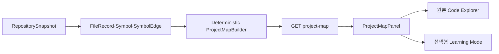
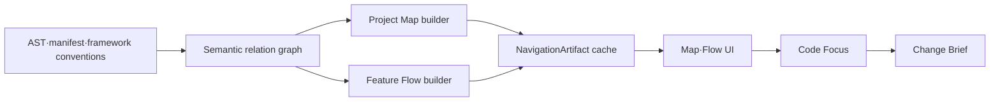

# RepoWise AI 저장소 내비게이션 개혁 상세 구현 계획서

- 작성일: 2026년 7월 19일
- 상위 기획: `NAVIGATION_REFORM_PLAN.md`
- 구현 기준: 현재 `main` 작업 트리와 기존 Adaptive Learning Journey 보존
- 현재 실행 범위: Tranche A — Map-first vertical slice

## 1. 구현 목표

제품의 기본 진입을 `진단 → 학습 경로 → 코드`에서 `프로젝트 지도 → 기능 → 코드`로 전환한다. 기존 분석·검색·학습 기능은 제거하지 않고 다음 두 모드로 재배치한다.

- 기본 `탐색 모드`: Project Map, 이후 Feature Flow, Code Focus, Change Brief
- 선택형 `깊이 배우기`: Assessment, Curriculum, Activity, Mastery, 공식 자료

첫 구현 묶음의 완료 상태는 다음 사용자 흐름이다.

```text
GitHub URL 입력
→ 저장소 분석 완료
→ 진단 없이 Project Map 확인
→ 프로젝트 목적·기능 후보·시스템 영역·외부 서비스 확인
→ 근거 파일 또는 원본 코드 탐색 열기
→ 사용자가 원할 때만 깊이 배우기 시작
```

## 2. 구현 전략과 핵심 결정

### 2.1 첫 수직 기능에서 바로 구현한 것

1. 결정론적 `GET /snapshots/{snapshot_id}/project-map`
2. Project Map 응답 타입과 코드 근거
3. 분석 완료 후 Project Map을 기본으로 보여 주는 UI
4. `원본 코드 탐색`과 `깊이 배우기`의 명시적 진입
5. assessment와 learning path가 Project Map 로딩을 막지 않는 상태 분리
6. 백엔드·프론트 단위 테스트

### 2.2 첫 수직 기능 당시 제외한 것

- 다중 파일 Feature Flow 생성 — Phase 2에서 구현
- 새 `NavigationArtifact` DB 테이블 — Phase 2에서 구현
- LLM 기반 프로젝트 요약
- 구조화된 Code Focus API
- Change Brief API
- 제품 이벤트 영속화
- 기존 curriculum이나 mastery 삭제

### 2.3 첫 수직 기능에서 DB migration을 하지 않는 이유

Project Map v1은 이미 저장된 snapshot, FileRecord, package.json, README와 파일 경로만으로 빠르게 계산할 수 있다. 아직 품질 기준이 검증되지 않은 artifact schema를 먼저 영속화하면 잘못된 데이터 모델을 고착시킬 수 있다.

첫 단계는 요청 시 결정론적으로 계산한다. 다음 조건 중 하나가 발생하면 `navigation_artifacts` cache를 도입한다.

- p95 응답 시간이 500ms를 넘는다.
- Feature Flow 생성에 LLM이나 비싼 graph traversal이 들어간다.
- 동일 snapshot artifact의 버전 이력과 재생성이 필요하다.

Phase 2에서는 Feature Flow가 다중 관계를 조립하고 동일 snapshot을 반복 조회하게 되어 cache를 도입했다. cache key는 `(snapshot_id, artifact_type, artifact_key, artifact_version)`이며 commit SHA와 Pydantic payload를 재검증한다. hit이면 원본 파일·symbol·edge query를 생략하고, miss·구버전·손상 payload는 결정론적으로 재생성한다. cache read/write DB 오류는 rollback 후 원래 builder 결과로 안전하게 우회한다.

## 3. 목표 아키텍처

### 3.1 단기 구조



### 3.2 중기 구조



## 4. Project Map v1 계약

### 4.1 API

```http
GET /api/snapshots/{snapshot_id}/project-map
```

동작:

- snapshot이 없으면 `404`
- snapshot이 `ready`가 아니면 `409`
- 외부 네트워크나 LLM을 호출하지 않음
- environment variable은 이름만 반환하고 값은 절대 반환하지 않음
- 모든 capability, system area, external service, environment variable에 file evidence 연결

### 4.2 응답 최상위 필드

| 필드 | 역할 |
| --- | --- |
| `repository_name` | `owner/name` |
| `snapshot_id` | 고정된 분석 단위 |
| `commit_sha` | 지도 신뢰 경계 |
| `summary` | README 또는 package metadata 기반 한 문장 |
| `summary_confidence` | `verified`, `inferred`, `unknown` |
| `tech_stack` | manifest와 파일 언어 기반 기술 |
| `capabilities` | 사용자가 이해할 기능 후보, 최대 5개 |
| `system_areas` | browser, server, data, external, configuration |
| `external_services` | dependency·import로 확인한 외부 서비스 |
| `environment_variables` | 코드가 참조하는 변수 이름과 역할 후보 |
| `read_first` | README, manifest, page·route 등 첫 파일 |
| `limitations` | 분석 범위와 확인 불가 영역 |

### 4.3 Evidence 규칙

Evidence 최소 필드:

```text
file_id
path
start_line
end_line
reason
```

규칙:

- path와 line은 FileRecord에서 서버가 생성한다.
- 동일 item의 evidence는 중복 제거한다.
- line 범위를 정확히 찾지 못하면 파일 전체가 아니라 관련 선언 또는 첫 관련 match를 사용한다.
- README·package description을 summary에 사용하면 해당 파일을 summary evidence로 남긴다.
- environment variable evidence는 변수명이 등장한 라인만 가리킨다.
- secret value, `.env` 내용, credential 패턴은 응답에 넣지 않는다.

### 4.4 결정론적 추출 규칙

#### 프로젝트 요약

우선순위:

1. `package.json.description`
2. README 첫 제목 다음의 첫 설명 문단
3. 저장소명과 확인된 주요 stack을 조합한 fallback

Markdown badge, HTML, 이미지, 코드 블록과 설치 명령은 요약 후보에서 제외한다.

#### 기술 스택

- 파일 언어: TypeScript, JavaScript
- framework: Next.js, React, Vite, Express
- styling: Tailwind CSS
- data: Prisma, Supabase, Firebase
- AI: OpenAI, Anthropic, Gemini SDK
- test: Vitest, Jest, Playwright

동일 label은 한 번만 반환한다.

#### Capability 후보

아래 signal을 evidence와 함께 합친다.

- auth 관련 dependency/import/path → 사용자 인증
- AI SDK/import/path → AI 기능
- Prisma/Supabase/Firebase/DB path → 데이터 저장·조회
- Next API route 또는 server file → 서버 요청 처리
- page·route file → 화면과 페이지 이동
- payment SDK/path → 결제
- test directory → 동작 검증

각 capability는 최소 하나의 evidence가 있을 때만 `verified` 또는 `inferred`로 노출한다. 근거 없는 일반 기능은 생성하지 않는다.

#### System area

- browser: page, component, hook, client directive
- server: API route, server action, server entry
- data: schema, model, repository, DB SDK
- external: known external SDK
- configuration: package, framework config, env reference

#### 환경 변수

인식 대상:

- `process.env.NAME`
- `import.meta.env.NAME`
- `process.env["NAME"]`

반환:

- 변수 이름
- 공개 변수 여부 추정
- 사용 맥락 설명
- evidence

반환 금지:

- 할당 값
- `.env` 파일 내용
- token·key로 보이는 문자열

## 5. 프론트엔드 상태 설계

### 5.1 Workspace mode

```ts
type WorkspaceMode = "map" | "flow" | "explorer" | "learning";
```

초기값은 `map`이다.

전이:

| 현재 | 행동 | 다음 |
| --- | --- | --- |
| map | 기능 흐름 보기 | flow |
| map | 근거 파일 열기 | explorer |
| map | 원본 코드 탐색 | explorer |
| map | 깊이 배우기 | learning |
| flow | 흐름 선택 | flow 상세 |
| flow | 단계 근거 열기 | explorer, 정확한 line highlight |
| flow | 프로젝트 지도 | map |
| flow | 깊이 배우기 | learning |
| explorer | 프로젝트 지도 | map |
| learning | 프로젝트 지도 | map |
| learning | lesson evidence 열기 | learning 상태 유지, code pane 표시 |

### 5.2 데이터 로딩 분리

기존에는 assessment 완료 뒤 tree, Start Here, graph, learning path를 한 번에 로딩한다. 아래 네 effect로 분리한다.

#### Navigation loader

조건:

- snapshot status가 `ready`
- learner profile과 assessment 상태에 의존하지 않음

로드:

- project map

#### Feature Flow loader

조건:

- snapshot status가 `ready`
- mode가 flow
- learner profile과 assessment 상태에 의존하지 않음

로드:

- 대표 flow catalog는 flow mode 진입 시
- flow detail은 사용자가 catalog item을 선택했을 때

Flow 진입만으로 tree, graph, assessment를 로드하지 않는다. 단계 근거를 열 때만 explorer로 전환하고 정확한 line range를 강조한다.

#### Explorer loader

조건:

- snapshot status가 `ready`
- mode가 explorer 또는 learning

로드:

- tree
- Start Here 호환 데이터
- import graph

기본 파일은 사용자가 explorer를 직접 열었을 때만 read-first 또는 첫 파일로 선택한다. map 진입 시 Monaco를 자동으로 열지 않는다.

#### Learning loader

조건:

- mode가 learning
- profile 존재
- assessment가 completed 또는 skipped

로드:

- learning path
- learning session
- current lesson evidence

### 5.3 Assessment lifecycle

- 앱 초기화나 snapshot 선택만으로 assessment session을 만들지 않는다.
- 사용자가 `깊이 배우기`를 누를 때 생성한다.
- 진행 중 assessment는 polling과 새로고침 복구를 유지한다.
- submit 또는 skip 뒤 learning loader를 실행한다.
- map·explorer는 assessment 상태와 무관하게 동작한다.

### 5.4 초기 화면

분석 중:

- 기존 progress 유지
- 완료 뒤 지도와 기능 후보가 준비된다는 copy 사용

분석 완료:

- ProjectMapPanel 전체 폭
- 지도 로딩 skeleton
- API 실패 시 retry와 `원본 코드 탐색` fallback

## 6. 프론트엔드 컴포넌트 계약

### 6.1 `ProjectMapPanel`

Props:

```ts
type Props = {
  map: ProjectMap | null;
  snapshot: Snapshot | null;
  loading: boolean;
  featureFlows: FeatureFlowSummary[];
  onOpenEvidence: (evidence: ProjectMapEvidence) => void;
  onOpenFeatureFlows: (flowId?: string) => void;
  onOpenExplorer: () => void;
  onStartLearning: () => void;
};
```

기본 렌더링 순서:

1. repository name, commit, summary, confidence
2. 오늘의 목적 선택 UI
3. capability 최대 3개
4. system area
5. external service와 환경 변수 이름
6. read-first evidence
7. limitation
8. 원본 코드 탐색과 깊이 배우기

접근성:

- 모든 click target은 button 또는 link
- confidence는 색만으로 구분하지 않고 text label 제공
- env variable은 `code`로 이름만 표시
- loading, error, empty 상태를 분리

### 6.2 `FeatureFlowPanel`

Props:

```ts
type Props = {
  catalog: FeatureFlowCatalog | null;
  flow: FeatureFlowDetail | null;
  loading: boolean;
  detailLoading: boolean;
  error: string | null;
  onSelectFlow: (flowId: string) => void;
  onOpenEvidence: (evidence: FeatureFlowEvidence) => void;
  onBackToCatalog: () => void;
  onBackToMap: () => void;
  onRetry: () => void;
  onStartLearning: () => void;
};
```

기본 렌더링 순서:

1. flow catalog 최대 3개
2. 선택한 기능의 trigger와 확인된 outcome
3. 근거가 있는 정상 단계
4. 정적으로 확인된 경우에만 실패 단계
5. 끊긴 경계와 분석 limitation
6. 단계별 코드 근거 이동

### 6.3 기존 component 재배치

| component | 새 위치 |
| --- | --- |
| `FileTree` | explorer mode |
| `CodePanel` | explorer와 learning mode |
| `AssistantPanel` | learning mode |
| `AssessmentPanel` | learning mode 내부 첫 상태 |
| `StartHereContent` | 일시적 explorer overview 호환, 이후 제거 검토 |
| `VoiceSessionDock` | active learning session이 있을 때만 |
| `DeepTaskTray` | active learning session 또는 향후 navigation context가 있을 때 |

## 7. 코드 변경 계획

### WP-A — Project Map backend contract

주요 파일:

- `apps/api/app/schemas.py`
- `apps/api/app/api/repositories.py`
- `apps/api/app/navigation/__init__.py`
- `apps/api/app/navigation/project_map.py`
- `apps/api/tests/test_project_map.py`

작업:

- Pydantic response types 추가
- deterministic builder 구현
- ready snapshot route 추가
- evidence·confidence·env redaction 테스트

완료 조건:

- endpoint가 동일 snapshot에 동일 응답을 생성
- 모든 semantic item에 evidence 존재
- env value가 응답에 없음
- missing README/package에서도 fallback 동작

### WP-B — Web API types and client

주요 파일:

- `apps/web/src/lib/api.ts`

작업:

- `ProjectMap*` TypeScript type 추가
- `api.getProjectMap(snapshotId)` 추가
- backend response와 필드 optionality 일치

### WP-C — Project Map UI

주요 파일:

- `apps/web/src/components/ProjectMapPanel.tsx`
- `apps/web/src/components/ProjectMapPanel.module.css`
- `apps/web/src/components/ProjectMapPanel.test.tsx`

작업:

- summary, capability, system area, external/env, read-first, limitation 렌더링
- explorer·learning CTA
- evidence file open action
- responsive layout과 접근성

### WP-D — Workbench mode orchestration

주요 파일:

- `apps/web/src/components/RepositoryWorkbench.tsx`
- `apps/web/src/app/globals.css`

작업:

- `WorkspaceMode` 추가
- projectMap state와 loader 추가
- assessment creation을 learning mode로 제한
- explorer data와 learning data effect 분리
- map 기본 렌더링
- existing mobile pane은 explorer/learning 내부에서 유지
- repository reset 시 mode와 loader refs 초기화

주의:

- 현재 작업 트리의 `AssistantPanel`/DeepTask 변경을 보존한다.
- RepositoryWorkbench에서 기존 DeepTask citation prop 전달을 유지한다.
- voice session은 learning session 없이는 연결되지 않는 현재 제약을 유지한다.

### WP-E — Integration tests and regression

백엔드:

- builder unit test
- endpoint ready/not-ready/not-found
- package/README fallback
- known dependency capability
- env name only/redaction
- evidence line bounds

프론트:

- map loading/empty
- summary와 confidence
- capability 상위 3개
- evidence click
- explorer CTA
- learning CTA
- env name 노출·value 미노출

회귀:

- AssessmentPanel tests
- LearningJourneyPanel tests
- DeepTaskTray tests
- full web lint/test/build
- API Ruff/pytest

### WP-F — Semantic Graph v1 기반

주요 파일:

- `apps/api/app/analysis/typescript.py`
- `apps/api/app/workers/repository_analysis.py`
- `apps/api/app/models.py`
- `apps/api/migrations/versions/0008_navigation_graph_artifacts.py`
- `apps/api/tests/test_semantic_graph_resolution.py`

현재 수직 범위:

- intrinsic JSX의 고정된 사용자 입력 event와 local identifier handler를 `TRIGGERS`로 연결
- provenance가 확인된 `fetch`/axios의 literal target을 `REQUESTS`로 추출
- export된 정적 Next App Router handler와 같은 package root·method·path가 일치할 때만 `HANDLED_BY` 생성
- query, fragment, URL credential 값을 semantic metadata와 사용자 응답에서 제거
- 동적 URL, inline callback, custom component callback, shadowed HTTP client는 verified edge로 승격하지 않음
- `SymbolEdge.metadata_json`과 versioned `NavigationArtifact` 저장 기반 추가

### WP-G — Feature Flow catalog/detail API

주요 파일:

- `apps/api/app/navigation/versions.py`
- `apps/api/app/navigation/feature_flow.py`
- `apps/api/app/schemas.py`
- `apps/api/app/api/repositories.py`
- `apps/api/tests/test_feature_flow.py`

현재 수직 범위:

- 최대 3개의 대표 flow catalog
- `TRIGGERS → handler → REQUESTS → HANDLED_BY`의 3~4개 근거 단계
- 모든 step에 유효한 file/line evidence
- semantic tuple 기반의 재분석 안정 ID
- test/spec/story/fixture seed 제외
- 동적·부분 흐름의 명시적 중단 limitation
- failure flow는 근거가 없으면 빈 배열 유지

### WP-H — Feature Flow UI와 코드 이동

주요 파일:

- `apps/web/src/components/FeatureFlowPanel.tsx`
- `apps/web/src/components/FeatureFlowPanel.module.css`
- `apps/web/src/components/FeatureFlowPanel.test.tsx`
- `apps/web/src/components/RepositoryWorkbench.tsx`

작업:

- map과 explorer 사이에 독립적인 flow mode 추가
- catalog/detail lazy loading
- 정상 단계, 관계, 신뢰도, limitation 표시
- 단계 evidence에서 explorer로 전환하며 정확한 line highlight
- assessment/tree/graph loader와 분리
- stale detail/file request가 최신 선택을 덮지 않도록 request sequence guard 적용

### WP-I — Phase 2 precision regression

반례를 테스트로 고정한다.

- shadowed `fetch`/axios
- export되지 않은 route handler
- custom callback과 비사용자 event
- dynamic request target/method
- query credential redaction과 target 길이 제한
- monorepo package root 오연결
- 동일 commit 재분석 뒤 stable flow/step ID
- 빠른 detail 이탈과 evidence 역순 응답

## 8. Feature Flow v2 확장 계획

첫 수직 구현의 `TRIGGERS`, `REQUESTS`, `HANDLED_BY`에 두 번째 수직 기능으로 `READS`, `WRITES`, `NAVIGATES_TO`, `USES_EXTERNAL`을 추가했다. 현재 구현은 React `useState` setter, literal Web Storage key, Next.js router/redirect, 인식된 외부 SDK client만 다루는 고정밀 subset이다. DB SDK, `Link`, cross-file helper traversal, component/test 관계는 후속 범위다.

### 8.1 분석 관계 확장 순서

1. import local binding ↔ exported symbol
2. JSX `onClick`/`onSubmit` ↔ handler (`TRIGGERS`)
3. `fetch`/axios/SDK ↔ literal target (`REQUESTS`)
4. Next page/API route/server action 관례
5. request path ↔ handler (`HANDLED_BY`)
6. React state setter·Web Storage (`READS`, `WRITES`) — 구현
7. Next router/redirect (`NAVIGATES_TO`) — 구현, `Link`는 후속
8. 인식된 SDK client (`USES_EXTERNAL`) — 구현
9. DB SDK read/write — 후속
10. component JSX relation (`RENDERS`) — 후속
11. implementation ↔ test (`VALIDATED_BY`) — 후속

### 8.2 데이터 모델

첫 수직 구현에서 additive migration `0008_navigation_graph_artifacts.py`를 추가했다.

기존 `symbol_edges`에는 다음 필드를 additive하게 추가한다.

```text
metadata_json JSONB NOT NULL DEFAULT '{}'
```

import binding, JSX prop, HTTP method/path, 외부 package, state setter와 confidence 산정 이유를 저장한다. 기존 `relation`, `target_path`, source line 필드는 그대로 유지한다.

```text
navigation_artifacts
- id
- snapshot_id
- artifact_type
- artifact_key
- artifact_version
- status
- payload_json
- evidence_ids
- confidence_summary
- generation_metadata
- created_at
- updated_at
```

Unique key:

```text
(snapshot_id, artifact_type, artifact_key, artifact_version)
```

artifact version 후보:

- `project-map-v2`
- `feature-flow-v2`
- `change-brief-v1`

버전은 `apps/api/app/navigation/versions.py`에서 관리하고 retrieval의 `snapshot.index_version`과 섞지 않는다.

```text
SEMANTIC_GRAPH_VERSION = "semantic-ts-v2"
PROJECT_MAP_VERSION = "project-map-v2"
FEATURE_CATALOG_VERSION = "feature-catalog-v2"
FEATURE_FLOW_VERSION = "feature-flow-v2"
CODE_EXPLANATION_VERSION = "minimum-sufficient-v1"
CHANGE_BRIEF_VERSION = "change-brief-v1"
```

### 8.3 Flow 생성기

현재 구현:

1. 사용자 trigger seed 수집과 test/story/fixture seed 제외
2. `TRIGGERS → REQUESTS → HANDLED_BY`의 검증된 직선 경로 선택
3. 요청 전 read, route의 외부 서비스, awaited 요청 뒤 write/navigation을 인과 순서로 연결
4. 모든 step의 snapshot line 범위 검증
5. 흐름당 최대 7단계, 대표 흐름 최대 3개로 제한
6. stable semantic ID와 evidence coverage 기반 정렬

후속 구현은 branch/cycle 처리, 정상·실패 흐름 분리, 제한된 LLM label, 별도 server verifier다.

LLM은 node 또는 edge를 추가할 수 없다.

## 9. Code Focus 최소 충분 설명 구현

상태: 첫 번째 vertical slice 완료.

### API

```http
POST /api/snapshots/{snapshot_id}/code-explanations
```

입력:

```json
{
  "selection": {"file_id": "...", "start_line": 1, "end_line": 8},
  "feature_flow_id": null,
  "flow_step_id": null,
  "depth": "minimum"
}
```

출력 블록:

- purpose
- executes_when
- input
- output_or_side_effect
- project_role
- change_impact
- required_concepts
- evidence

depth:

- `minimum`
- `behavior`
- `syntax`
- `analogy`
- `change`

구현 원칙과 현재 동작:

1. 한 요청은 최대 80줄만 허용하고 파일·라인 범위를 snapshot과 대조한다.
2. 선택 범위를 포함하는 가장 작은 symbol을 중심으로 설명한다.
3. 선택 범위와 겹치는 semantic edge만 입력·출력·부작용 근거로 사용한다.
4. Feature Flow 문맥은 캐시된 flow step의 evidence가 선택 범위와 실제로 겹칠 때만 신뢰한다.
5. `minimum`은 역할·실행 시점·입력·결과·프로젝트 내 위치를 먼저 보여준다.
6. `syntax`는 기존 AST statement segmenter를 재사용하되 원문 코드를 artifact에 복제하지 않는다.
7. `analogy`, `change`를 포함한 모든 depth는 동일한 근거 경계 안에서만 확장한다.
8. 결과는 `code_explanation` NavigationArtifact로 버전·commit·cache key를 검증해 저장한다.
9. 파일 또는 선택 범위가 바뀌면 이전 요청을 무효화해 늦게 도착한 설명이 최신 화면을 덮지 못하게 한다.

주요 구현 파일:

- `apps/api/app/navigation/code_focus.py`
- `apps/api/app/api/repositories.py`
- `apps/api/app/schemas.py`
- `apps/web/src/components/CodeFocusPanel.tsx`
- `apps/web/src/components/RepositoryWorkbench.tsx`
- `apps/web/src/lib/api.ts`

현재 설명은 deterministic builder 기반이다. 이후 LLM을 붙이더라도 검증된 symbol·edge·flow evidence 밖의 사실을 추가할 수 없도록 이 응답 계약을 유지한다.

## 10. Change Brief 구조화 영향 분석 구현

상태: Phase 4 vertical slice 완료.

기존 `impact_analysis` deep task의 자유 서술 결과를 구조화한다.

기존 학습·음성 DeepTask 계약은 유지하고 탐색 모드용 공용 실행 경로를 추가했다.

- `chat_sessions.navigation_context JSONB` 추가 완료
- `deep_tasks.learning_session_id` nullable·`ON DELETE SET NULL` 전환 완료
- `deep_tasks.context_json JSONB` 추가 완료
- chat session 단위 idempotency unique index 추가 완료
- 기존 `POST /learning-sessions/{id}/deep-tasks` 유지
- 신규 `POST /chat/sessions/{id}/deep-tasks` 구현
- navigation context에는 `feature_key`, `flow_step_id`, `selection`, `explanation_depth`만 저장
- 탐색 요청은 `impact_analysis`만 허용하고 학습용 자유 서술 응답과 분리
- 기존 voice·learning·SSE·취소·idempotency 회귀 테스트 통과

필수 출력:

- request summary
- candidate locations
- confirmed direct impacts
- possible impacts to verify
- unknown boundaries
- risk level and rationale
- verification steps
- rollback guidance
- evidence

안전 조건:

- evidence가 없는 candidate를 최우선 정답으로 제시하지 않음
- 낮은 confidence에서는 “바뀌지 않는다”를 단정하지 않음
- 실제 patch apply는 별도 승인과 후속 단계

현재 생성 방식:

1. 선택 범위를 포함하는 가장 작은 symbol을 변경 출발점으로 고정한다.
2. 선택 범위의 outgoing edge와 선택 symbol을 향하는 incoming edge를 함께 수집한다.
3. confidence 0.8 이상인 쓰기·요청·handler·화면 이동·외부 서비스 관계만 직접 영향으로 확정한다.
4. 낮은 confidence, 미해결 대상, 관계 부족은 `possible_impacts_to_verify`로 내린다.
5. 관계가 없으면 위험도를 `low`로 단정하지 않고 `unknown`으로 표시한다.
6. 모든 후보 위치와 영향 항목은 snapshot 내부 파일·라인 evidence를 포함한다.
7. 동일한 prompt·selection·feature context는 `change-brief-v1` NavigationArtifact를 재사용한다.
8. Worker 결과는 deterministic semantic graph 모드로 생성하며 실제 patch를 만들거나 적용하지 않는다.

주요 구현 파일:

- `apps/api/app/navigation/change_brief.py`
- `apps/api/app/api/deep_tasks.py`
- `apps/api/app/workers/deep_tasks.py`
- `apps/api/migrations/versions/0009_navigation_change_briefs.py`
- `apps/web/src/components/ChangeBriefPanel.tsx`
- `apps/web/src/components/RepositoryWorkbench.tsx`
- `apps/web/src/lib/api.ts`

## 11. 평가와 관측

### 11.1 Navigation gold fixture

신규 경로:

```text
apps/api/app/evaluation/navigation.py
apps/api/evaluation/fixtures/navigation_gold_v1.json
```

현재 evaluator는 대표 Top 3 Feature Flow를 gold feature와 일대일로 대응시키고 다음 값을 계산한다.

- `feature_recall`: 최소 단계 coverage를 만족한 기대 기능 비율
- `step_recall`: 기대 관계·역할·근거 경로 중 실제로 찾은 비율
- `verified_precision`: `verified`로 노출한 단계 중 gold와 일치한 비율
- `false_verified_steps`: 잘못 확정된 flow, relation, role, path 목록

실행 명령:

```powershell
pnpm eval:navigation --fixture apps/api/evaluation/fixtures/navigation_gold_v1.json --snapshot-id <snapshot_id>
```

현재 JSON은 evaluator 회귀를 위한 2개 기능 baseline이다. 실제 대표 저장소의 parser v2 snapshot을 만든 뒤 사람이 검토한 gold 경로로 교체·확장해야 제품 수준 수치가 된다.

Project Map fixture 필드:

- snapshot fixture ID
- expected summary signals
- expected capabilities
- expected system areas
- expected external services
- expected env names
- forbidden secret strings
- expected evidence paths

### 11.2 제품 이벤트

첫 수직 기능에서는 UI handler에 event interface만 두고 저장은 후속으로 미룬다. 배포 전 다음 event를 영속화한다.

- `project_map_viewed`
- `intent_selected`
- `evidence_opened`
- `explorer_opened`
- `learning_mode_started`
- `feature_selected`
- `flow_step_opened`
- `change_brief_requested`

### 11.3 성능 목표

| 항목 | 초기 목표 |
| --- | --- |
| project-map p50 | 150ms 이하 |
| project-map p95 | 500ms 이하 |
| deterministic response stability | 100% |
| semantic item evidence coverage | 100% |
| secret value leakage | 0 |
| map UI LCP after response | 1초 이하 |

## 12. Rollout과 rollback

현재 로컬 MVP의 첫 수직 기능에서는 별도 remote feature flag보다 mode 전환을 rollback 경로로 사용한다.

- 기본: map
- 사용자 fallback: 원본 코드 탐색
- API 실패 fallback: error + explorer CTA
- learning 기능: 기존 path를 그대로 유지

`NEXT_PUBLIC_NAVIGATION_DEFAULT`는 기본 화면 선택일 뿐 kill switch가 아니다. 배포 전에는 서버와 UI를 독립적으로 끌 수 있는 다음 설정을 추가한다.

```dotenv
NAVIGATION_V1_ENABLED=false
NAVIGATION_FEATURE_FLOW_ENABLED=false
NAVIGATION_CHANGE_BRIEF_ENABLED=false
NAVIGATION_LLM_LABELS_ENABLED=false
NEXT_PUBLIC_NAVIGATION_UI_ENABLED=false
NEXT_PUBLIC_NAVIGATION_DEFAULT=map
```

새 UI는 client flag와 `/health` 또는 `/capabilities`가 반환하는 server capability가 모두 활성일 때만 기본이 된다. 긴급 rollback은 `NAVIGATION_V1_ENABLED=false`와 `NEXT_PUBLIC_NAVIGATION_UI_ENABLED=false`로 처리하며 migration downgrade를 요구하지 않는다.

기본 화면 설정:

```dotenv
NEXT_PUBLIC_NAVIGATION_DEFAULT=map
```

허용 값:

- `map`
- `explorer`

rollback은 값을 `explorer`로 바꾸는 것으로 처리한다. API endpoint는 additive이므로 기존 client와 호환된다.

## 13. 테스트 명령

```powershell
uv run --project apps/api ruff check apps/api
uv run --project apps/api pytest -q
pnpm lint:web
pnpm test:web
pnpm build:web
```

빠른 반복:

```powershell
uv run --project apps/api pytest -q apps/api/tests/test_project_map.py
pnpm --filter @repowise/web test -- ProjectMapPanel
```

## 14. 구현 순서와 의존성

```text
WP-A Backend contract
  ├─→ WP-B Web types
  │     └─→ WP-C Project Map UI
  └────────→ WP-D Workbench orchestration
              └─→ WP-E integration regression

WP-F Semantic Graph precision subset
  └─→ WP-G Feature Flow catalog/detail API
        └─→ WP-H Flow UI + evidence navigation
              └─→ WP-I adversarial precision regression
                    ├─→ semantic relation expansion
                    ├─→ Code Focus
                    └─→ Change Brief
```

WP-A와 WP-C skeleton은 병렬 작업 가능하다. WP-D는 backend와 frontend 타입이 확정된 뒤 통합한다.

## 15. 작업 단위별 Definition of Done

### Map-first vertical slice

- ready snapshot에서 project-map endpoint가 동작한다.
- map이 profile·assessment 없이 로드된다.
- 첫 화면에 Monaco나 assessment가 강제 노출되지 않는다.
- summary, capability, system area, external/env, evidence를 볼 수 있다.
- evidence에서 실제 파일을 연다.
- explorer와 learning을 명시적으로 선택할 수 있다.
- existing journey, voice, deep task 동작이 깨지지 않는다.
- API 전체 Ruff/pytest, Web lint/test/build가 통과한다.

### Feature Flow v1

- 대표 기능 최소 3개 중 기준 정답 2개 이상을 찾는다.
- 한 feature가 3~7개의 연결 step을 가진다.
- 모든 step에 code evidence가 있다.
- `verified` 오표시율이 5% 미만이다.
- 관계가 끊기면 unknown으로 표시한다.

현재 두 번째 수직 구현은 관계 정확도와 모든 step evidence 조건을 코드·반례 fixture로 충족한다. state/storage read-write, navigation, external SDK를 최대 7단계 정상 흐름에 연결하며, 비동기 요청 이후 효과는 `await` 근거가 있을 때만 노출한다. 다만 실제 대표 저장소 gold fixture에서 `Top 3 중 2개`와 `오표시율 5% 미만`을 계측하는 제품 수준 DoD, failure path, DB SDK·`Link`·cross-file helper 일반화는 아직 남아 있다.

### Navigation MVP

- 비전공자가 map만 보고 프로젝트 목적을 설명한다.
- 기능 하나의 시작·중간·결과를 따라간다.
- code focus의 최소 충분 설명 5항목을 확인한다.
- 저위험 변경 후보와 검증 방법을 찾는다.
- 학습 모드 없이 위 과업이 가능하다.

## 16. 리스크와 대응

| 리스크 | 구현 대응 |
| --- | --- |
| README description이 부정확 | confidence와 evidence 노출, package/path fallback |
| path 이름만으로 기능을 과대 추론 | inferred 표시, evidence 없는 capability 금지 |
| env secret 노출 | 값 미수집, 이름 regex만 사용, forbidden-string test |
| Workbench 상태 회귀 | loader ref 분리, mode별 조건, 기존 regression test |
| user의 미커밋 DeepTask 변경 손상 | 해당 파일 최소 수정, diff 검토, 기존 test 실행 |
| Project Map 응답 지연 | versioned artifact cache hit 시 파일·edge query 생략 |
| Feature Flow 잘못된 연결 | semantic edge 선행, LLM edge 생성 금지, verifier |
| 기존 학습 기능과 중복 UI | 탐색과 학습 mode 경계, 공통 evidence 재사용 |

## 17. 현재 진행 상태

| 작업 | 상태 |
| --- | --- |
| 제품 개혁 기획 | 완료 |
| 상세 구현 계획 | 완료 |
| WP-A Project Map backend | 완료 |
| WP-B Web API type | 완료 |
| WP-C Project Map UI | 완료 |
| WP-D Workbench mode orchestration | 완료 |
| WP-E 전체 회귀 검증 | 완료 |
| WP-F Semantic Graph precision subset | 완료 |
| WP-G Feature Flow catalog/detail API | 완료 |
| WP-H Feature Flow UI·근거 이동 | 완료 |
| WP-I adversarial precision regression | 완료 |
| Phase 2 관계 확장 v2 | 완료 |
| Phase 2 NavigationArtifact read/write cache | 완료 |
| Phase 2 gold evaluator·2기능 baseline | 완료 |
| Phase 3 Code Focus API·versioned cache | 완료 |
| Phase 3 최소 충분 설명 UI·근거 이동 | 완료 |
| Phase 3 stale response·범위 제한 회귀 테스트 | 완료 |
| Phase 4 navigation-scoped DeepTask·DB migration | 완료 |
| Phase 4 structured Change Brief builder·versioned cache | 완료 |
| Phase 4 Change Brief UI·Code Focus 연계 | 완료 |
| Phase 4 안전 조건·idempotency·전체 회귀 테스트 | 완료 |
| 대표 저장소 parser v2 재분석·실제 gold 검수 | 완료 |
| Phase 5 Structure Map·기능 오버레이 | 완료 |
| Python/FastAPI·DB SDK·failure path·cross-file helper 관계 확장 | 완료 |
| Architecture diff·PNG/Mermaid export·제한형 AI label | 완료 |

현재 누적 검증 결과:

- API Ruff 통과
- API pytest `127 passed` (기존 Starlette deprecation warning 1개)
- Web Vitest `99 passed`
- Web TypeScript 검사 통과
- Web ESLint 통과
- Next.js production build 통과
- Alembic migration 적용 및 head `0009_navigation_change_briefs` 확인
- `git diff --check` 통과

Phase 1~5의 탐색·구조 시각화 vertical slice와 운영 검증을 완료했다. RepoWiseAI와 p-map을 `semantic-ts-v2`로 재분석했고, 사람이 검수한 Architecture 및 Navigation gold에서 두 저장소 모두 목표 임계값을 통과했다. 실측 누락을 근거로 Python/FastAPI, DB SDK read/write, explicit failure path, local fetch wrapper, cross-file helper, library public API 흐름을 확장했다. Change Brief도 RepoWiseAI의 Web→API→queue/model 영향과 p-map의 내부 호출·실패 경로를 실제 snapshot에서 검수했다.

이 문서는 각 tranche 종료 시 실제 구현 파일, 테스트 결과, 남은 위험을 기준으로 갱신한다.
