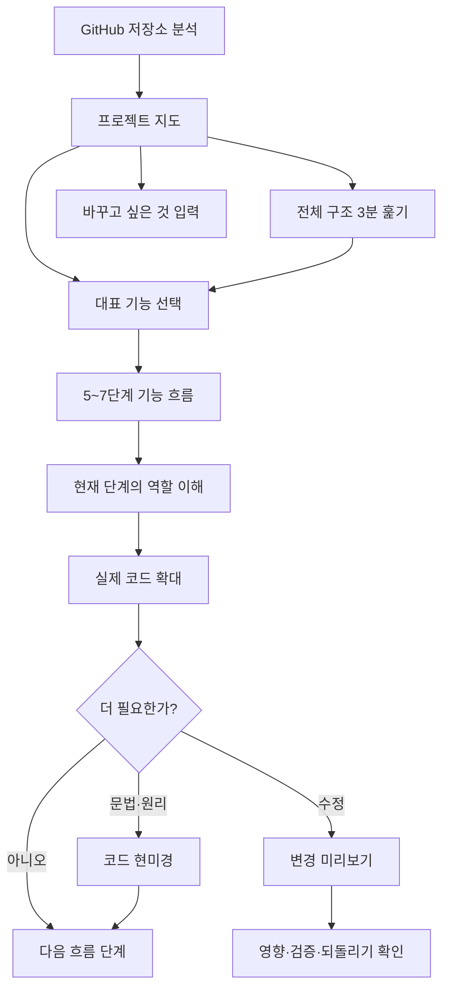
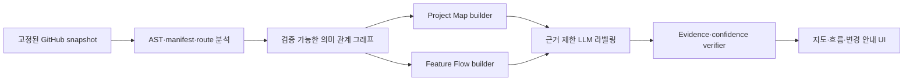

# RepoWise AI 저장소 내비게이션 중심 제품 개혁 기획서

- 작성일: 2026년 7월 19일
- 문서 성격: 기존 구현을 활용한 제품 방향 전환안
- 상태: 제안

## 1. 결론

RepoWise AI를 처음부터 다시 만들 필요는 없다. 현재 구현은 저장소 스냅샷 고정, AST 분석, 심볼·관계 그래프, 계층형 청크, 근거 검색, 코드 인용, 선택 범위 질문, 보충 설명, 영향 분석까지 갖추고 있다. 문제는 분석 능력보다 그 능력을 사용자에게 보여 주는 순서에 있다.

현재 첫 경험은 사실상 다음과 같다.

> 진단 → 학습 경로 → 파일과 코드 → 막히면 문장별 설명·공식 문서

개혁 후의 기본 경험은 다음과 같아야 한다.

> 프로젝트 지도 → 기능 흐름 → 현재 단계의 역할 → 필요한 코드 → 필요할 때만 문법·공식 문서 → 변경 전 영향 확인

제품 정의도 다음처럼 바꾼다.

> GitHub 저장소를 파일이 아니라 기능과 실행 흐름으로 재구성하고, 사용자가 원하는 기능을 따라가며 안전한 작은 변경을 준비하도록 돕는 저장소 내비게이션.

학습 기능은 폐기하지 않는다. 다만 `학습 여정`을 기본 제품에서 선택형 `깊이 배우기` 모드로 옮긴다. 핵심 사용자가 가장 먼저 얻어야 할 가치는 “문법을 배웠다”가 아니라 “이 프로젝트가 어떻게 움직이고 어디를 바꿔야 하는지 알겠다”이다.

## 2. 해결할 핵심 문제

비전공자는 코드 한 줄을 이해하기 전에 다음 맥락부터 필요하다.

- 이 저장소는 무엇을 하는가?
- 사용자는 어떤 행동을 할 수 있는가?
- 지금 보는 파일과 함수는 그중 어느 부분인가?
- 이 코드는 언제 실행되고 데이터는 어디로 이동하는가?
- 이 부분을 바꾸면 어디까지 달라지는가?

이 맥락 없이 `const`, `async`, `useEffect`부터 설명하면 새로운 개념이 계속 파생된다. 공식 문서를 연결해도 사용자는 문서의 어느 부분이 지금 코드에 필요한지 판단하지 못한다. 설명의 양이 부족한 것이 아니라 설명의 출발점과 단위가 잘못된 것이다.

따라서 제품의 중심 객체를 다음과 같이 바꾼다.

| 현재 중심 객체 | 개혁 후 중심 객체 |
| --- | --- |
| 파일, 심볼, 코드 청크 | 사용자 목적, 기능, 실행 단계 |
| 학습 레슨 완료 | 원하는 기능의 경로 파악 |
| 문법·개념 설명 | 역할·시점·데이터·영향 설명 |
| 자유 질문 | 맥락에 맞는 다음 행동 |
| 이해도 점수 | 작은 변경 준비 성공 |

## 3. 현재 구현 진단

### 3.1 이미 잘 구현되어 있어 유지할 기반

| 현재 자산 | 개혁 후 역할 | 근거 위치 |
| --- | --- | --- |
| 커밋에 고정된 저장소 스냅샷 | 모든 지도와 설명의 신뢰 경계 | `apps/api/app/models.py`, `apps/api/app/workers/repository_analysis.py` |
| 안전한 파일 필터와 TS/JS AST 분석 | 기능 그래프의 원천 데이터 | `apps/api/app/services/file_filter.py`, `apps/api/app/analysis/typescript.py` |
| 파일·심볼·청크·IMPORTS/CALLS | 프로젝트 지도와 기능 흐름 후보 | `apps/api/app/models.py`, `apps/api/app/workers/repository_analysis.py` |
| 하이브리드 검색과 evidence registry | 코드 포커스와 변경 안내의 근거 검색 | `apps/api/app/retrieval/`, `apps/api/app/services/grounded_chat.py` |
| citation warp와 Monaco 강조 | 지도에서 실제 코드로 내려가는 연결 | `apps/web/src/components/RepositoryWorkbench.tsx`, `CodePanel.tsx` |
| 문장별 설명·선수 개념·작은 예제·공식 자료 | 코드 포커스의 선택형 상세 설명 | `apps/api/app/learning/explanations.py`, `apps/web/src/components/LearningJourneyPanel.tsx` |
| flow·impact 질문 라우팅과 deep task | 기능 질문과 변경 미리보기의 심층 분석 | `apps/api/app/retrieval/query.py`, `apps/api/app/api/deep_tasks.py` |
| Assessment·Curriculum·Mastery | 명시적으로 배우려는 사용자의 선택형 학습 모드 | `apps/api/app/assessment/`, `apps/api/app/learning/` |
| 파일 트리·코드·의존성 그래프 | 원본 근거를 직접 확인하는 고급 탐색기 | `apps/web/src/components/FileTree.tsx`, `CodePanel.tsx`, `DependencyGraph.tsx` |

### 3.2 첫 경험이 문제를 재생산하는 지점

1. **진단이 가치 확인보다 먼저 나온다.**
   
   `RepositoryWorkbench.tsx`는 스냅샷이 생기면 자동으로 진단 세션을 만들고, 진단이 끝나야 tree, Start Here, graph, learning path를 함께 불러온다. `AssistantPanel.tsx`도 진단이 활성 상태이면 다른 내용을 가린다. 사용자는 저장소에 대한 첫 설명을 받기 전에 시험부터 만난다.

2. **기본 화면의 가장 강한 단위가 여전히 파일과 코드다.**
   
   데스크톱은 `파일 트리 / Monaco 코드 / 학습 패널` 3열이고 모바일 탭도 `파일 / 코드 / 학습`이다. 프로젝트의 의미나 기능 흐름보다 원본 구조가 먼저 시선을 차지한다.

3. **Start Here가 프로젝트를 설명하지 못한다.**
   
   `StartHerePanel.tsx`는 기술 스택, 진입점, 상위 디렉터리를 보여 준다. 백엔드 `get_start_here()`의 한 문장 요약도 “몇 개 파일과 심볼을 분석했다”는 분석 통계다. 누가 무엇을 하는 서비스인지, 주요 행동이 무엇인지, 화면·서버·저장소·외부 서비스가 어떻게 연결되는지는 없다.

4. **`기능 흐름`이라는 이름과 실제 데이터가 다르다.**
   
   `learning/curriculum.py`의 `feature_flow` module은 중요도가 높은 심볼을 여러 개 고르는 방식이다. 한 사용자 행동이 여러 파일을 거쳐 결과에 도달하는 연결된 end-to-end flow는 아니다. 사용자는 나뭇가지를 추천 순서대로 볼 뿐 여전히 숲의 길을 얻지 못한다.

   기존 `IMPLEMENTATION_PLAN.md`에는 Project Map과 feature cluster 탐색이 이미 설계되어 있다. 이번 개혁은 원래 비전을 뒤집는 것이 아니라, 구현 과정에서 빠진 의미 계층을 실제 기본 화면과 데이터 모델로 복구하는 작업이다.

5. **막힌 뒤의 도움도 문법과 자료 쪽으로 너무 빨리 내려간다.**
   
   문장별 설명, 배경지식, 작은 예제, 공식 자료가 동일한 수준의 도움 버튼으로 배치되어 있다. 기본 learner profile도 `line_by_line`과 `analogy`를 선호한다. `apps/api/app/ai/answers.py`의 beginner guidance도 낯선 문법과 용어부터 시작한 뒤 실행 흐름을 설명하도록 되어 있어, 목표로 삼는 `역할 → 동작 → 문법` 순서와 반대다.

6. **현재 관계 그래프만으로는 기능 흐름을 확정하기 어렵다.**
   
   `TypeScriptAnalyzer`는 import와 호출 표현을 추출하지만, worker의 CALLS 해석은 같은 파일 안의 표시 이름을 우선 연결한다. import binding, JSX event, 클라이언트 요청과 API route, 상태 변경, 내비게이션, DB·외부 서비스 호출은 별도 의미 관계로 모델링되지 않는다. LLM 요약만 추가하면 그럴듯하지만 틀린 흐름이 생길 수 있다.

7. **공식 자료 조사와 현재 코드 맥락이 분리될 수 있다.**
   
   공식 자료 deep task는 주로 원문 prompt와 teaching style로 실행되고 현재 feature, flow step, selection, concept gap이 필수 입력이 아니다. 따라서 유효한 공식 링크를 찾아도 “왜 지금 이 문서가 필요한가”를 잃을 수 있다. 자료 추천은 독립 검색이 아니라 현재 코드 역할 설명의 마지막 계층이어야 한다.

8. **강한 진단 게이트에 비해 목표 개인화 효과가 약하다.**
   
   진단은 전체 이해, 특정 기능 수정, 프로그래밍 학습 같은 목표를 묻지만 현재 `plan_curriculum()`은 goal을 경로 구조 결정에 직접 사용하지 않는다. 사용자는 큰 선행 비용을 내지만 첫 경로는 여전히 비슷한 15~40개 청크 중심 구조가 된다.

핵심 판단은 다음과 같다.

> 엔진은 상당 부분 재사용할 수 있지만, 현재 UI와 curriculum을 단순히 다듬는 것만으로는 해결되지 않는다. 프로젝트 지도와 기능 흐름이라는 새 데이터 단위가 필요하다.

## 4. 제품 목표와 범위

### 4.1 핵심 사용자

AI 코딩 도구, 템플릿 또는 외주로 만든 React·Next.js 프로젝트를 보유했지만 코드를 직접 작성하거나 구조적으로 읽는 데 익숙하지 않은 사용자다.

이 사용자가 RepoWise AI를 사용하는 목적은 다음 네 가지다.

- 이 저장소가 무엇인지 빠르게 파악한다.
- 로그인, AI 요청, 데이터 저장 같은 기능 하나를 끝까지 따라간다.
- 화면 문구, 입력값, 조건 같은 작은 변경의 위치를 찾는다.
- 변경 전 영향 범위와 확인 방법을 파악한다.

### 4.2 지원 수준

| 수준 | 사용자 목표 | MVP 지원 |
| --- | --- | --- |
| 1. 구경하기 | 목적, 주요 기능, 시스템 영역, 중요한 파일 파악 | 필수 |
| 2. 기능 이해 | 실행 순서, 데이터 이동, 앞뒤 관계 파악 | 필수 |
| 3. 작은 수정 준비 | 수정 후보, 위험, 영향, 확인 방법 파악 | 필수 |
| 4. 구조 변경 | 새 페이지·DB·인증·파이프라인 설계 및 구현 | 후속 |

### 4.3 MVP 지원 범위

- JavaScript / TypeScript
- React / Next.js 웹 애플리케이션
- 일반적인 REST 요청
- Tailwind CSS
- Supabase / Firebase 계열 SDK
- OpenAI·Gemini 등 일반적인 AI API 호출
- 공개 GitHub 저장소와 현재의 스냅샷 크기 제한

### 4.4 MVP 비목표

- 모든 언어·프레임워크 지원
- 완전한 정적 호출·영향 분석 보장
- 런타임 트레이싱
- 자동 코드 수정·배포·PR 생성
- 구조 변경 수준의 종합 개발 교육
- 레슨 완료율이나 시험 점수를 제품의 북극성 지표로 사용

## 5. 제품 원칙

1. **숲을 먼저 보여 준다.** 프로젝트 → 기능 → 실행 단계 → 코드 순서로 내려간다.
2. **문법보다 목적을 먼저 말한다.** 왜 존재하고 언제 무엇을 바꾸는지를 우선한다.
3. **필요한 만큼만 깊어진다.** 기본 설명은 최소 충분 이해에서 멈춘다.
4. **파일이 아니라 과업에서 출발한다.** “로그인은 어떻게 작동해?”, “제목은 어디서 바꿔?”가 기본 진입점이다.
5. **모든 설명은 코드 근거로 돌아갈 수 있다.** 지도도 추상화된 그림으로 끝나지 않는다.
6. **사실과 추정을 구분한다.** 확인되지 않은 연결을 그럴듯하게 메우지 않는다.
7. **수정 안내에는 안전장치가 포함된다.** 위치뿐 아니라 위험, 영향, 확인, 되돌리기를 함께 말한다.
8. **개인화는 조용하고 통제 가능해야 한다.** 행동으로 추천하되 사용자가 설명 밀도를 직접 바꿀 수 있다.
9. **반복 설명을 줄여 자립을 돕는다.** 전에 본 패턴과 이번 차이만 점차 알려 준다.

## 6. 목표 사용자 여정



상단에는 항상 현재 위치를 표시한다.

```text
프로젝트 지도 > 사용자 인증 > 로그인 요청 > handleSubmit
```

파일 트리는 삭제하지 않는다. `원본 코드 탐색`으로 한 단계 뒤에 두고, 모든 지도 카드와 흐름 단계에서 실제 파일·라인으로 한 번에 이동할 수 있게 한다.

## 7. 화면과 기능 기획

### 7.1 프로젝트 지도 — 분석 후 기본 화면

분석 완료 직후 진단이나 Monaco 대신 전체 폭의 지도를 보여 준다.

필수 정보:

- 이 프로젝트가 무엇을 하는지 한 문장
- 주 사용자가 누구인지
- 사용자가 하는 주요 행동 3~5개
- 주요 화면·API·데이터 저장소·외부 서비스
- 대표 기능 3개와 추천 시작 기능
- 실행 방법과 필요한 환경 변수의 이름 및 역할
- 가장 먼저 읽어 볼 코드 위치
- 초보자가 시도할 만한 저위험 변경 예시
- 분석이 확인한 내용, 추정한 내용, 확인하지 못한 영역

첫 행동은 실력 질문이 아니라 목적 선택이다.

```text
오늘 이 저장소에서 무엇을 하려 하나요?

[전체 구조 파악] [특정 기능 따라가기] [작은 수정 준비] [문제 범위 찾기]
```

아무것도 선택하지 않아도 가장 대표적인 기능을 추천하고 60초 지도를 시작한다.

### 7.2 기능 지도 — 파일 대신 기능 카드

각 기능 카드는 다음 정보를 기본으로 보여 준다.

- 사용자 행동: 무엇을 할 때 시작되는가
- 결과: 무엇이 보이거나 저장되는가
- 시스템 영역: 화면 / 서버 / 데이터 / 외부 서비스 중 무엇이 관여하는가
- 단계 수와 관련 파일 수
- 정상 흐름과 확인 가능한 실패 흐름
- 분석 신뢰도

기능은 최대 3개를 우선 노출하고 나머지는 펼친다. “모든 기능”을 처음부터 보여 주면 파일 트리와 같은 과밀 문제가 다시 생긴다.

### 7.3 기능 따라가기 — 5~7단계의 이야기

기능을 선택하면 그래프 전체보다 사람이 읽을 수 있는 실행 순서를 먼저 보여 준다.

예시:

```text
1. 사용자가 로그인 버튼을 누른다.
2. 화면이 이메일과 비밀번호를 읽는다.
3. 로그인 API로 요청을 보낸다.
4. 서버가 인증 서비스에 확인한다.
5. 성공한 사용자 정보를 저장한다.
6. 메인 화면으로 이동한다.
```

각 단계의 계약:

| 필드 | 내용 |
| --- | --- |
| 역할 | 이 단계가 전체 기능에서 맡는 일 |
| 실행 시점 | 어떤 이벤트·호출·요청 뒤 실행되는지 |
| 입력 | 앞 단계에서 받는 값 |
| 출력·변화 | 반환값, 상태, 저장, 화면 변화 |
| 앞뒤 연결 | 이전 단계와 다음 단계 |
| 코드 근거 | 파일, 심볼, 라인, evidence ID |
| 관계 근거 | TRIGGERS, REQUESTS, HANDLED_BY 등 |
| 신뢰도 | 확인됨, 높은 가능성, 확인 불가 |

단계별 다음 행동은 자유 질문보다 구체적으로 제공한다.

- 이 단계의 코드 보기
- 이 함수를 호출하는 곳 보기
- 데이터가 다음에 가는 곳 보기
- 실패할 때의 흐름 보기
- 이 부분을 바꾸면 영향 보기
- 문법을 더 자세히 보기

### 7.4 코드 포커스 — 코드를 열기 전에 맥락 고정

코드 상단에 다음 문맥을 항상 붙인다.

```text
현재 위치: 로그인 흐름 2/6
이 코드의 역할: 입력한 이메일과 비밀번호를 서버로 보내는 제출 처리
실행 시점: 사용자가 로그인 폼을 제출할 때
```

기본 설명은 다음 다섯 질문에만 답한다.

1. 왜 존재하는가?
2. 언제 실행되는가?
3. 무엇을 입력받는가?
4. 무엇을 반환하거나 바꾸는가?
5. 수정하면 어디에 영향을 줄 수 있는가?

이 다섯 항목을 `최소 충분 이해`로 정의한다. 기본 카드에서 Promise, 이벤트 루프, 구조 분해 같은 배경 개념을 모두 펼치지 않는다.

상세 설명은 사용자가 선택한다.

```text
[한 문장으로] [동작 과정] [문법까지] [비유로] [수정하려면]
```

현재의 문장별 설명, 선수 개념, 작은 예제는 이 상세 계층에서 재사용한다. 설명 종류는 섞지 않고 `실행 동작 / 프로젝트 역할 / 설계 이유 / 수정 영향 / 필요한 문법`으로 시각적으로 분리한다.

### 7.5 변경 미리보기 — 패치보다 먼저 변경 지도

사용자가 “메인 화면 제목을 바꾸고 싶어”처럼 입력하면 바로 코드를 수정하지 않고 구조화된 변경 안내를 먼저 보여 준다.

```text
수정 후보: src/app/page.tsx
위치: Home 컴포넌트의 h1
바뀌는 것: 메인 화면 문구
바뀌지 않을 것으로 확인된 것: 서버 요청, 데이터 저장
직접 영향: Home 화면
추가 확인 후보: 관련 UI 테스트
위험도: 낮음
확인 방법: 개발 서버에서 메인 화면 제목 확인
되돌리기: 변경 전 문자열로 복원
분석 신뢰도: 높음
```

영향은 다음 세 구획으로만 표현한다.

- `확인된 직접 영향`
- `가능성이 있어 확인할 영향`
- `현재 분석으로 확인할 수 없는 영역`

MVP에서는 변경 제안과 검증 방법까지만 제공한다. 실제 패치 생성과 적용은 기능 흐름·영향 정확도가 검증된 뒤로 미룬다.

### 7.6 공식 문서와 학습 기능의 새 위치

공식 문서 링크는 항상 다음 설명 뒤에 둔다.

1. 지금 필요한 개념 한 문장
2. 현재 코드에서 이 개념이 쓰이는 이유
3. 문서에서 읽을 정확한 주제
4. 예상 읽기 시간
5. 공식 문서 링크

기존의 진단·전체 curriculum·activity·mastery는 `깊이 배우기`를 선택한 사용자에게 제공한다. 초기 진단은 더 이상 저장소 탐색의 게이트가 아니다. 프로젝트 지도와 기능 흐름은 learner profile이 없어도 생성되어야 한다.

## 8. 정보 신뢰도와 안전 원칙

### 8.1 세 단계 신뢰도

| 표시 | 조건 | UI 표현 |
| --- | --- | --- |
| 코드로 확인됨 | 정적 분석으로 양 끝과 관계가 해석되고 코드 근거가 존재 | 명확한 실선과 근거 배지 |
| 높은 가능성 | 프레임워크 관례·이름·리터럴 경로로 연결되지만 일부가 미해석 | 점선과 추정 이유 |
| 확인 불가 | 동적 호출, 런타임 설정 등으로 연결을 확정할 수 없음 | 끊긴 지점과 추가 확인 방법 |

LLM은 확인된 간선을 새로 만들 수 없다. 정적 분석이 제공한 노드·간선을 사람의 언어로 이름 붙이고 묶는 역할만 한다. 근거가 없는 설명은 `코드로 확인됨`으로 승격할 수 없다.

### 8.2 제품 불변 조건

- 모든 지도와 흐름은 snapshot의 commit SHA에 고정한다.
- 모든 flow step은 하나 이상의 유효한 code evidence를 가진다.
- 코드 citation의 path와 line은 모델이 아니라 서버가 조립한다.
- 추론 관계에는 분석 방법과 confidence가 남는다.
- 연결이 끊기면 숨기지 않고 어디부터 확인되지 않는지 표시한다.
- 변경 안내는 위험도만 말하지 않고 확인 방법과 되돌리기를 함께 제공한다.
- 지원하지 않는 저장소 유형은 억지로 웹 사용자 여정으로 해석하지 않는다.

## 9. 분석·데이터 구조 개혁

### 9.1 현재 분석에 추가할 의미 관계

| 관계 | 예시 |
| --- | --- |
| `TRIGGERS` | JSX `onClick`, `onSubmit`이 handler를 실행 |
| `RENDERS` | page나 component가 하위 component를 렌더링 |
| `REQUESTS` | `fetch`, axios, SDK가 API·외부 서비스에 요청 |
| `HANDLED_BY` | 클라이언트 API 경로가 Next route handler와 연결 |
| `READS` / `WRITES` | state, local storage, DB, SDK 데이터 읽기·쓰기 |
| `NAVIGATES_TO` | Link, redirect, router 이동 |
| `USES_EXTERNAL` | Supabase, Firebase, OpenAI 등 외부 서비스 사용 |
| `VALIDATED_BY` | 구현 심볼·route와 관련 테스트 연결 |

TS/JS v1 분석 순서:

1. import의 local binding과 export/re-export를 해석한다.
2. React event prop과 handler를 연결한다.
3. `fetch`·SDK 호출의 literal target을 추출한다.
4. Next.js page, layout, API route, server action 관례를 식별한다.
5. 클라이언트 요청 경로와 route handler를 연결한다.
6. 상태 변경, 저장, 외부 서비스, 이동을 의미 edge로 기록한다.
7. 사용자 trigger를 seed로 깊이와 순환이 제한된 graph walk를 수행한다.
8. LLM이 확인된 근거 범위 안에서 기능 이름과 단계 설명을 생성한다.
9. verifier가 근거 없는 단계와 간선을 제거한다.

### 9.2 새 제품 데이터 단위

초기에는 테이블을 기능별로 세분화하지 않고 snapshot에 고정된 versioned artifact로 저장하는 편이 단순하다.

```text
NavigationArtifact
- id
- snapshot_id
- artifact_type: project_map | feature_catalog | feature_flow
- artifact_key
- artifact_version
- status
- payload_json
- evidence_ids
- confidence_summary
- generation_metadata
- created_at / updated_at
```

핵심 응답 형태:

```text
ProjectMap
- one_line_summary
- primary_user
- user_actions
- system_areas
- feature_summaries
- external_services
- environment_requirements
- read_first
- safe_change_examples
- limitations
- evidence_ids

FeatureFlow
- title
- user_goal
- trigger
- outcome
- normal_steps
- failure_steps
- involved_areas
- confidence

FlowStep
- role
- executes_when
- input
- output_or_side_effect
- previous_step / next_step
- code_references
- relation_type
- confidence
```

### 9.3 API 초안

| API | 역할 |
| --- | --- |
| `GET /snapshots/{id}/project-map` | 프로젝트 한눈에 보기 |
| `GET /snapshots/{id}/feature-flows` | 대표 기능 목록 |
| `GET /snapshots/{id}/feature-flows/{flow_id}` | 한 기능의 정상·실패 흐름 |
| `POST /snapshots/{id}/code-explanations` | 임의 선택 범위의 최소 충분 설명과 선택 깊이 |
| `POST /snapshots/{id}/change-briefs` | 수정 후보·영향·위험·검증 안내 |

기존 `ChatSession`은 learning session 없이도 생성할 수 있으므로 탐색 질문에 재사용한다. `navigation_context`에 현재 feature와 flow step을 넣고, 전체 learning path는 사용자가 `깊이 배우기`를 선택할 때만 만든다.

### 9.4 분석 파이프라인



## 10. 프론트엔드 전환 구조

`RepositoryWorkbench.tsx` 하나가 분석, 진단, 경로, 코드, 채팅, 음성, deep task 상태를 모두 조율하는 현재 구조에서는 기본 경험을 바꾸기 어렵다. 화면을 다음 상태 단위로 나눈다.

- `ProjectMapView`: 분석 후 기본 화면
- `FeatureFlowView`: 기능과 단계 탐색
- `CodeFocusView`: 현재 단계의 설명과 실제 코드
- `ChangeBriefView`: 변경 전 위치·영향·검증
- `CodeExplorerView`: 기존 파일 트리·Monaco·dependency graph
- `LearningModeView`: 기존 assessment·journey·mastery

기본 workspace state:

```text
empty → analyzing → map → feature_flow → code_focus → change_brief
                              ↘ code_explorer
                              ↘ learning_mode
```

기존 코드 뷰어와 학습 컴포넌트를 제거하지 않고 필요할 때 lazy하게 연다. 모바일 탭도 `파일 / 코드 / 학습`이 아니라 기본적으로 `지도 / 흐름 / 코드`로 바꾸고, 학습은 더보기 또는 명시적 모드 진입으로 둔다.

## 11. 단계별 구현 계획

### Phase 0 — 기준선과 입구 전환, 3~4일

목표: 새 분석 엔진을 기다리지 않고도 “진단과 코드가 먼저 보이는 문제”부터 제거한다.

- snapshot ready 직후 Start Here·tree·graph 로딩을 assessment와 분리
- 프로젝트 개요를 첫 화면으로 이동
- 진단을 `설명 맞춤 설정` 또는 `깊이 배우기` 안으로 이동
- learning path와 session 자동 생성을 중지하고 선택 시 생성
- 기존 3열 workspace를 `원본 코드 탐색`으로 보존
- 현재 사용자 흐름의 baseline event 추가
- 대표 저장소와 사용자 과업의 gold fixture 정의

완료 조건:

- 사용자가 진단에 답하지 않고도 분석 결과와 프로젝트 개요를 본다.
- 분석 완료 후 빈 코드나 파일 트리보다 개요가 먼저 열린다.
- 기존 학습 모드와 코드 탐색 기능은 별도 진입점에서 계속 동작한다.

### Phase 1 — Project Map v2, 5~7일

목표: 분석 통계가 아니라 프로젝트의 이야기를 제공한다.

- `NavigationArtifact`와 project map API 추가
- README, manifest, route, page, external SDK, env 이름을 근거로 system area 추출
- one-line summary, 주요 사용자 행동, 외부 서비스, read-first 생성
- 각 주장에 evidence와 confidence 연결
- 전체 폭 Project Map UI 구현
- 대표 기능 후보 최대 3개 노출

완료 조건:

- 지도만 보고 프로젝트 목적, 주요 사용자 행동, 화면·서버·데이터·외부 서비스 경계를 설명할 수 있다.
- 지도에 나온 코드 사실은 모두 근거로 이동한다.
- 모델 추론과 코드로 확인된 사실이 구분된다.

### Phase 2 — Feature Flow v1, 7~10일

목표: 대표 기능 하나를 시작부터 결과까지 실제로 따라간다.

- import binding과 JSX event 관계 추가
- client request와 Next API route 연결
- state write, navigation, external service 의미 edge 추가
- bounded graph walk와 flow verifier 구현
- 대표 기능 3개, 기능당 기본 5~7단계 생성
- 기능 breadcrumb, 단계 목록, 정상·실패 흐름 UI 구현
- 각 단계의 빠른 다음 행동 제공

완료 조건:

- 기준 저장소의 대표 기능 Top 3 중 최소 2개를 찾는다.
- 모든 노출 단계가 실제 파일·라인 근거를 가진다.
- 확인된 관계의 오표시율이 5% 미만이다.
- 끊긴 흐름은 추측으로 메우지 않고 확인 불가로 표시한다.

### Phase 3 — 코드 현미경과 변경 미리보기, 5~7일

목표: 흐름의 한 단계를 이해하고 작은 수정 준비까지 이어 간다.

- 현재 step과 임의 selection 모두에 동작하는 code explanation API
- 최소 충분 이해 5항목의 구조화된 출력
- 기존 line explanation·concept·example·source를 상세 깊이로 이동
- deep impact task를 구조화된 ChangeBrief 출력으로 확장
- 직접 영향, 확인 후보, 미확인 영역, 검증, 되돌리기 UI 구현
- 맥락 버튼을 자유 채팅보다 먼저 노출

완료 조건:

- 사용자는 문법 설명 없이도 코드의 역할·시점·입력·변화·영향을 본다.
- 공식 문서는 현재 코드와 필요한 주제가 설명된 뒤에만 노출된다.
- 저위험 변경에서 후보 위치, 위험, 확인 방법을 함께 제공한다.
- 근거가 부족한 영향은 확정 사실처럼 말하지 않는다.

### Phase 4 — 행동 기반 적응과 선택형 학습 통합, P1

- 설명 깊이 열기·접기 행동을 기반으로 밀도 추천
- `간단히 / 보통 / 자세히` 수동 제어와 초기화
- 반복 패턴의 “전에 본 것 / 이번에 다른 것” 설명
- flow에서 학습 모드로 들어갈 때 현재 위치와 concept gap 전달
- 학습이 끝나면 원래 flow step으로 복귀
- 라이브러리·CLI용 별도 map template 검토

## 12. 첫 수직 기능의 정확한 범위

첫 구현은 모든 기능을 찾으려 하지 않는다. 하나의 대표 Next.js 저장소에서 아래 시나리오를 완성한다.

1. 프로젝트 지도에서 서비스 목적과 `AI 요청` 기능을 본다.
2. 기능 카드에서 `버튼 → event handler → fetch → API route → 외부 AI SDK → 응답 표시` 흐름을 연다.
3. 각 단계에서 실제 코드와 신뢰도를 확인한다.
4. fetch 단계의 역할·실행 시점·입력·변화·영향을 본다.
5. “버튼 문구를 바꾸고 싶어”를 입력해 저위험 변경 미리보기를 받는다.

첫 수직 기능에서 하지 않는 것:

- 완전한 자동 기능 군집화
- 모든 framework SDK 식별
- 실제 코드 패치 적용
- 전체 mastery 재설계
- 음성 UX 확장

이 수직 기능이 사용성 평가를 통과한 뒤 로그인·데이터 저장·페이지 이동 흐름을 추가한다.

## 13. 우선순위와 중단할 일

### P0

- 진단 게이트 제거와 지도 우선 진입
- Project Map v2
- 대표 기능 3개의 근거 기반 flow
- 최소 충분 코드 설명
- 구조화된 변경 미리보기
- evidence와 confidence 표시
- 과업 성공 이벤트와 gold fixture

### P1

- 실패 흐름과 테스트 연결
- 행동 기반 설명 밀도
- 저장소 용어집
- 기능 지도 사용자 교정
- 문제 원인 범위 좁히기
- 선택형 학습 모드와 flow의 자연스러운 왕복

### P2

- 실제 패치·테스트·PR
- 런타임 trace
- 더 많은 언어와 framework
- private repository 운영
- 음성 기반 지도 탐색

P0가 검증될 때까지 다음 신규 확장은 잠시 중단한다.

- 음성 기능의 추가 고도화
- 공식 자료 종류와 source 수 확대
- concept graph의 대규모 확장
- 새로운 언어 parser 추가
- 40단계 curriculum의 세밀한 최적화

이미 구현된 기능은 유지하되 제품 개혁의 선행 조건으로 두지 않는다.

## 14. 성공 지표와 평가

### 14.1 북극성 지표

> 저장소 분석 후 사용자가 원하는 작은 변경의 위치와 영향 범위를 올바르게 판단하기까지 걸린 시간.

### 14.2 초기 목표 가설

| 지표 | 목표 |
| --- | --- |
| 분석 완료 후 첫 유용한 프로젝트 설명 도달 | 90초 이내 |
| 5분 안에 프로젝트 목적 설명 성공 | 85% 이상 |
| 7분 안에 대표 기능 흐름 추적 성공 | 70% 이상 |
| 10분 안에 저위험 변경 위치·영향 판단 성공 | 70% 이상 |
| 노출된 flow step의 유효 code evidence 연결 | 100% |
| `코드로 확인됨`으로 표시한 잘못된 edge | 5% 미만 |
| 진단을 하지 않고 기본 가치 도달 | 100% |

수치는 초기 가설이며 5명 이상의 비전공자 기준선 테스트 후 조정한다.

### 14.3 필수 사용자 과업

1. 프로젝트가 누구에게 무엇을 제공하는지 자기 말로 설명한다.
2. 대표 기능의 시작, 중간 처리, 결과를 순서대로 설명한다.
3. 해당 기능과 관련된 핵심 파일을 찾는다.
4. 화면 제목 변경 같은 저위험 수정 위치를 찾는다.
5. 그 수정이 서버와 데이터에 영향을 주는지 판단한다.

### 14.4 오프라인 평가 데이터

`evals/navigation/`에 10개 안팎의 고정 저장소 또는 축소 fixture와 사람이 작성한 정답을 둔다.

- 프로젝트 목적과 사용자 행동
- 대표 기능 Top 3
- 기능별 시작 trigger와 outcome
- 정상 flow step과 관계 유형
- API·상태·외부 서비스 연결
- 저위험 변경 후보와 관련 테스트
- 반드시 `확인 불가`라고 해야 하는 동적 관계

측정 항목:

- feature precision@3
- flow edge precision / recall
- verified edge 오표시율
- citation 유효성
- impact candidate recall
- 지원 불가 또는 불확실성을 올바르게 인정한 비율

### 14.5 제품 이벤트

- `project_map_viewed`
- `intent_selected`
- `feature_selected`
- `flow_step_opened`
- `code_evidence_opened`
- `explanation_depth_changed`
- `context_action_clicked`
- `change_brief_requested`
- `verification_step_viewed`
- `learning_mode_entered`

이벤트는 설명을 많이 읽었는지가 아니라 지도에서 과업을 끝냈는지를 평가하는 데 사용한다.

## 15. 검증 실험

| 실험 | 비교 | 판단 지표 |
| --- | --- | --- |
| 첫 화면 | 진단 먼저 vs 지도 먼저 | 첫 유용한 정보까지 시간, 이탈 |
| 기본 탐색 | 파일 트리 vs 기능 지도 | 목적 설명, 관련 파일 찾기 성공률 |
| 질문 방식 | 빈 채팅 vs 맥락 행동 버튼 | 첫 질문 성공률, 재질문 수 |
| 설명 형식 | 자유 서술 vs 5항목 템플릿 | 실행 시점·영향 이해 정확도 |
| 문서 노출 | 즉시 링크 vs 코드 맥락 뒤 링크 | 과업 완료율, 문서 복귀율 |
| flow 생성 | 정적 분석만 vs 근거 제한 LLM 라벨링 | 이름 품질, 잘못된 edge, 비용 |

## 16. 주요 리스크와 대응

| 리스크 | 대응 |
| --- | --- |
| 기능 흐름이 틀림 | 세 단계 신뢰도, step별 근거, verifier, 사용자 교정 |
| 동적 호출과 framework 관례 누락 | 끊긴 위치 표시, 런타임 확인 방법 안내, 확정 표현 금지 |
| 프로젝트 지도가 다시 과밀해짐 | 대표 기능 3개와 5~7단계만 기본 노출 |
| 쉬운 설명이 실제 동작을 왜곡 | 쉬운 역할 설명과 정확한 기술 설명을 계층으로 분리 |
| 행동 기반 개인화가 오판 | 수동 설명 밀도, 추천 이유, 초기화 제공 |
| 영향 분석이 과도한 확신을 줌 | 직접·가능성·미확인 분리, 검증과 되돌리기 필수 |
| 라이브러리·CLI를 웹앱처럼 해석 | MVP 지원 범위 표시, 저장소 유형별 map template 분리 |
| 새 기능 때문에 기존 구현이 버려짐 | 학습·코드 탐색을 선택 모드로 보존하고 공통 evidence 사용 |
| 범위가 다시 커짐 | P0 검증 전 음성·다언어·자동 수정·concept 확장 중단 |

## 17. MVP 수용 기준

개혁된 MVP는 비전공자 테스트 참여자가 파일 트리나 원본 코드를 먼저 읽지 않고도 다음을 수행할 때 완료로 본다.

- 프로젝트의 목적, 주요 사용자 행동, 시스템 영역을 설명한다.
- 대표 기능 하나의 시작·중간 처리·결과를 따라간다.
- 각 단계의 코드 근거와 분석 신뢰도를 확인한다.
- 선택 코드의 역할, 실행 시점, 입력, 변화, 수정 영향을 이해한다.
- 작은 변경의 후보 위치, 위험, 영향, 확인 방법을 판단한다.
- 더 알고 싶은 경우에만 문법, 개념, 공식 문서로 내려간다.
- 학습 모드에 들어가지 않아도 위 과업을 모두 완료한다.

## 18. 최종 제품 판단 기준

이 개혁의 성공 여부는 기능 수로 판단하지 않는다. 다음 문장이 실제 사용자 테스트에서 성립해야 한다.

> RepoWise AI를 사용한 비전공자는 코드를 먼저 해독하지 않아도 프로젝트의 전체 지도를 얻고, 원하는 기능의 길을 따라가며, 필요한 코드만 확대해 보고, 작은 변경의 위치와 위험을 판단할 수 있다.

가장 먼저 구현할 것은 더 쉬운 문법 설명이 아니다. 사용자가 현재 위치와 목적지를 알 수 있는 `Project Map v2`와, 그 둘 사이의 길을 보여 주는 `Feature Flow v1`이다.
