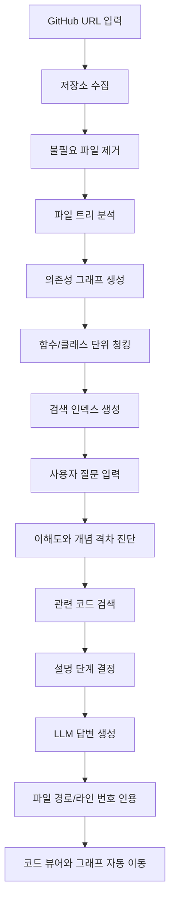

# RepoWise AI 전체 프로젝트 기획서

작성일: 2026년 7월 6일  
프로젝트명: RepoWise AI  
프로젝트 유형: AI 기반 코드베이스 이해 보조 웹 서비스

## 1. 프로젝트 한 줄 소개

RepoWise AI는 GitHub 저장소를 분석한 뒤, 사용자가 낯선 코드베이스를 빠르게 이해할 수 있도록 코드 인용, 구조 시각화, 맞춤형 설명을 제공하는 AI 코드베이스 가이드 서비스이다.

### 1.1 개발 전제

본 프로젝트는 대규모 팀 개발이 아니라, 1인 개발자가 AI 도구를 적극적으로 활용해 구현하는 것을 전제로 한다. 따라서 초기 구조는 여러 명이 동시에 병렬 개발하는 방식보다, 한 사람이 기능을 세로 단위로 완성해가며 검증할 수 있는 형태를 우선한다.

개발 방식의 핵심 원칙:

- 작은 기능 단위로 만들고 바로 실행해 검증한다.
- AI를 코드 생성, 리팩터링, 테스트 케이스 작성, 문서화 보조 도구로 사용한다.
- 프론트엔드와 백엔드를 완전히 분리해서 오래 개발하기보다, 하나의 사용자 흐름을 끝까지 연결하는 vertical slice 방식으로 진행한다.
- 처음부터 완성형 SaaS를 목표로 하지 않고, 개인 개발자가 유지 가능한 MVP를 먼저 만든다.

## 2. 프로젝트 배경

대규모 소프트웨어 프로젝트에 새로 참여한 개발자는 보통 다음과 같은 어려움을 겪는다.

- 폴더와 파일이 많아 어디서부터 봐야 할지 모른다.
- 함수 하나는 읽을 수 있어도 전체 흐름을 파악하기 어렵다.
- 문서가 오래되었거나 실제 코드와 맞지 않는다.
- 선배 개발자나 기존 팀원의 설명에 의존해야 한다.
- 일반 챗봇은 실제 코드 라인 근거 없이 추측성 설명을 할 수 있다.

RepoWise AI는 이 문제를 해결하기 위해 실제 소스코드를 분석하고, 답변마다 파일 경로와 라인 번호를 연결하여 사용자가 코드 근거를 직접 확인할 수 있게 한다.

## 3. 핵심 목표

프로젝트의 핵심 목표는 다음 네 가지이다.

1. 코드베이스 구조를 빠르게 이해하게 만든다.
2. AI 답변이 실제 코드 근거를 가지도록 만든다.
3. 사용자의 수준에 맞춰 설명 깊이를 조절한다.
4. 코드 문법, 구현 로직, 자료구조/알고리즘, 수학적 개념까지 단계적으로 설명한다.

즉, RepoWise AI는 단순한 챗봇이 아니라 코드베이스를 함께 탐색하는 AI 아키텍트이자 개인 맞춤형 프로그래밍 튜터 역할을 한다.

## 4. 주요 사용자

### 4.1 학회 신입 부원

기존 학회 프로젝트를 처음 보는 사용자이다. 코드 작성 경험은 있지만, 큰 프로젝트의 구조를 읽는 경험은 부족할 수 있다.

필요 기능:

- 쉬운 비유 설명
- 파일 구조 안내
- 핵심 진입점 추천
- 함수 단위 설명

### 4.2 신규 투입 개발자

회사 또는 팀 프로젝트에 새로 들어온 개발자이다. 빠르게 서비스 구조와 업무 관련 코드를 파악해야 한다.

필요 기능:

- 기능 흐름 설명
- 호출 관계 추적
- 관련 파일 묶음 추천
- 실제 라인 기반 인용

### 4.3 프로젝트 리뷰어

다른 팀의 프로젝트를 평가하거나 발표 준비를 하는 사용자이다.

필요 기능:

- 아키텍처 요약
- 주요 모듈 설명
- 의존성 그래프
- 기술 스택 추정

## 5. 서비스 전체 흐름



## 6. 프로젝트 구성

RepoWise AI는 크게 네 영역으로 구성된다.

| 영역 | 역할 |
| --- | --- |
| Frontend | 사용자가 저장소를 입력하고, 코드와 답변을 탐색하는 웹 화면 |
| Backend API | 저장소 분석, 검색, 채팅, 세션 관리를 담당 |
| AI/RAG Pipeline | 코드 청킹, 임베딩, 하이브리드 검색, 프롬프트 조립 |
| Learning Engine | 사용자 이해도 모델링, 개념 격차 진단, 설명 단계 결정 |
| Database/Storage | 저장소 메타데이터, 파일, 청크, 벡터, 채팅 상태 저장 |

## 7. 프론트엔드 구성

프론트엔드는 사용자가 실제로 프로젝트를 탐색하는 작업 공간이다.

### 7.1 주요 화면

#### 저장소 입력 화면

사용자가 GitHub 저장소 URL을 입력한다.

구성 요소:

- GitHub URL 입력창
- 분석 시작 버튼
- 지원 언어/제한 안내
- 최근 분석한 저장소 목록

#### 분석 진행 화면

저장소 분석 상태를 보여준다.

구성 요소:

- clone 진행 상태
- 파일 수집 상태
- 청킹 상태
- 임베딩 상태
- 실패 시 오류 메시지

#### 코드베이스 탐색 화면

서비스의 메인 화면이다.

구성 요소:

- 파일 트리
- Monaco 코드 뷰어
- AI 채팅 패널
- 의존성 그래프
- 학습 깊이 선택 패널
- 개념 설명 카드
- 현재 선택된 파일/라인 상태

#### 아키텍처 그래프 화면

파일 또는 모듈 간 관계를 시각화한다.

구성 요소:

- 파일 노드
- import/export 관계 edge
- 선택한 파일과 연결된 주변 파일 강조
- 그래프 노드 클릭 시 코드 뷰어 이동

### 7.2 핵심 UI 기능

| 기능 | 설명 |
| --- | --- |
| 파일 트리 | 저장소 폴더 구조 탐색 |
| 코드 뷰어 | 파일 내용 표시, 라인 이동, 하이라이트 |
| AI 채팅 | 코드 구조와 함수 흐름 질문 |
| citation link | 답변 속 파일 경로/라인 번호 클릭 |
| warp UI | 클릭 또는 AI 명령으로 코드 위치 자동 이동 |
| 이해도 버튼 | 쉬운 설명, 자세한 설명, 라인별 설명 선택 |
| 학습 깊이 컨트롤 | 문법, 로직, 아키텍처, CS, 수학 개념 설명 단계 선택 |
| 개념 카드 | 현재 코드와 연결된 문법/개념/공식 요약 |
| 미니 확인 질문 | 사용자가 이해했는지 확인하고 다음 설명 깊이를 조정 |
| 그래프 시각화 | 파일 간 의존성 관계 표시 |

## 8. 백엔드 구성

백엔드는 저장소 분석과 AI 답변 생성을 담당한다.

### 8.1 주요 모듈

| 모듈 | 역할 |
| --- | --- |
| Repository Service | GitHub 저장소 수집 |
| File Service | 파일 목록, 파일 내용, 파일 트리 관리 |
| Parser Service | import/export, 함수, 클래스 추출 |
| Chunking Service | 코드 조각 생성 및 라인 번호 보존 |
| Indexing Service | BM25와 벡터 인덱스 생성 |
| Retrieval Service | 사용자 질문에 맞는 코드 검색 |
| Chat Service | LLM 호출 및 답변 생성 |
| Session Service | 사용자 이해도 상태 관리 |
| UI Action Service | open_file 같은 화면 제어 명령 생성 |
| Learner Model Service | 사용자의 문법/구현/CS/수학 이해도 추적 |
| Concept Mapper Service | 코드 조각과 필요한 개념을 연결 |
| Explanation Planner Service | 사용자 수준에 맞는 설명 순서 결정 |
| Feedback Service | 버튼/퀴즈/후속 질문을 통해 이해도 갱신 |

### 8.2 API 예시

| Method | Endpoint | 설명 |
| --- | --- | --- |
| POST | `/repositories` | 저장소 등록 및 분석 시작 |
| GET | `/repositories/{id}` | 분석 상태 조회 |
| GET | `/repositories/{id}/tree` | 파일 트리 조회 |
| GET | `/repositories/{id}/files/{path}` | 파일 내용 조회 |
| GET | `/repositories/{id}/graph` | 의존성 그래프 조회 |
| POST | `/chat/sessions` | 채팅 세션 생성 |
| POST | `/chat/sessions/{id}/messages` | 질문 전송 |
| POST | `/chat/sessions/{id}/feedback` | 이해도 피드백 반영 |

## 9. AI 분석 파이프라인

AI 파이프라인은 RepoWise AI의 핵심이다. 단순히 코드를 LLM에 통째로 넣는 방식이 아니라, 검색 가능한 형태로 구조화한 뒤 필요한 근거만 조립한다.

### 9.1 데이터 수집

사용자가 입력한 GitHub URL에서 저장소를 가져온다.

처리 내용:

- 저장소 clone/download
- `.gitignore` 분석
- 불필요한 폴더 제외
- 바이너리 파일 제외
- 분석 대상 파일 선별

### 9.2 구조 분석

프로젝트 전체 구조를 파악한다.

처리 내용:

- 디렉터리 트리 생성
- import/export 파싱
- 파일 간 의존성 edge 생성
- framework와 entry point 후보 추정

### 9.3 코드 청킹

소스코드를 검색 가능한 작은 단위로 나눈다.

청킹 기준:

- 함수 단위
- 클래스 단위
- 큰 함수는 내부 블록 단위
- 라인 번호 보존
- 파일 경로 보존

### 9.4 하이브리드 검색

질문에 관련된 코드를 찾는다.

검색 방식:

- BM25 키워드 검색
- 벡터 의미 검색
- 파일명/함수명 가중치 부여
- 의존성 그래프 인접 파일 추가

### 9.5 답변 생성

검색된 코드 조각과 프로젝트 구조 정보를 LLM에 전달한다.

답변 조건:

- 실제 코드 근거가 있는 내용만 설명
- 파일 경로와 라인 번호 포함
- 사용자의 이해도 상태 반영
- 필요한 경우 화면 제어 명령 반환

### 9.6 학습 설명 오케스트레이션

RepoWise AI는 검색된 코드를 바로 설명하지 않고, 먼저 사용자가 어떤 층위에서 막힐 가능성이 있는지 판단한다.

설명 층위:

| 층위 | 설명 예시 |
| --- | --- |
| 문법 단위 | `async`, `await`, destructuring, type annotation 같은 언어 문법 |
| 코드 로직 | 조건문, 반복문, 함수 호출 순서, 데이터 흐름 |
| 프레임워크 개념 | React hook, FastAPI router, dependency injection |
| CS 개념 | 상태 관리, 캐싱, 트리 탐색, 그래프 의존성 |
| 알고리즘 개념 | 검색, 정렬, 점수 결합, chunk ranking |
| 수학적 개념 | 벡터 유사도, cosine similarity, BM25 점수, 정규화 |

예를 들어 사용자가 "벡터 검색이 왜 필요한지 모르겠어"라고 질문하면, 시스템은 단순히 Chroma 사용법을 설명하지 않고 다음 순서로 설명한다.

1. 키워드 검색과 의미 검색의 차이
2. 문장을 숫자 벡터로 바꾸는 이유
3. 벡터 간 가까움을 재는 방식
4. cosine similarity의 직관
5. 실제 RepoWise 검색 코드에서 이 개념이 쓰이는 위치

이 흐름을 위해 답변 생성 전에 `Explanation Planner`가 설명 목표와 필요한 선행 개념을 선택한다.

## 10. 데이터 저장 구조

### repositories

저장소 단위 정보를 저장한다.

- id
- url
- name
- branch
- status
- created_at

### files

분석된 파일 정보를 저장한다.

- id
- repository_id
- path
- language
- content
- line_count

### code_chunks

검색과 답변 근거가 되는 코드 조각을 저장한다.

- id
- repository_id
- file_path
- content
- start_line
- end_line
- symbol_name
- symbol_type
- embedding

### dependency_edges

파일 간 의존성 관계를 저장한다.

- id
- repository_id
- source_file
- target_file
- import_name

### chat_sessions

사용자 세션과 이해도 상태를 저장한다.

- id
- repository_id
- understanding_state
- created_at

### chat_messages

대화 기록과 citation 정보를 저장한다.

- id
- session_id
- role
- content
- citations
- ui_actions
- created_at

### learning_profiles

사용자별 이해도 상태를 저장한다.

- id
- session_id
- syntax_level
- logic_level
- architecture_level
- cs_level
- math_level
- preferred_explanation_style
- weak_concepts
- updated_at

### concept_events

사용자가 어떤 개념을 이해했거나 어려워했는지 기록한다.

- id
- session_id
- concept_name
- concept_type
- event_type
- evidence
- created_at

### explanation_traces

AI가 어떤 이유로 특정 설명 단계를 선택했는지 기록한다.

- id
- message_id
- selected_depth
- prerequisite_concepts
- cited_chunks
- follow_up_buttons

## 11. 사용자 이해도 상태 관리

RepoWise AI는 사용자에게 항상 같은 깊이로 설명하지 않는다. 특히 이 프로젝트의 핵심은 사용자가 코드 문법에서 막힌 것인지, 구현 흐름에서 막힌 것인지, 알고리즘/수학 개념에서 막힌 것인지를 구분하는 것이다.

관리할 상태:

- 사용자의 코드 이해 수준
- 언어 문법 이해 수준
- 구현 로직 이해 수준
- 프레임워크 이해 수준
- CS 개념 이해 수준
- 수학적 개념 이해 수준
- 선호 설명 방식
- 현재 보고 있는 파일
- 최근 질문 주제
- 마지막 피드백
- 반복해서 어려워한 개념 목록

설명 모드:

| 모드 | 설명 |
| --- | --- |
| 기본 설명 | 핵심 흐름 중심 |
| 쉬운 비유 | 비전공자도 이해 가능한 비유 중심 |
| 라인별 설명 | 코드 라인을 따라 세부 설명 |
| 아키텍처 설명 | 파일/모듈 관계 중심 |
| 테스트 관점 | 어떤 동작을 검증해야 하는지 중심 |
| 문법 설명 | 코드에 나온 언어 문법을 가장 작은 단위로 설명 |
| 개념 설명 | 자료구조, 알고리즘, 수학 개념을 코드와 연결해 설명 |

이해도 상태 예시:

```json
{
  "syntax_level": "beginner",
  "logic_level": "intermediate",
  "architecture_level": "beginner",
  "cs_level": "beginner",
  "math_level": "novice",
  "preferred_explanation_style": "step_by_step",
  "weak_concepts": ["cosine_similarity", "dependency_graph", "async_await"],
  "last_feedback": "too_hard"
}
```

설명 생성 방식:

1. 질문에서 사용자가 막힌 층위를 추정한다.
2. 필요한 선행 개념을 고른다.
3. 현재 코드 위치와 연결되는 설명만 우선 제공한다.
4. 이해도에 따라 문법 설명, 로직 설명, 수학 설명을 접거나 펼친다.
5. 답변 끝에서 다음 학습 버튼을 제안한다.

## 12. MVP 개발 범위

MVP에서는 다음 범위까지만 구현한다.

- public GitHub repository 분석
- TypeScript/JavaScript 우선 지원
- 파일 트리 조회
- import 기반 의존성 그래프
- 함수/클래스 단위 청킹
- 하이브리드 검색
- citation 포함 AI 답변
- citation 클릭 시 코드 위치 이동
- 간단한 이해도 피드백 버튼
- 문법/로직/개념 설명 단계 선택
- 약한 개념 목록 저장
- 코드와 연결된 수학 개념 설명

MVP 이후 확장 기능:

- private repository 연동
- GitHub OAuth
- PR diff 분석
- 테스트 코드 추천
- 자동 문서 생성
- 팀 단위 workspace
- 저장소 재분석/incremental indexing

## 13. 예상 폴더 구조

```text
RepoWiseAI/
  apps/
    web/
      src/
        app/
        components/
        features/
        hooks/
        lib/
        stores/
    api/
      app/
        main.py
        api/
        core/
        models/
        schemas/
        services/
        parsers/
        rag/
        workers/
  packages/
    shared/
      schemas/
      types/
  docs/
    project-plan.md
    architecture.md
    api-spec.md
    demo-scenario.md
  scripts/
  docker-compose.yml
  README.md
  .env.example
```

## 14. 개발 일정 초안

이 일정은 1인 개발자가 AI 도구를 사용해 진행하는 기준이다. 각 주차는 거대한 모듈을 완성하는 방식이 아니라, 실행 가능한 작은 결과물을 만들고 AI로 리팩터링과 테스트 보강을 반복하는 방식으로 진행한다.

### 1주차: 프로젝트 기반 구축

- Next.js 프로젝트 생성
- FastAPI 프로젝트 생성
- 기본 API 연결
- 공통 타입/환경변수 정리
- 저장소 입력 UI 초안

### 2주차: 저장소 분석 기능

- GitHub 저장소 수집
- `.gitignore` 처리
- 파일 트리 생성
- 파일 내용 조회 API
- TypeScript/JavaScript import 파싱

### 3주차: 청킹과 검색

- 함수/클래스 단위 청킹
- 라인 번호 메타데이터 저장
- BM25 검색
- 벡터 검색
- 하이브리드 검색 결과 병합

### 4주차: AI 답변과 citation

- LLM 프롬프트 구성
- 답변 schema 정의
- citation 렌더링
- citation 클릭 시 Monaco 이동
- hallucination 방지 규칙 적용

### 5주차: 인터랙티브 UX

- React Flow 의존성 그래프
- 그래프 노드 클릭 이동
- function calling 기반 `open_file` 액션
- 이해도 피드백 버튼
- 설명 모드별 응답 변화

### 6주차: 데모 완성

- 오류 처리
- 샘플 저장소 선정
- 발표 시나리오 작성
- UI 다듬기
- 테스트 질문 세트 작성
- 최종 발표 자료 준비

### 7주차: 학습 가이드 품질 개선

- 문법/로직/CS/수학 설명 프롬프트 분리
- 약한 개념 추적 로직 개선
- 미니 확인 질문 추가
- 같은 코드에 대해 설명 깊이를 바꾸는 데모 정리

### 8주차: 1인 개발 안정화

- 코드 구조 정리
- 테스트 보강
- 문서 정리
- 배포 자동화 최소 구성
- 발표/포트폴리오용 README 정리

## 15. 1인 AI 개발 운영 방식

이 프로젝트는 혼자 개발하는 것을 전제로 하므로, 역할 분담 대신 개발 루틴을 명확히 잡는다.

| 루틴 | 내용 |
| --- | --- |
| 기능 단위 개발 | 저장소 입력, 파일 트리, 검색, 채팅처럼 작은 단위로 완성 |
| AI 페어 프로그래밍 | 구현 전 설계 검토, 구현 후 리팩터링, 테스트 케이스 생성에 AI 활용 |
| 문서 우선 개발 | 큰 기능을 만들기 전에 짧은 설계 메모를 작성 |
| 데모 우선 검증 | 실제 사용 흐름이 되는지 매주 확인 |
| 기술 부채 정리 | 주 1회 구조 정리와 불필요한 코드 제거 |

1인 개발 기준 우선순위:

1. citation 정확도
2. 저장소 분석 안정성
3. 질문에 맞는 코드 검색 품질
4. 학습 깊이 조절 품질
5. UI 완성도

## 16. 발표 데모 시나리오

1. 사용자가 GitHub 저장소 URL을 입력한다.
2. RepoWise AI가 저장소를 분석한다.
3. 화면에 파일 트리와 의존성 그래프가 나타난다.
4. 사용자가 "로그인 흐름 설명해줘"라고 질문한다.
5. AI가 관련 파일과 함수 라인을 인용하며 답변한다.
6. 답변 속 citation을 클릭하면 코드 뷰어가 해당 라인으로 이동한다.
7. 사용자가 "쉬운 비유로 설명해줘"를 누른다.
8. AI가 같은 코드를 더 쉬운 방식으로 다시 설명한다.
9. 사용자가 "문법부터 설명해줘"를 누른다.
10. AI가 코드에 나온 문법을 작은 단위로 설명한다.
11. 사용자가 "수학 개념도 설명해줘"를 누른다.
12. AI가 검색 점수, 벡터 유사도 같은 개념을 코드와 연결해 설명한다.
13. 사용자가 "이 함수가 호출되는 곳 보기"를 누른다.
14. 그래프와 코드 뷰어가 관련 호출 위치로 이동한다.

## 17. 프로젝트 성공 기준

MVP 성공 기준:

- 저장소 분석이 끝나면 파일 트리와 코드 내용을 볼 수 있다.
- 특정 기능에 대해 질문하면 관련 코드 조각을 검색할 수 있다.
- AI 답변에 실제 파일 경로와 라인 번호가 포함된다.
- citation 클릭으로 코드 위치 이동이 된다.
- 사용자 피드백에 따라 설명 방식이 달라진다.
- 같은 코드에 대해 문법, 로직, CS, 수학 개념 설명을 단계별로 제공할 수 있다.
- 사용자가 어려워한 개념이 세션 상태에 반영된다.

최종 성공 기준:

- 신규 사용자가 문서 없이도 프로젝트 구조를 이해할 수 있다.
- AI 답변의 핵심 주장 대부분이 코드 citation으로 검증 가능하다.
- 코드 뷰어, 그래프, 채팅이 하나의 탐색 경험으로 연결된다.
- 사용자의 이해 수준에 따라 설명이 자연스럽게 쉬워지거나 깊어진다.
- 수학적 개념도 코드 구현 위치와 연결해서 설명된다.
- 발표 데모에서 "처음 보는 저장소를 AI와 함께 이해한다"는 가치가 명확히 전달된다.

## 18. 프로젝트의 차별점

RepoWise AI의 차별점은 다음과 같다.

- 일반 챗봇처럼 말만 하는 것이 아니라 실제 코드 위치로 이동시킨다.
- 코드 자동완성 도구처럼 한 줄 작성에 머물지 않고 전체 구조를 설명한다.
- 답변의 근거를 파일 경로와 라인 번호로 제공한다.
- 사용자의 이해도에 따라 설명 방식을 바꾼다.
- 코드 문법부터 수학적 개념까지 설명 깊이를 체계적으로 조절한다.
- 학회 신입 부원 교육, 신규 개발자 온보딩, 프로젝트 리뷰에 모두 활용할 수 있다.
