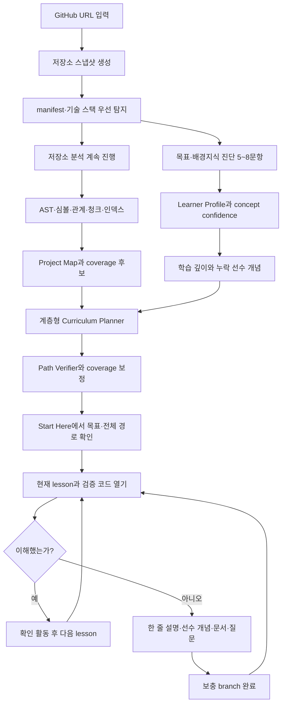
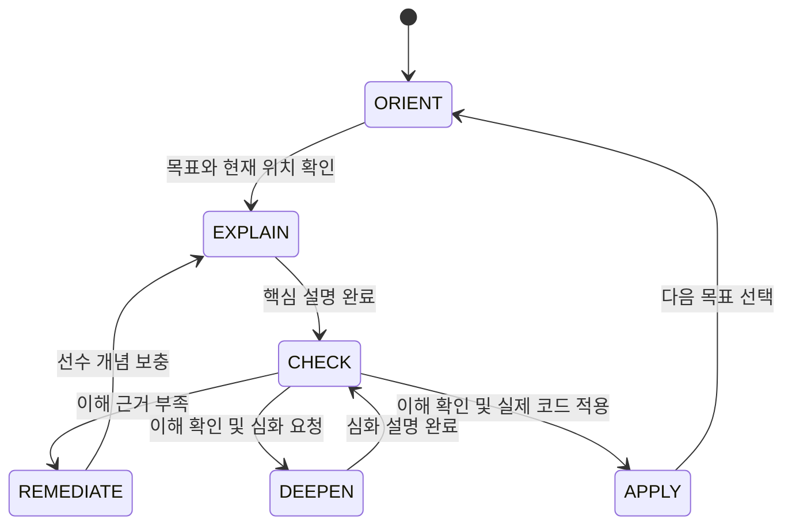

# RepoWise AI 전체 프로젝트 기획서

최초 작성일: 2026년 7월 6일
최종 개정일: 2026년 7월 12일
프로젝트명: RepoWise AI
프로젝트 유형: AI 기반 코드베이스 학습 및 이해 보조 웹 서비스, B2D SaaS

## 1. 프로젝트 한 줄 소개

RepoWise AI는 GitHub 코드베이스를 실제 코드 근거와 검증된 학습자료에 연결하여, 배경지식이 없는 사용자도 문법부터 실행 흐름, 아키텍처, 필요한 CS·수학 개념까지 자신의 수준에 맞게 배울 수 있도록 안내하는 인터랙티브 AI 코드 학습 가이드이다.

### 1.1 제품 정의

RepoWise AI는 단순한 저장소 요약 도구나 코드 Q&A 챗봇이 아니다. 사용자가 무엇을 질문해야 할지 모르는 상태에서도 프로젝트의 시작 지점과 핵심 흐름을 제안하고, 실제 코드와 선수 개념을 함께 설명하며, 이해 여부에 따라 다음 학습 단계를 조정하는 서비스이다.

제품이 수행하는 역할은 다음 세 가지이다.

1. **AI 코드베이스 가이드**: 파일 구조, 진입점, 기능 흐름과 영향 범위를 설명한다.
2. **근거 기반 코드 리뷰어**: 모든 코드 관련 주장을 저장소 스냅샷의 실제 파일과 라인에 연결한다.
3. **개인 맞춤형 프로그래밍 튜터**: 현재 코드를 이해하는 데 필요한 문법, 웹, 프레임워크, CS, 알고리즘, 수학 개념을 단계적으로 가르친다.

### 1.2 개발 전제

본 프로젝트는 1인 개발자가 AI 도구를 적극적으로 활용해 구현하는 것을 전제로 한다. 초기 구조는 조직 단위 마이크로서비스보다 하나의 기능을 화면부터 데이터까지 완성하는 vertical slice 방식과 유지 가능한 모듈형 모놀리스를 우선한다.

개발 원칙:

- 작은 기능 단위로 구현하고 즉시 실행해 검증한다.
- AI를 설계 검토, 코드 생성, 리팩터링, 테스트, 문서화 보조에 사용한다.
- 검색 품질과 citation 정확도를 UI 완성도보다 먼저 검증한다.
- 모델이나 프레임워크에 강하게 결합하지 않고 교체 가능한 인터페이스를 둔다.
- 처음부터 완성형 SaaS를 만들지 않고 하나의 대표 사용자 흐름을 안정적으로 완성한다.

## 2. 프로젝트 배경

코딩 경험이 적은 사용자나 AI로 프로젝트를 만든 바이브 코더는 다음과 같은 문제를 겪는다.

- 폴더와 파일이 많아 어디서부터 읽어야 할지 모른다.
- 자신이 무엇을 모르는지 몰라 적절한 질문을 만들기 어렵다.
- AI가 생성한 코드를 실행할 수는 있지만 수정하거나 확장할 근거가 부족하다.
- 함수 하나의 문법을 읽어도 전체 요청·데이터 흐름을 연결하지 못한다.
- 공식 문서의 개념 설명과 자신의 프로젝트 코드가 어떻게 연결되는지 알기 어렵다.
- 일반 챗봇의 설명이 실제 저장소 코드와 일치하는지 검증하기 어렵다.
- 문서가 오래되었거나 현재 커밋의 코드와 맞지 않을 수 있다.

RepoWise AI는 저장소를 특정 커밋 기준으로 분석하고, 코드 근거와 검증된 외부 학습 근거를 구분하여 제공한다. 사용자는 설명을 읽는 즉시 해당 코드 위치와 공식 자료를 확인할 수 있으며, 서비스는 사용자의 이해 상태에 따라 다음 설명과 학습 순서를 조정한다.

## 3. 핵심 목표와 원칙

### 3.1 핵심 목표

1. 사용자가 처음 보는 코드베이스에서 읽기 시작할 위치와 핵심 실행 흐름을 찾게 한다.
2. 코드 관련 주장을 실제 저장소 스냅샷의 파일·심볼·라인 근거에 연결한다.
3. 일반 개념은 신뢰할 수 있는 공식 학습자료에 연결하고 코드 근거와 구분한다.
4. 사용자가 막힌 개념과 현재 목적에 따라 설명 깊이와 순서를 조정한다.
5. 코드에 실제로 필요한 선수 개념만 선택적으로 설명한다.
6. 사용자가 코드를 이해한 뒤 안전한 다음 탐색이나 수정 행동을 선택하게 한다.

### 3.2 근거 원칙

RepoWise AI는 출처를 다음과 같이 구분한다.

| 근거 유형 | 사용 범위 | 표시 방식 |
| --- | --- | --- |
| Repository Code | 현재 저장소의 구현, 호출 관계, 설정 | 커밋, 파일 경로, 라인 범위 |
| Repository Docs | README, 프로젝트 문서, 주석 | 커밋, 파일 경로, 라인 범위 |
| Official Learning Source | 문법, 프레임워크, CS 개념 | 문서 제목, URL, 버전 또는 확인일 |
| Model Inference | 코드에서 직접 확정할 수 없는 해석 | 추론임을 명시하고 불확실성 표시 |

근거가 부족한 경우에는 그럴듯한 답을 생성하지 않고, 현재 인덱스에서 확인할 수 없는 내용과 추가로 필요한 정보를 알려준다.

### 3.3 범위 원칙

- 모든 코드에 억지로 수학 설명을 붙이지 않는다.
- 현재 코드를 이해하는 데 필요한 문법·웹·CS·알고리즘·수학 개념만 선택한다.
- 완전한 정적 분석이나 모든 호출 관계의 정확한 해석을 약속하지 않는다.
- 사용자의 수준은 질문의 난이도만으로 단정하지 않고 명시적 피드백과 확인 활동을 근거로 갱신한다.

## 4. 주요 사용자

### 4.1 바이브 코딩한 비전공자: 핵심 사용자

AI를 이용해 프로젝트를 만들었지만 생성된 코드의 구조와 원리를 충분히 이해하지 못해 기능 수정과 확장에 어려움을 겪는 사용자이다.

핵심 요구:

- “이 프로젝트는 어디서 시작되는가?”를 알려주는 안내형 진입 경험
- 현재 기능과 관련된 파일을 순서대로 보여주는 실행 흐름 탐색
- 기초 문법부터 필요한 원리까지 단계적으로 이어지는 설명
- 변경 시 영향을 받을 수 있는 코드와 확인할 테스트 안내
- 검증된 외부 학습자료와 현재 코드의 연결

### 4.2 학회 신입 부원 및 초보 개발자

기존 학회 프로젝트나 팀 프로젝트를 처음 접하며, 작은 예제는 읽어봤지만 실제 프로젝트 구조를 탐색한 경험이 부족한 사용자이다.

핵심 요구:

- 프로젝트 목적과 핵심 모듈 요약
- 추천 학습 순서와 주요 진입점
- 파일·함수·컴포넌트 단위 설명
- 프레임워크와 프로젝트 관례 설명
- 이해 확인 질문과 약한 개념 복습

### 4.3 프로젝트 리뷰어: 보조 사용자

다른 팀의 프로젝트를 평가하거나 발표를 준비하는 사용자이다. MVP의 최우선 사용자는 아니지만 동일한 분석 데이터를 활용할 수 있다.

핵심 요구:

- 아키텍처와 주요 기능 흐름 요약
- 기술 스택과 외부 의존성 확인
- 주요 모듈과 진입점 탐색
- 근거가 연결된 프로젝트 설명

## 5. 핵심 차별화 가치

### 5.1 질문을 기다리지 않는 안내형 탐색

배경지식이 없는 사용자는 좋은 질문을 만들기 어렵다. RepoWise AI는 분석이 끝난 뒤 다음 항목을 먼저 제시한다.

- 이 프로젝트가 해결하는 문제
- 실행이 시작되는 파일과 핵심 화면 또는 API
- 우선 이해할 핵심 기능 흐름 3~7개와 전체 커리큘럼
- 해당 프로젝트를 읽기 위해 필요한 선수 개념
- 추천 탐색 경로와 예상 학습 시간

### 5.2 코드와 개념을 분리해 검증하는 듀얼 근거

저장소 코드와 외부 학습자료를 서로 다른 코퍼스와 검색 경로로 관리한다. 코드 구현에 대한 설명은 코드로 검증하고, 일반 개념에 대한 설명은 공식 문서로 검증한다.

### 5.3 사용자별 개념 숙련도와 선수 관계

단순히 사용자를 초급·중급·고급으로 분류하지 않는다. `async/await`, `HTTP request`, `React state`처럼 개별 개념의 이해 근거와 신뢰도를 기록하고, 개념 간 선수 관계를 이용해 다음 설명을 결정한다.

### 5.4 답변과 화면의 양방향 연결

답변의 근거를 클릭하면 코드 뷰어가 해당 스냅샷의 파일과 라인으로 이동한다. 반대로 사용자가 코드를 선택하면 AI는 선택 범위와 주변 심볼을 질문 맥락으로 사용한다.

### 5.5 챗봇과 구분되는 Guided Learning Loop

RepoWise AI의 기본 경험은 자유 질문이 아니라 `경로 선택 → 코드 읽기 → 이해 확인 → 보충 또는 다음 단계 → 적용`의 반복이다. 채팅은 이 흐름을 보조하는 인터페이스이며 제품의 중심이 아니다.

#### 5.5.1 프로젝트 전체를 다루는 계층형 Learning Path

- 하나의 짧은 Tour가 아니라 `Path → Module → Lesson → Step` 구조로 커리큘럼을 만든다.
- 기본 module은 프로젝트 방향 잡기, 선수 개념, 아키텍처, 핵심 기능 흐름, 데이터·상태, 오류 처리, 테스트, 변경 영향과 적용으로 구성한다.
- 각 lesson은 하나 이상의 검증된 code chunk와 연결되며 목표, 예상 시간, 필요한 개념, 확인 활동, 완료 기준을 가진다.
- 저장소 규모와 사용자 수준에 따라 약 15~40개 step으로 구성하되, 중요하지 않은 파일을 억지로 포함하지 않는다.
- entry point, 핵심 심볼, route/API, 데이터 모델, 상태, 오류 처리, 테스트, 설정 파일의 coverage를 계산하고 빠진 영역이 있으면 경로를 보완한다.

#### 5.5.2 분석 중 사용자 진단

- 저장소 분석과 동시에 5~8개의 짧은 질문으로 학습 목표, 언어·프레임워크 경험, 코드 읽기 자신감, CS·수학 배경을 확인한다.
- 자기 평가는 낮은 confidence로 저장하고, 코드 실행 순서나 async 흐름을 묻는 짧은 객관식 결과는 더 강한 근거로 사용한다.
- manifest와 기술 스택이 확인되면 React, Next.js, TypeScript처럼 저장소에 실제 필요한 영역만 추가로 진단한다.
- 진단은 건너뛸 수 있으며, 응답하지 않은 영역은 초보로 단정하지 않고 `unknown`으로 유지한다.
- 분석 완료 전 응답이 없으면 기본 경로를 만들고, 나중에 진단이 끝나면 완료된 lesson은 보존한 채 앞으로의 경로만 조정한다.

#### 5.5.3 개념별 이해도 상태

- `async/await`, callback, HTTP처럼 코드에 실제 등장한 개념만 canonical concept ID로 연결한다.
- 이해 상태는 자기 신고, 확인 활동 정답, 코드 적용 결과를 이벤트로 저장하고 단순 질문 난이도로 추정하지 않는다.
- 각 개념은 mastery score와 confidence를 별도로 가지며, 근거가 부족하면 `unknown` 상태를 유지한다.
- 다음 Tour 단계와 설명 블록은 선수 개념의 상태를 보고 `REMEDIATE`, `EXPLAIN`, `DEEPEN` 중 하나를 선택한다.

#### 5.5.4 코드 읽기 활동

- 단계마다 “다음에 실행될 코드는?”, “이 값은 어디서 오는가?”, “이 조건이 거짓이면?” 같은 짧은 활동을 배치한다.
- 활동은 객관식, 실행 순서 배열, 코드 위치 선택의 세 종류로 시작하며 정답은 검증된 심볼·라인 근거에 연결한다.
- 결과는 단순 점수가 아니라 어떤 개념을 어떤 근거로 이해했는지 갱신하는 concept event가 된다.
- 오답 시 정답만 노출하지 않고 관련 라인 이동과 최소 선수 개념 보충을 제공한다.

#### 5.5.5 막힌 지점의 다중 보충 모드

- “어려워요”를 누르면 단순히 문장을 쉽게 바꾸지 않고 `코드 한 줄씩`, `선수 개념`, `작은 예시`, `관련 문서`, `AI에게 질문` 중 필요한 도움을 선택한다.
- 코드 한 줄씩 설명은 물리적인 한 줄이 아니라 AST statement와 multi-line expression 단위로 나누고 각 설명을 실제 라인 범위에 연결한다.
- 선수 개념 보충은 현재 step의 concept와 사용자 mastery를 비교해 가장 가까운 누락 prerequisite만 micro-lesson으로 삽입한다.
- 보충 lesson을 끝내면 원래 lesson으로 자동 복귀하며, 자유 질문을 해도 현재 경로와 복귀 위치가 유지된다.

#### 5.5.6 변경 영향 분석

- 선택한 심볼의 caller, callee, import/reference, 관련 테스트를 근거와 confidence와 함께 보여준다.
- 정적 분석으로 확인된 관계와 이름 기반 추정 관계를 UI에서 구분한다.
- “어디가 깨진다”라고 단정하지 않고 `직접 영향`, `간접 확인`, `근거 부족`으로 위험을 분류한다.
- 사용자는 영향 후보를 순서대로 열어 본 뒤 수정 전 체크리스트로 저장할 수 있다.

#### 5.5.7 공식 Learning Corpus와 외부 자료 추천

- 코드 사실은 Repository Corpus에서, 문법·프레임워크·수학 개념은 허용 목록의 공식 문서에서 각각 검색한다.
- 학습자료는 publisher, URL, 버전, 확인일, 언어, 난이도, 연결 concept ID를 저장한다.
- 일반 개념 설명은 현재 코드에 필요한 최소 범위만 검색하며 코드 citation과 학습자료 citation을 시각적으로 분리한다.
- 공식 문서를 우선 추천하고, 이후 검수된 교육 자료를 별도 source tier로 추가한다. 임의 URL을 모델이 직접 생성하지 않는다.
- 각 추천에는 “현재 코드의 어떤 개념 때문에 필요한가”, 난이도, 예상 학습 시간, 연결 lesson을 함께 표시한다.
- MVP 허용 출처는 MDN, TypeScript, React, Next.js, Python, FastAPI 등 현재 지원 스택의 공식 문서로 제한한다.

### 5.6 Start Here·Learning Path·AI 질문의 통합

세 기능은 별도 제품이 아니라 하나의 `Learning Journey Session`을 공유하는 서로 다른 화면이다.

- Start Here는 저장소 overview와 목표 선택을 담당하고 선택 결과로 Learning Path를 생성한다.
- Learning Path는 전체 curriculum과 현재 lesson, 완료 상태, 보충 branch를 관리한다.
- AI 질문은 현재 lesson, 선택 코드, concept gap, 최근 활동 결과를 자동으로 문맥에 포함한다.
- AI 답변의 `한 줄씩 보기`, `개념 배우기`, `문서 열기`, `경로에 추가`, `원래 lesson으로 돌아가기` action이 같은 세션을 갱신한다.
- 사용자는 어느 화면에서 시작해도 같은 현재 위치와 학습 상태를 보며, 질문을 마친 뒤 경로를 잃지 않는다.

## 6. 전체 사용자 흐름



### 6.1 첫 진입 경험

분석 완료 직후 빈 채팅창만 보여주지 않는다. 사용자는 다음 목표 중 하나를 선택한다.

- 프로젝트 전체 구조부터 보기
- 특정 기능 흐름 따라가기
- 선택한 코드 한 줄씩 이해하기
- 코드 수정 전 영향 범위 확인하기
- 이 프로젝트에 필요한 기초 개념 배우기

### 6.2 답변 기본 구조

비전공자용 기본 답변은 다음 순서를 따른다.

1. 한 문장 결론
2. 현재 코드에서 확인되는 위치
3. 실행 흐름 또는 데이터 흐름
4. 이해에 필요한 최소 선수 개념
5. 바꾸면 어떤 영향이 생길 수 있는지
6. 확인 질문 또는 다음 탐색 버튼

## 7. 주요 화면과 UX

### 7.1 저장소 입력 및 분석 화면

- GitHub URL 입력
- 지원 언어와 저장소 크기 제한 안내
- 분석 단계별 진행 상태
- manifest 탐지 후 저장소 기술 스택에 맞는 5~8문항 진단
- 진단 건너뛰기와 “나중에 맞춤 설정” 선택
- 분석과 진단을 병렬로 진행해 대기 시간을 학습 설정 시간으로 활용
- 분석 실패 원인과 재시도
- 분석 기준 브랜치와 커밋 SHA 표시

### 7.2 Start Here 화면

사용자가 질문을 만들기 전에 프로젝트의 전체 방향을 잡는 화면이다.

- 프로젝트 목적과 기술 스택
- 핵심 진입점
- 사용 목표와 진단 결과의 confidence 요약
- 3~7개의 핵심 기능 흐름과 curriculum module
- 전체 예상 시간, 필수 coverage, 선택 module
- 필요한 선수 개념과 먼저 보충할 영역
- “전체 경로 시작” 또는 “이 기능부터 따라가기” 명령

### 7.3 코드베이스 탐색 화면

기본 레이아웃:

- 왼쪽: 파일 트리와 심볼 목록
- 중앙: Monaco 코드 뷰어
- 오른쪽: 현재 Learning Journey의 경로·도움·근거
- 하단 탭: 아키텍처·호출 관계 그래프
- 상단 고정 영역: 전체 진행률, 현재 module/lesson, 원래 경로로 복귀
- 현재 lesson 내부: 기본 설명, 한 줄씩 보기, 선수 개념, 문서 추천, 질문 입력
- 보조 패널: 개념 카드, 근거 목록, curriculum coverage

### 7.4 핵심 인터랙션

| 기능 | 설명 |
| --- | --- |
| Citation Warp | 코드 citation 클릭 시 파일·라인·그래프 노드 이동 |
| Selection Ask | 선택한 코드 범위를 자동으로 질문 맥락에 포함 |
| Adaptive Path | 사용자 수준과 project coverage에 맞춘 module·lesson·step 안내 |
| Journey Context | Start Here, 현재 lesson, 코드 선택, AI 질문이 한 세션 상태를 공유 |
| Line Explain | AST statement 단위 설명과 Monaco 라인 강조 동기화 |
| Remediation Branch | 어려움 발생 시 선수 개념·예시·문서를 임시 lesson으로 삽입 |
| Resume Path | 보충 설명과 자유 질문 뒤 원래 lesson 위치로 복귀 |
| Evidence Badge | 코드, 저장소 문서, 공식 자료, 추론을 구분 표시 |
| Depth Control | 문법, 로직, 구조, 개념 설명을 선택적으로 펼침 |
| Concept Card | 현재 코드에 필요한 개념과 선수 관계 표시 |
| Check Step | 짧은 확인 질문 또는 코드 예측 활동 제공 |
| Impact View | 선택한 심볼의 caller, callee, 참조, 테스트 표시 |

## 8. 시스템 구성

| 영역 | 역할 |
| --- | --- |
| Frontend | 안내형 탐색, 코드 뷰어, 채팅, 근거, 그래프, 학습 상태 UI |
| Backend API | 저장소·세션·질문·피드백 API와 응답 스트리밍 |
| Analysis Worker | 저장소 수집, AST 분석, 심볼 그래프, 청킹, 임베딩 |
| Repository Retrieval | 심볼, 키워드, 벡터, 그래프 기반 코드 검색 |
| Learning Retrieval | 허용된 공식 학습자료와 개념 노드 검색 |
| RAG Orchestrator | 질문 분석, 검색 계획, 결과 융합, 컨텍스트 조립 |
| Assessment Engine | 목표·자기 평가·객관식 진단을 concept evidence로 변환 |
| Curriculum Planner | project map, coverage 후보, learner profile로 계층형 경로 생성 |
| Journey Orchestrator | Start Here, lesson, 보충 branch, 질문, 복귀 위치의 단일 상태 관리 |
| Learning Engine | 개념 격차 진단, 설명 계획, activity 채점, 숙련도 업데이트 |
| Grounding Verifier | 주장과 근거 ID, 라인 범위, 출처 유형 검증 |
| Database/Storage | 스냅샷, 심볼, 청크, 검색 기록, 학습 상태 저장 |

초기에는 이 영역을 하나의 FastAPI 코드베이스와 별도 worker 프로세스로 구현한다. 서비스 경계는 모듈로 유지하되 물리적인 마이크로서비스 분리는 하지 않는다.

## 9. AI 및 RAG 구조

### 9.1 전체 설계 원칙

AI/RAG 구조는 다음 두 파이프라인으로 분리한다.

- **오프라인 분석 파이프라인**: 저장소를 특정 커밋 기준으로 분석하고 검색 가능한 근거를 생성한다.
- **온라인 질의 파이프라인**: 질문과 현재 화면·학습 상태를 해석하고 필요한 검색과 설명을 수행한다.

LLM은 코드 구조 분석의 유일한 수단이 아니다. 파일 경로, 심볼, import, 호출 관계와 라인 번호는 가능한 한 결정적인 파서와 데이터베이스 조회로 확보하고, LLM은 검색 계획·설명·요약에 사용한다.

### 9.2 듀얼 코퍼스

#### Repository Corpus

- 소스코드와 설정 파일
- README와 저장소 내부 문서
- 함수, 클래스, 컴포넌트, API route 등의 심볼
- import, export, call, use, test 관계
- 저장소·모듈·파일·심볼 계층 요약

#### Learning Corpus

- JavaScript/TypeScript 공식 문서
- MDN Web Docs
- React 등 지원 프레임워크 공식 문서
- 프로젝트에서 직접 사용하는 라이브러리의 공식 문서
- 서비스가 직접 작성한 개념 카드와 선수 개념 관계

초기 버전은 임의의 웹 문서를 자동 수집하지 않는다. 허용 목록 기반 공식 출처만 사용하고, 문서 제목, URL, 확인일, 버전, 언어, 난이도 태그를 저장한다.

### 9.3 저장소 이해 모델

저장소는 다음 계층으로 표현한다.

```text
Repository Snapshot
  └─ Module / Directory
      └─ File
          └─ Symbol
              └─ Block Chunk
```

심볼 그래프의 대표 관계:

- `IMPORTS`
- `EXPORTS`
- `DEFINES`
- `CALLS`
- `USES`
- `EXTENDS`
- `ROUTES_TO`
- `TESTS`

모든 관계는 `confidence`와 `analysis_method`를 기록하여 정적 분석으로 확정된 관계와 추정 관계를 구분한다.

### 9.4 질문 분석과 검색 계획

온라인 질의는 다음 정보와 함께 해석한다.

- 사용자 질문
- 현재 선택된 파일·심볼·라인
- 최근 대화의 지시 대상
- 사용자의 선택한 목표와 설명 방식
- 개념별 숙련도와 최근 혼란 근거

질문 유형:

| 유형 | 예시 | 우선 검색 방식 |
| --- | --- | --- |
| Exact Lookup | “login 함수가 어디 있어?” | 경로·심볼 직접 검색 |
| Code Explanation | “이 줄이 무슨 뜻이야?” | 선택 범위와 부모 심볼 조회 |
| Flow Tracing | “로그인은 어떤 순서로 처리돼?” | 심볼·호출·route 그래프 탐색 |
| Concept Learning | “Promise가 왜 필요해?” | Learning Corpus와 코드 예시 검색 |
| Change Impact | “이 함수를 바꾸면 어디가 영향받아?” | 참조·caller·테스트 그래프 검색 |
| Project Orientation | “어디서부터 보면 돼?” | 계층 요약, 진입점, 핵심 흐름 검색 |

질문 유형에 따라 사용할 retriever, 검색 깊이, 그래프 확장 범위와 컨텍스트 예산을 결정한다.

### 9.5 하이브리드 검색과 재순위화

검색 채널:

1. 파일 경로와 심볼 이름의 정확 검색
2. 코드 토큰과 문서의 full-text 검색
3. 자연어 질문과 코드·문서의 dense vector 검색
4. 심볼 그래프 인접 노드 확장
5. Learning Corpus의 개념·공식 문서 검색

검색 결과는 점수의 단순 정규화 합산 대신 RRF(Reciprocal Rank Fusion)로 1차 융합한다. 이후 상위 후보에 한해 reranker가 질문 적합성, 근거 다양성, 현재 화면과의 연관성을 기준으로 재정렬한다. 동일 심볼의 중복 청크는 합치고 정의·caller·callee·테스트처럼 역할이 다른 근거는 유지한다.

### 9.6 컨텍스트 조립

Context Assembler는 토큰 수만 채우지 않고 다음 규칙으로 근거 묶음을 만든다.

- 질문을 직접 설명하는 핵심 심볼
- 핵심 심볼의 정의와 필요한 caller·callee
- 관련 설정, 타입, 테스트
- 필요한 범위의 모듈 요약
- 현재 설명에 필요한 개념 자료
- 각 근거의 `evidence_id`, 출처 유형, 위치, 스냅샷

전체 디렉터리 트리를 매번 넣지 않고 질문과 관련된 하위 트리와 미리 생성된 구조 요약만 사용한다.

### 9.7 답변 생성과 Grounding 검증

LLM은 자유 형식 문자열 대신 구조화된 응답을 생성한다.

- 설명 블록
- 주장별 `evidence_ids`
- 코드·개념 citation
- 다음 학습 행동
- UI action 후보
- 근거 부족 또는 불확실성 상태

Grounding Verifier는 다음을 검사한다.

- evidence ID가 검색 결과에 실제로 존재하는가
- 코드 citation의 파일과 라인 범위가 현재 스냅샷에 존재하는가
- 코드 주장이 외부 일반 문서만으로 뒷받침되지 않았는가
- 개념 주장이 신뢰 가능한 학습 출처를 가지는가
- 근거 없는 확정 표현이 포함되지 않았는가

검증을 통과한 evidence ID만 백엔드가 실제 클릭 가능한 citation으로 변환한다.

### 9.8 임베딩 운영 원칙

- 코드 검색에 맞는 query/document 입력 형식을 사용한다.
- `embedding_provider`, `model`, `version`, `dimension`, `input_template`를 인덱스에 기록한다.
- 모델이나 차원이 바뀌면 기존 벡터와 혼합하지 않고 새 인덱스 버전으로 전체 재임베딩한다.
- 임베딩 모델 선택은 대표 질문 세트의 Recall과 비용을 비교해 결정한다.

## 10. 학습 엔진

### 10.1 Concept Graph

개념을 문자열 목록이 아닌 식별 가능한 노드로 관리한다.

개념 예시:

- 언어 문법: 변수, 함수, 타입, closure, Promise, async/await
- 웹: HTTP, request/response, cookie, token, CORS
- 프레임워크: React component, props, state, hook
- CS: 상태 관리, 캐시, 트리, 그래프, 의존성
- 알고리즘·수학: 검색, 정렬, cosine similarity, 점수 정규화

개념 간에는 `PREREQUISITE_OF`, `RELATED_TO`, `APPLIED_IN` 관계를 둔다. MVP에서는 TypeScript/JavaScript와 대표 데모 저장소에 필요한 30~50개 개념으로 제한한다.

### 10.2 개념별 숙련도

사용자 수준은 영역별 단일 등급이 아니라 개념별 상태로 저장한다.

```json
{
  "concept_id": "async_await",
  "mastery_score": 0.35,
  "confidence": 0.6,
  "evidence_type": "check_answer",
  "attempt_count": 2,
  "last_seen_at": "2026-07-11T10:00:00Z"
}
```

영역별 수준은 개념별 기록을 집계한 표시값으로만 사용한다.

### 10.3 숙련도 갱신 원칙

- 질문이 고급스럽다는 이유만으로 숙련도를 올리지 않는다.
- 같은 질문을 반복했다는 이유만으로 약한 개념으로 확정하지 않는다.
- 명시적 “이해했어요/어려워요” 피드백, 확인 질문, 코드 예측, 적용 활동을 근거로 갱신한다.
- 모든 자동 갱신에는 근거 유형과 confidence를 저장한다.
- 사용자가 학습 상태를 확인하고 직접 수정할 수 있게 한다.

### 10.4 Teaching State Machine



이 상태 머신은 대화 흐름을 관리하고, 개념별 숙련도는 별도의 Learner Model이 관리한다.

## 11. 데이터 저장 구조 요약

| 데이터 | 목적 |
| --- | --- |
| `repositories` | 저장소 기본 정보 |
| `repository_snapshots` | branch, commit SHA, 분석·인덱스 버전 |
| `files` | 스냅샷별 파일 메타데이터와 content hash |
| `symbols` | 함수, 클래스, 컴포넌트, route 등 |
| `symbol_edges` | import, call, use, test 등의 관계 |
| `code_chunks` | 계층형 코드 검색 단위와 라인 범위 |
| `learner_profiles` / `learner_goals` | 사용자 목표, 선호 방식, 영역별 자기 평가와 confidence |
| `assessment_sessions` / `assessment_responses` | 분석 중 진단 문항, 답변, 채점 근거 |
| `learning_paths` / `learning_modules` | 스냅샷·사용자별 curriculum과 coverage 목표 |
| `learning_lessons` / `learning_steps` | module 내부 lesson, 검증 코드, 개념, 활동과 순서 |
| `learning_sessions` / `journey_events` | Start Here·경로·질문이 공유하는 현재 위치와 이벤트 |
| `remediation_branches` | 한 줄 설명·선수 개념·문서 학습 후 복귀할 임시 경로 |
| `explanation_artifacts` | statement별 설명, 근거 라인, 모델·프롬프트·profile 버전 |
| `learning_activities` / `activity_attempts` | 코드 읽기 활동, 정답 근거, 시도 결과 |
| `impact_analysis_runs` | 선택 심볼의 영향 후보, 관계, confidence와 확인 상태 |
| `knowledge_sources` | 공식 학습자료의 출처·버전·확인일 |
| `knowledge_chunks` | 학습자료 검색 단위 |
| `concepts` / `concept_edges` | 개념과 선수 관계 |
| `chat_sessions` / `chat_messages` | 대화와 UI 맥락 |
| `learner_concept_mastery` | 사용자별 개념 숙련도와 근거 |
| `concept_events` | 혼란, 확인, 심화 요청 이벤트 |
| `retrieval_runs` | 질문별 검색 계획, 후보와 점수 |
| `answer_claims` / `citations` | 주장과 검증된 근거 연결 |

## 12. MVP 개발 범위

### 12.1 MVP에 포함

- public GitHub repository 분석
- TypeScript/JavaScript 저장소 우선 지원
- branch와 commit SHA가 고정된 repository snapshot
- 파일 트리와 AST 기반 함수·클래스·import/export 추출
- 심볼 테이블과 import graph, 제한된 call/use 관계
- repository·file·symbol 계층형 청킹
- 심볼 정확 검색, full-text 검색, vector 검색, RRF 융합
- 대표 질문에 대한 선택적 reranking
- 코드 evidence ID 기반 citation과 클릭 이동
- 분석 중 5~8문항의 선택 가능한 사용자 목표·배경지식 진단
- 대표 저장소의 필수 coverage를 만족하는 4~8개 module, 약 15~40개 step의 계층형 경로
- Start Here, Learning Path, AI 질문이 공유하는 단일 Learning Journey Session
- 단계별 “이해했어요/어려워요” 피드백과 코드 위치 자동 이동
- AST statement 기반 코드 한 줄씩 설명과 근거 라인 동기화
- 누락 선수 개념 micro-lesson, 공식 문서 추천, 보충 후 원래 lesson 복귀
- 객관식 또는 실행 흐름 예측형 코드 읽기 활동
- 선택 심볼의 caller, callee, import, 테스트 기반 제한적 영향 분석
- 공식 JavaScript/TypeScript·웹 문서 중심의 제한된 Learning Corpus
- 30~50개 핵심 Concept Graph
- Start Here 프로젝트 안내와 추천 탐색 경로
- 문법·로직·구조·필요 개념의 선택적 설명
- 명시적 피드백과 간단한 확인 질문 기반 숙련도 기록
- 구조화된 답변과 검증된 UI action
- 검색·citation 품질 평가 세트

### 12.2 MVP에서 제외

- private repository와 GitHub OAuth
- 임의 웹 전체를 대상으로 한 실시간 검색
- 모든 언어의 정교한 AST와 완전한 call graph
- 코드 실행과 자동 수정 반영
- PR diff 분석과 자동 리뷰
- 조직·팀 권한, 결제, 요금제
- 실시간 다중 사용자 협업
- 대규모 멀티에이전트 구조
- 장기간 학습 추천 알고리즘과 정교한 지식 추적 모델

### 12.3 MVP 기준 대표 저장소

대표 데모 저장소는 다음 조건을 만족하는 1~2개로 고정한다.

- TypeScript 또는 JavaScript 기반
- React/Next.js와 간단한 API 흐름 포함
- 로그인, 데이터 조회, 상태 관리처럼 설명 가능한 기능 존재
- 테스트 또는 명확한 README 보유
- 지나치게 크지 않고 발표 중 분석과 탐색이 가능

## 13. 8주 개발 일정

### 1주차: 분석 코어와 평가 기준

- FastAPI, Next.js, PostgreSQL 개발 환경 구성
- 로컬 fixture 저장소와 repository snapshot 구현
- 파일 필터, 트리, content hash 생성
- 질문 유형별 초기 평가 세트 작성

### 2주차: AST와 심볼 그래프

- TypeScript/JavaScript AST parser adapter
- 함수·클래스·import/export·route 추출
- symbols와 symbol_edges 저장
- 라인 범위와 스냅샷 검증 테스트

### 3주차: 계층형 인덱싱과 검색

- 계층형 code chunk 생성
- full-text와 vector 인덱스
- 정확 심볼 검색과 RRF 융합
- Recall@K, MRR 측정 시작

### 4주차: 근거 기반 답변

- Query Analyzer와 Retrieval Planner
- Context Assembler
- 구조화된 답변 schema
- evidence ID 기반 citation과 Grounding Verifier

### 5주차: 코드 탐색 UI와 Guided Code Tour 기준선

- Start Here 화면
- 파일 트리, Monaco Editor, 채팅
- citation warp와 selection ask
- 제한된 심볼·의존성 그래프
- 3~5단계 Guided Path 기준선, 진행 상태, 코드 warp

### 6주차: 사용자 진단과 통합 Learning Session

- 분석 중 stack-aware 진단과 learner profile
- Start Here·Tour·AI 질문의 공유 session/context
- 핵심 개념 30~50개와 선수 관계
- 완료 위치·보충 branch·복귀 위치 event

### 7주차: 계층형 Curriculum과 보충 학습

- project map·feature cluster·coverage inventory
- module·lesson·step path planner와 verifier
- AST statement 기반 한 줄 설명
- 선수 개념 micro-lesson과 코드 읽기 activity

### 8주차: Learning Corpus·통합 UX·평가

- 허용된 공식 학습자료 인덱스와 개념 카드
- 코드 근거와 학습 근거의 UI 구분
- 경로·도움·질문·복귀가 이어지는 단일 패널
- curriculum coverage와 learner-fit 평가
- 비전공자 사용성 테스트
- 검색·citation·grounding 회귀 평가
- 실패·비용·지연 처리
- 대표 데모 시나리오 고정
- 배포, README, 발표 자료 정리

## 14. 1인 AI 개발 운영 방식

| 운영 원칙 | 실행 방식 |
| --- | --- |
| Vertical Slice | fixture 분석부터 화면 citation까지 한 흐름씩 완성 |
| Evaluation First | 검색 기능 추가 전 기대 근거와 질문 세트 작성 |
| Provider Adapter | LLM, embedding, parser를 인터페이스 뒤에 배치 |
| Trace Everything | 검색 후보, 선택 근거, 모델·프롬프트 버전 기록 |
| Weekly Demo | 매주 실제 브라우저에서 한 사용자 흐름 확인 |
| Scope Gate | 대표 저장소에서 검증되지 않은 확장은 다음 단계로 이동 |

우선순위:

1. 스냅샷과 citation 무결성
2. 질문에 맞는 검색 계획과 근거 검색 품질
3. 근거 없는 주장 차단
4. 비전공자가 따라갈 수 있는 설명 순서
5. 개념별 개인화
6. 시각적 완성도

## 15. 품질 평가 계획

### 15.1 평가 데이터

대표 저장소마다 다음 유형의 질문과 정답 근거를 만든다.

- 파일·심볼 위치 질문
- 기능 실행 흐름 질문
- 선택 코드 설명 질문
- 변경 영향 질문
- 문법·프레임워크 개념 질문
- 근거가 없어 답변을 보류해야 하는 질문

초기 목표는 저장소당 20~30개, 총 40~60개의 평가 질문이다.

### 15.2 핵심 지표

| 영역 | 지표 |
| --- | --- |
| Retrieval | Recall@5/10, MRR, nDCG |
| Citation | 존재하는 파일·라인 비율, 스냅샷 일치율 |
| Grounding | 근거가 연결된 검증 가능 주장 비율 |
| Assessment | 진단 완료율, 자기 평가와 활동 결과의 calibration, unknown 유지율 |
| Curriculum | 필수 영역 coverage, 핵심 symbol·flow 포함률, path verifier 통과율 |
| Learning | 설명 난이도 적합성, 확인 활동 전후 이해 변화, 불필요한 선수 개념 비율 |
| Journey | lesson 완료율, 어려움 이후 회복률, 보충 후 원래 경로 복귀율 |
| Line Explain | statement 라인 해석률, 설명-라인 연결 정확도 |
| Activity | concept별 정답률, 재시도 개선율, 근거 라인 도달률 |
| Impact | 관계 근거 해석률, false direct-impact 비율 |
| UX | 첫 핵심 파일 도달 시간, citation 클릭 성공률, 무질문 탐색 성공률 |
| Operation | 저장소 인덱싱 시간·비용, 응답 p95 지연 |

## 16. 발표 데모 시나리오

1. 사용자가 AI로 만든 TypeScript 저장소 URL을 입력한다.
2. RepoWise AI가 분석 기준 커밋과 진행 상태를 표시한다.
3. 분석이 진행되는 동안 사용자가 목표·언어 경험·async 이해를 묻는 짧은 진단에 답한다.
4. Start Here가 프로젝트 목적, 진단 결과, 전체 module과 예상 시간을 함께 보여준다.
5. 사용자가 “전체 경로 시작”을 선택하고 첫 lesson의 검증된 route 라인으로 이동한다.
6. 사용자가 “어려워요 → 코드 한 줄씩”을 선택하면 statement별 설명과 라인 강조가 동기화된다.
7. `async/await`가 부족하다고 확인되면 현재 경로에 선수 개념 micro-lesson이 임시로 삽입된다.
8. 공식 문서 추천과 현재 저장소 예제를 함께 보고 짧은 확인 활동에 답한다.
9. 보충 lesson 완료 후 원래 route lesson의 정확한 위치로 복귀한다.
10. 사용자가 AI 질문을 해도 현재 module·lesson·선택 코드가 질문 맥락에 포함된다.
11. 답변의 “경로에 추가” action으로 필요한 심화 lesson이 앞으로의 curriculum에 반영된다.
12. 핵심 기능·데이터·오류·테스트 module을 거친 뒤 변경 영향 checklist로 적용 활동을 마친다.

## 17. 주요 리스크와 대응

| 리스크 | 대응 |
| --- | --- |
| LLM이 citation을 만들어냄 | evidence ID만 선택하게 하고 백엔드가 경로·라인으로 변환 |
| 저장소 변경으로 라인 불일치 | commit SHA와 snapshot별 파일 hash 저장 |
| 검색 방식별 점수 척도 불일치 | RRF 기반 융합과 평가 기반 weight 조정 |
| import graph만으로 흐름 설명 부족 | symbol graph와 제한된 call/use 관계 추가 |
| 외부 자료의 품질·버전 문제 | 공식 출처 허용 목록, 버전·확인일 저장 |
| 사용자 수준을 잘못 추정 | 명시적 피드백과 확인 활동 중심으로 갱신 |
| 진단 문항이 분석 대기를 늘림 | 분석과 병렬 수행, 2분 이내, 건너뛰기와 사후 재계획 지원 |
| 경로가 길고 지루해짐 | 필수·선택 module 구분, 목표별 path budget, 이미 아는 개념 skip |
| 보충 학습 때문에 원래 흐름을 잃음 | remediation branch와 return lesson/step을 session에 명시적으로 저장 |
| 외부 링크를 AI가 만들어냄 | source registry에 등록된 canonical URL만 서버가 렌더링 |
| 비전공자가 질문을 만들지 못함 | Start Here와 목표 기반 Guided Path 제공 |
| 1인 개발 범위 초과 | 언어·저장소·개념 수와 질문 유형을 고정 |
| 대형 저장소 비용 증가 | 크기 제한, 증분 가능 content hash, 선택적 임베딩 |

## 18. 성공 기준

### MVP 성공 기준

- 저장소 분석 결과가 특정 commit SHA에 고정된다.
- 대표 질문에서 관련 코드 근거를 안정적으로 검색한다.
- 모든 코드 citation이 실제 스냅샷의 파일과 라인에 존재한다.
- 코드 주장과 일반 개념 출처가 UI에서 구분된다.
- 사용자가 질문을 만들지 않아도 Start Here에서 첫 탐색을 시작할 수 있다.
- 진단을 건너뛰거나 완료한 경우 모두 근거와 confidence가 있는 learner profile이 생성된다.
- 대표 저장소에서 계층형 경로가 필수 project coverage 기준을 충족한다.
- 모든 lesson과 step이 실제 code chunk, concept 또는 등록된 학습자료에 연결된다.
- Start Here, 경로, AI 질문이 하나의 current lesson과 선택 상태를 공유한다.
- 어려움 피드백과 코드 읽기 활동이 근거 있는 concept event로 저장된다.
- 한 줄 설명이 실제 AST statement 라인 범위와 동기화된다.
- 보충 lesson과 자유 질문 후 원래 경로로 복귀할 수 있다.
- 같은 코드에 대해 사용자가 필요한 설명 층위를 선택할 수 있다.
- 관련 코드에 필요한 선수 개념을 공식 자료와 연결해 설명한다.
- 확인 활동과 피드백이 개념별 학습 상태에 근거와 함께 저장된다.
- 검색과 답변 품질을 고정된 평가 세트로 반복 측정할 수 있다.

### 최종 성공 기준

- 비전공자가 문서 없이도 대표 저장소의 목적과 핵심 실행 흐름을 설명할 수 있다.
- 사용자가 답변의 핵심 주장을 직접 코드 또는 공식 자료에서 검증할 수 있다.
- 코드 뷰어, 심볼 그래프, AI 설명, 학습 경로가 하나의 탐색 경험으로 연결된다.
- 사용자가 계층형 경로를 따라 프로젝트의 목적, 아키텍처, 핵심 흐름, 데이터, 오류, 테스트를 설명할 수 있다.
- 같은 저장소라도 진단 결과와 학습 목표에 따라 설명 깊이와 선수 lesson이 달라진다.
- 변경 영향 화면이 정적 근거와 추정을 구분하고 확인할 파일을 순서대로 제시한다.
- 시스템이 불필요한 개념을 나열하지 않고 현재 코드에 필요한 선수 개념을 선택한다.
- 발표 데모에서 “AI가 만든 코드를 사용자가 자기 지식으로 바꾸는 서비스”라는 가치가 명확하게 전달된다.

## 19. 프로젝트의 차별점

RepoWise AI의 핵심 차별점은 저장소를 요약하는 데 있지 않다.

- 사용자가 질문을 만들기 전부터 읽기 시작할 위치와 학습 경로를 제안한다.
- 코드 근거와 일반 개념 근거를 서로 다른 코퍼스와 citation으로 관리한다.
- 파일 단위 검색을 넘어 심볼과 실행 흐름 관계를 활용한다.
- 사용자 수준을 단일 초급·중급 등급이 아니라 개념별 근거로 관리한다.
- 설명 후 이해 확인, 보충, 심화, 실제 적용으로 이어지는 학습 상태 머신을 가진다.
- AI가 생성한 프로젝트를 실행 가능한 결과물에서 사용자가 이해하고 확장할 수 있는 코드베이스로 바꿔준다.

최종적으로 RepoWise AI는 “저장소에 대해 답하는 AI”가 아니라 “사용자가 자신의 저장소를 이해하고 다음 코드를 스스로 판단하도록 돕는 AI 코드 학습 환경”을 지향한다.
