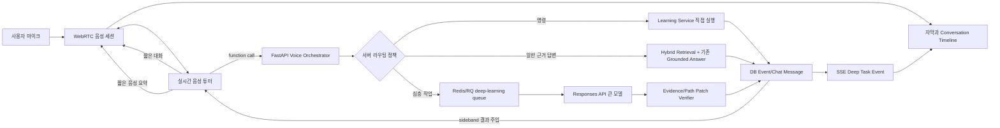

# RepoWise AI 실시간 음성 학습 파이프라인 구현 계획

작성일: 2026-07-13  
대상 저장소: `D:\workspace\RepoWiseAI`

## 1. 결론

사용자가 제안한 방향은 맞다. 다만 비용과 정확도를 함께 잡으려면 단순한 `작은 모델 → 큰 모델` 2단계보다 아래 3개 실행 경로가 낫다.

1. **결정적 명령 경로**: “다음”, “이해했어”, “멈춰”, “2번”처럼 뜻이 명확한 학습 조작은 LLM 없이 즉시 실행한다.
2. **실시간 음성 경로**: 인사, 짧은 확인, 되묻기, 턴테이킹, 작업 시작 안내는 저지연 음성 모델이 담당한다.
3. **근거·심층 작업 경로**: 저장소 코드 설명, 공식 학습자료 탐색, 영향 분석, 학습 경로 생성·재계획은 기존 검색 파이프라인과 큰 추론 모델이 담당한다.

실시간 모델은 계속 사용자를 상대하는 “음성 튜터”로 남고, 큰 모델은 서버의 제한된 도구로 호출한다. 큰 모델로 대화 주체 자체를 넘기는 handoff 방식보다 목소리, 페르소나, 현재 레슨 상태가 안정적으로 유지된다.

가장 먼저 만들 수직 기능은 다음 하나다.

> 현재 레슨에서 말로 질문 → 기존 코드 검색과 근거 검증 → 화면에 상세 답변과 citation 표시 → 짧은 음성 요약 재생

이 기능은 현재 `LearningSession`, `ChatSession`, `HybridRetriever`, `GroundedAnswerGenerator`를 그대로 재사용할 수 있어 위험이 가장 낮다.

## 2. 현재 구현에서 재사용할 기반

현재 RepoWise AI에는 음성 입출력만 없을 뿐, 학습 튜터의 핵심 상태와 근거 기반 답변 경로는 이미 있다.

- `apps/api/app/api/learning.py`
  - 학습 경로 시작 시 `LearningSession`과 연결된 `ChatSession`을 생성한다.
  - 현재 module, lesson, step, concept, 선택 코드, 보충 경로를 관리한다.
  - 이해함, 어려움, 건너뛰기, activity 답변, 보충 학습, 재계획 API가 있다.
- `apps/api/app/api/chat.py`
  - 현재 학습 상태를 검색 query와 답변 prompt에 주입한다.
  - `질문 → HybridRetriever → EvidenceRegistry → GroundedAnswerGenerator → citation` 흐름이 있다.
- `apps/api/app/ai/answers.py`
  - OpenAI Responses API Structured Outputs를 사용한다.
  - 모델이 선택한 evidence ID를 서버 allowlist로 다시 검증한다.
- `apps/api/app/models.py`
  - `LearningSession`, `JourneyEvent`, `ChatSession`, `ChatMessage`, `RetrievalRun`이 있다.
- `apps/web/src/components/RepositoryWorkbench.tsx`
  - 저장소, 학습 경로, 현재 레슨, 코드 선택, 채팅 상태를 조정한다.
- `apps/web/src/components/LearningJourneyPanel.tsx`
  - 학습 경로, 현재 레슨, 보충 학습, checkpoint, 질문 UI가 한 화면에 있다.
- `apps/api/app/queue.py`
  - Redis와 RQ를 이용한 비동기 worker 기반이 있다. 현재는 저장소 분석 작업만 처리한다.

따라서 새 음성 챗봇을 별도로 만들지 않는다. **기존 Learning Journey에 음성 transport와 작업 orchestrator를 추가**한다.

현재 해결해야 할 핵심 공백은 다음과 같다.

- WebRTC, WebSocket, SSE, 스트리밍 응답이 없다.
- `GENERATION_MODEL` 하나만 있어 실시간·일반·심층 역할이 나뉘지 않는다.
- 채팅 기록은 저장하지만 직전 대화가 현재 답변 prompt에 들어가지 않아 “그 부분 다시” 같은 후속 발화가 약하다.
- 학습자료는 정적 URL 목록이고, 최신 본문 탐색과 freshness 검증은 없다.
- 긴 작업을 위한 별도 queue, 작업 상태, 취소, 재접속 복구가 없다.
- 현재 `asking`과 `journeyBusy`가 요청 완료까지 화면 동작을 넓게 막는다.

## 3. 목표와 비목표

### 3.1 목표

- 사용자가 현재 학습 단계에서 자연스럽게 말하고 AI 음성 답변을 듣는다.
- 사용자가 AI 발화 중 끼어들 수 있다.
- 짧은 대화와 긴 작업을 분리해 긴 작업 중에도 계속 대화하고 코드를 탐색할 수 있다.
- 모든 코드 사실은 현재 snapshot의 검증된 evidence에 연결한다.
- 로드맵 변경은 즉시 덮어쓰지 않고 preview와 사용자 적용을 거친다.
- 음성·텍스트 질문이 같은 `LearningSession`과 `ChatSession`을 사용한다.
- 모델명, reasoning effort, timeout, 비용 한도를 운영 설정으로 교체할 수 있다.

### 3.2 이번 범위의 비목표

- 원본 음성 장기 저장과 음성 재학습 데이터 수집
- 처음부터 Researcher, Planner, Evaluator를 별도 agent로 세분화하는 것
- 큰 모델이 코드 근거 또는 curriculum 후보를 자유롭게 발명하도록 하는 것
- 음성 UI를 별도 페이지나 별도 학습 세션으로 분리하는 것
- 모든 질문을 실시간 모델이 직접 답하게 하는 것

## 4. 권장 전체 구조



중요한 경계는 다음과 같다.

- 브라우저와 OpenAI 사이의 음성 media는 WebRTC로 직접 흐른다. FastAPI가 raw audio를 중계하지 않는다.
- 표준 OpenAI API key는 서버에만 둔다.
- tool 실행, DB 접근, retrieval, 로드맵 변경은 모두 서버가 소유한다.
- 실시간 음성 모델은 큰 모델의 원시 reasoning을 받지 않는다. 검증된 `voice_summary`, `screen_answer`, `citations`, `proposed_patch`만 받는다.
- 앱 DB의 `LearningSession`이 canonical 학습 상태다. Realtime conversation과 Responses state는 transport/model state일 뿐 source of truth가 아니다.

## 5. 모델 역할과 초기 설정

모델 ID는 2026-07-13 OpenAI 공식 문서를 기준으로 한 초기값이다. alias는 동작이 바뀔 수 있으므로 배포 직전에 다시 확인하고, 회귀 테스트가 필요한 운영 환경에서는 snapshot 고정을 검토한다.

| 역할 | 초기값 | 사용 범위 | 비고 |
|---|---|---|---|
| 실시간 음성 | `gpt-realtime-2.1-mini` | 음성 in/out, 짧은 대화, 되묻기, tool 선택 | 한국어 tool routing 평가가 기준 미달이면 `gpt-realtime-2.1`로 상향 |
| 현재 일반 답변 | 기존 `gpt-5.4-mini` 유지 | 현재 코드 근거 기반의 보통 질문 | 음성 MVP에서 기존 동작을 먼저 보존 |
| 심층 기본 | `gpt-5.6-terra`, `reasoning.effort=medium` | 다중 파일 설명, 로드맵 proposal, 자료 비교 | 품질과 비용 균형 |
| 심층 상향 | `gpt-5.6-sol` 또는 `gpt-5.6`, `reasoning.effort=high` | 복잡한 영향 분석, 다수 자료 종합 | 명시적인 품질 조건을 통과할 때만 사용 |
| 고처리량 보조 | `gpt-5.6-luna` | 분류, 요약, 후보 정리 | 서버 규칙으로 대체 가능한지 먼저 확인 |
| 별도 STT | 기본적으로 사용하지 않음 | 녹취 전용 세션이 필요할 때만 | `gpt-realtime-whisper` 또는 transcribe 계열 검토 |

OpenAI 공식 Voice agents 가이드는 자연스러운 저지연 대화에는 speech-to-speech, 중간 텍스트 통제가 더 중요한 흐름에는 STT → text agent → TTS chain을 구분한다. RepoWise의 주 UX는 자연스러운 학습 대화이므로 native speech-to-speech를 기본으로 하되, 화면용 확정 transcript와 서버의 학습 이벤트는 별도로 저장한다.  
참고: [Voice agents](https://developers.openai.com/api/docs/guides/voice-agents), [Realtime overview](https://developers.openai.com/api/docs/guides/realtime)

실시간 mini는 바로 비용 기본값으로 고정하지 않는다. 공식 비용 가이드도 큰 실시간 모델로 prompt와 도구 동작을 먼저 검증한 뒤 mini를 평가하라고 안내한다. 개발 초기에는 두 모델을 동일 eval로 비교하고, mini가 아래 조건을 만족할 때 운영 기본값으로 채택한다.  
참고: [Realtime costs](https://developers.openai.com/api/docs/guides/realtime-costs)

- deep route 재현율 95% 이상
- 결정적 학습 명령 정확도 98% 이상
- 코드 사실을 직접 답하는 금지 동작 0건
- 사용자 끼어들기와 tool call 중복 실행 0건

### 5.1 초기 환경 설정

기존 `GENERATION_MODEL`의 의미를 갑자기 바꾸지 않고 역할별 설정을 추가한다.

```dotenv
# 기존 일반 grounded answer
GENERATION_MODEL=gpt-5.4-mini

# 실시간 음성
REALTIME_MODEL=gpt-realtime-2.1-mini
REALTIME_QUALITY_FALLBACK_MODEL=gpt-realtime-2.1
REALTIME_REASONING_EFFORT=low
VOICE_MAX_SESSION_SECONDS=1800

# 심층 작업
DEEP_MODEL=gpt-5.6-terra
DEEP_REASONING_EFFORT=medium
DEEP_ESCALATION_MODEL=gpt-5.6-sol
DEEP_ESCALATION_REASONING_EFFORT=high
DEEP_TASK_TIMEOUT_SECONDS=180
DEEP_QUEUE_NAME=repowise-deep-learning

# 운영 정책
OPENAI_BACKGROUND_MODE_ENABLED=false
STORE_FINAL_VOICE_TRANSCRIPTS=true
VOICE_TRANSCRIPT_RETENTION_DAYS=30
```

`Settings`에는 문자열만 추가하지 말고 허용 모델 역할, timeout 범위, retention 범위를 시작 시 검증한다. 실제 model ID는 한곳의 `ModelRoutingPolicy`에서만 읽고 service나 prompt에 직접 하드코딩하지 않는다.

## 6. 서버 라우팅 정책

모델이 혼자 라우팅 결정을 소유하면 안 된다. Realtime 모델은 function을 제안하고, 서버가 다시 검증한다.

### 6.1 Route 0: 모델 없는 즉시 명령

아래 발화는 한국어 normalization과 현재 UI 상태를 이용해 deterministic parser가 처리한다.

- “멈춰”, “말 그만”, “음소거”
- “다음”, “이전”, “원래 레슨으로 돌아가”
- “이해했어”, “아직 어려워”, “건너뛸래”
- checkpoint에서 “1번”, “2번”, “A”, “B”
- “다시 읽어줘”, “짧게 말해줘”

상태 변경 명령은 현재 가능한 action인지 서버에서 확인한다. 예를 들어 checkpoint가 없는 상태의 “2번”은 실행하지 않고 되묻는다.

### 6.2 Route 1: 실시간 모델의 짧은 응답

아래는 검색 없이 1~2문장으로 답할 수 있다.

- 인사와 연결 확인
- 사용자의 발화를 잘못 들었을 때 되묻기
- “자료를 찾기 시작했어요”, “결과가 준비되면 알려드릴게요” 같은 진행 안내
- 현재 화면에 이미 확정되어 전달된 label 읽기
- 큰 답변의 검증된 `voice_summary` 읽기

실시간 모델의 system instruction에는 다음 제한을 둔다.

- 코드 동작, 파일 위치, 외부 문서 내용, 사용자 숙련도를 추측하지 않는다.
- 사실 질문은 반드시 서버 tool로 보낸다.
- URL, 긴 코드, citation 목록을 음성으로 읽지 않는다.
- 답변은 기본 20초 이내로 말하고 상세 내용은 화면에 있다고 안내한다.

### 6.3 Route 2A: 기존 일반 grounded answer

다음은 현재 `HybridRetriever + GroundedAnswerGenerator`를 service로 추출해 재사용한다.

- 현재 선택 코드의 실행 흐름
- 현재 레슨의 개념 설명
- 한두 파일 범위의 책임과 호출 관계
- 짧은 후속 질문

현재 REST 채팅과 음성 tool이 같은 service를 호출해야 retrieval과 citation 검증이 갈라지지 않는다.

### 6.4 Route 2B: 큰 모델 심층 작업

아래 조건 중 하나면 `deep_task`를 생성한다.

- 사용자가 “찾아줘”, “비교해줘”, “로드맵을 짜줘/바꿔줘”, “전체 영향”, “왜 이런 구조인지 깊게”를 요청한다.
- 다수 파일, 다수 concept, 외부 최신 자료, 로드맵 변경이 필요하다.
- 일반 검색 결과의 evidence가 부족하거나 상충한다.
- 예상 입력이 크거나 결과 생성이 5초를 넘을 가능성이 높다.
- 결과가 학습 경로 또는 mastery에 영향을 준다.

큰 모델도 무제한 권한을 갖지 않는다.

- 코드 질문: 서버가 제공한 evidence ID만 선택한다.
- 로드맵: deterministic curriculum planner가 만든 후보 ID만 정렬·선택·설명한다.
- 공식 자료: allowlist 도메인, canonical URL, fetched/verified 시점을 서버가 검증한다.
- mastery: 모델은 제안만 하고, 점수 변경은 기존 scoring policy가 계산한다.

### 6.5 라우터 의사코드

```python
def route_voice_turn(turn, context):
    command = deterministic_command_parser(turn.transcript, context)
    if command.is_confident and command.is_allowed:
        return execute_command(command)

    proposed = realtime_tool_call(turn)
    validated = validate_tool_request(proposed, context)

    if validated.needs_clarification:
        return ask_short_clarification(validated.reason)
    if validated.task_type in DEEP_TASK_TYPES:
        return enqueue_deep_task(validated, context.snapshot())
    return run_grounded_answer(validated, context.snapshot())
```

## 7. 한 번의 음성 턴이 처리되는 순서

### 7.1 세션 연결

1. 사용자가 `대화 시작`을 누른다. 사용자 gesture 이후에만 마이크 권한을 요청한다.
2. 브라우저가 `RTCPeerConnection`과 audio track을 만들고 SDP offer를 FastAPI로 보낸다.
3. FastAPI는 표준 API key와 session config로 OpenAI `/v1/realtime/calls` unified interface를 호출한다.
4. FastAPI는 SDP answer를 브라우저에 반환하고 OpenAI 응답의 call ID를 `voice_sessions`에 저장한다.
5. FastAPI는 같은 Realtime session에 sideband WebSocket을 연결한다.
6. 브라우저는 audio track으로 응답 음성을 재생하고 data channel의 transcript/status event를 UI에 표시한다.

이 방식은 표준 API key를 브라우저에 노출하지 않고, 서버가 같은 세션에서 instructions와 tool call을 통제할 수 있다. ephemeral client secret 방식도 공식 지원되지만, RepoWise는 학습 상태와 tool 실행을 서버가 소유하므로 unified interface + sideband를 기본 설계로 선택한다.  
참고: [Realtime WebRTC](https://developers.openai.com/api/docs/guides/realtime-webrtc), [Server-side controls](https://developers.openai.com/api/docs/guides/realtime-server-controls)

### 7.2 짧은 대화 또는 학습 명령

1. VAD 또는 push-to-talk 종료로 사용자 발화가 확정된다.
2. transcript와 당시 학습 context snapshot을 `voice_turns`에 저장한다.
3. 결정적 parser가 명령을 먼저 확인한다.
4. 명령이면 기존 learning service를 호출하고 `JourneyEvent`를 기록한다.
5. 결과 label을 Realtime session에 넣고 짧게 확인 발화한다.

### 7.3 일반 코드 질문

1. Realtime 모델이 `answer_with_repository_evidence` function을 요청한다.
2. sideband handler가 tool arguments를 검증한다.
3. 추출한 공용 chat service가 현재 retrieval과 evidence 검증을 실행한다.
4. 상세 답변과 citation을 기존 `ChatMessage`에 저장한다.
5. `voice_summary`만 function output으로 Realtime 모델에 돌려준다.
6. Realtime 모델이 짧게 말하고 화면에는 상세 답변과 코드 이동 버튼을 표시한다.

### 7.4 긴 자료 탐색 또는 로드맵 생성

1. Realtime 모델이 `start_deep_learning_task`를 호출한다.
2. 서버가 idempotency key, 권한, task type, context version을 확인한다.
3. `deep_tasks(status=queued)`를 만들고 RQ `deep-learning` queue에 넣는다.
4. tool에는 `{task_id, status: "queued", acknowledgement}`를 즉시 반환한다.
5. 음성 튜터는 “자료를 찾는 동안 계속 질문해도 돼요”라고 말한다.
6. worker가 `retrieving → reasoning → verifying → ready` 상태를 DB에 기록한다.
7. 브라우저는 SSE로 상태와 최종 화면 결과를 받는다.
8. sideband handler는 완료된 `voice_summary`를 같은 Realtime session에 주입하고 `response.create`를 요청한다.
9. 음성 세션이 끝났다면 화면 알림만 남긴다. 새 세션을 자동 시작하지 않는다.

Realtime function tool은 앱이 business logic을 실행하고 `function_call_output`을 반환하는 경우의 공식 기본 경로다. 내부 DB와 학습 상태를 다루는 RepoWise tool을 MCP나 클라이언트 코드에 직접 맡기지 않는다.  
참고: [Realtime with tools](https://developers.openai.com/api/docs/guides/realtime-mcp)

## 8. Function tool 계약

초기에는 tool을 세 개만 둔다. tool 수가 늘어나면 mini 모델의 선택 정확도와 prompt cost가 나빠질 수 있다.

```json
{
  "name": "answer_with_repository_evidence",
  "description": "현재 저장소와 레슨의 검증된 코드 근거로 질문에 답한다.",
  "parameters": {
    "type": "object",
    "properties": {
      "question": {"type": "string"},
      "answer_depth": {"enum": ["beginner", "standard", "advanced"]}
    },
    "required": ["question"]
  }
}
```

```json
{
  "name": "start_deep_learning_task",
  "description": "자료 탐색, 영향 분석, 로드맵 생성처럼 시간이 걸리는 작업을 시작한다.",
  "parameters": {
    "type": "object",
    "properties": {
      "task_type": {
        "enum": ["research_materials", "impact_analysis", "roadmap_proposal", "deep_explanation"]
      },
      "request": {"type": "string"},
      "source_policy": {"enum": ["repository_only", "official_docs_only"]}
    },
    "required": ["task_type", "request"]
  }
}
```

```json
{
  "name": "apply_learning_action",
  "description": "현재 레슨에서 허용된 결정적 학습 동작을 실행한다.",
  "parameters": {
    "type": "object",
    "properties": {
      "action": {
        "enum": ["understood", "needs_help", "skip", "next", "return", "submit_choice"]
      },
      "choice_id": {"type": ["string", "null"]}
    },
    "required": ["action"]
  }
}
```

클라이언트가 `learning_session_id`, `lesson_id`, `selection`, mastery 값을 tool argument로 결정하게 하지 않는다. 서버는 인증된 voice session에서 이 context를 조회한다. 그래야 오래된 화면 상태와 임의 ID 주입을 막을 수 있다.

심층 결과의 공통 schema는 다음처럼 둔다.

```json
{
  "task_id": "dtask_...",
  "status": "ready",
  "voice_summary": "현재 코드는 요청 검증과 저장을 분리해요. 핵심 근거 두 곳을 화면에 표시했어요.",
  "screen_answer": "상세한 근거 기반 설명",
  "evidence_ids": ["ev_..."],
  "learning_sources": [],
  "proposed_path_patch": null,
  "confidence": 0.91,
  "model_metadata": {
    "route": "deep_explanation",
    "model": "configured-model",
    "reasoning_effort": "medium",
    "prompt_version": "deep-tutor-v1"
  }
}
```

## 9. API 설계

### 9.1 음성 연결

```text
POST /api/learning-sessions/{session_id}/voice/offer
Content-Type: application/sdp
Body: SDP offer
Response: SDP answer
```

서버가 내부적으로 생성한 `voice_session_id`는 response header 또는 별도 JSON bootstrap 응답으로 전달한다. 구현 편의상 `POST /voice/sessions`로 metadata를 먼저 만들고 `/voice/sessions/{id}/offer`로 SDP를 보내는 2단계도 가능하지만, 한 방식을 선택해 테스트에서 고정한다.

```text
POST /api/voice-sessions/{voice_session_id}/stop
GET  /api/voice-sessions/{voice_session_id}
```

### 9.2 심층 작업

```text
POST /api/learning-sessions/{session_id}/deep-tasks
GET  /api/deep-tasks/{task_id}
POST /api/deep-tasks/{task_id}/cancel
GET  /api/learning-sessions/{session_id}/events?after={sequence}
```

- `POST`는 `Idempotency-Key`를 필수로 받는다.
- SSE event는 단조 증가 `sequence`를 가지며 재접속 때 `Last-Event-ID` 또는 `after`로 복구한다.
- 전달은 at-least-once로 보고 클라이언트가 `event_id`를 중복 제거한다.
- task 취소는 DB에 `cancel_requested_at`을 기록하고 worker가 retrieval/reasoning/verifying 단계 사이에서 확인한다.

### 9.3 로드맵 proposal과 적용 분리

```text
POST /api/learning-sessions/{session_id}/roadmap-proposals
GET  /api/roadmap-proposals/{proposal_id}
POST /api/roadmap-proposals/{proposal_id}/apply
POST /api/roadmap-proposals/{proposal_id}/reject
```

큰 모델이 만든 결과를 바로 현재 path에 적용하지 않는다. 화면에서 아래 diff를 보여 준 뒤 사용자가 적용한다.

- 보존되는 완료 lesson
- 새로 추가되는 선수 개념과 이유
- 순서가 바뀌는 미완료 lesson
- 선택 또는 제거되는 lesson
- 예상 학습 시간 변화

`apply`는 proposal의 `base_revision`과 현재 `LearningPath.model_metadata.revision`이 같을 때만 허용한다. 다르면 409로 재생성을 요구한다.

## 10. 데이터 모델과 migration

다음 Alembic migration을 추가한다.

### 10.1 `voice_sessions`

| 필드 | 용도 |
|---|---|
| `id` | 내부 voice session ID |
| `learning_session_id`, `chat_session_id` | 기존 학습·대화 연결 |
| `provider_call_id` | sideband 연결과 추적 |
| `status` | connecting, active, reconnecting, ended, failed |
| `realtime_model`, `prompt_version` | 재현성과 회귀 분석 |
| `started_at`, `ended_at`, `last_event_at` | 수명주기 |
| `disconnect_reason` | 종료 진단 |

### 10.2 `voice_turns`

| 필드 | 용도 |
|---|---|
| `voice_session_id`, `chat_message_id` | 음성 턴과 기존 기록 연결 |
| `role`, `transcript`, `transcript_status` | interim은 UI만, final만 DB 저장 |
| `intent`, `route`, `tool_name` | 라우팅 관측 |
| `context_snapshot` | 발화 확정 당시 lesson, step, selection, path revision |
| `interrupted`, `audio_duration_ms` | UX 측정 |
| `speech_end_to_ack_ms`, `first_audio_ms`, `completed_ms` | latency 측정 |

### 10.3 `deep_tasks`

| 필드 | 용도 |
|---|---|
| `learning_session_id`, `source_turn_id` | 요청 원점 |
| `task_type`, `status`, `progress_stage` | 수명주기 |
| `context_snapshot`, `base_revision` | 늦게 끝난 작업의 상태 오염 방지 |
| `rq_job_id`, `provider_response_id` | worker/provider 추적 |
| `request_fingerprint`, `idempotency_key` | 중복 실행 방지 |
| `result_message_id`, `result_payload` | 화면·음성 결과 |
| `model_metadata`, `token_usage`, `latency_breakdown` | 비용과 품질 분석 |
| `cancel_requested_at`, `finished_at`, `error_code` | 운영 상태 |

### 10.4 `orchestration_runs` 또는 기존 metadata 확장

초기 MVP에서는 별도 표 대신 `voice_turns`와 `deep_tasks.model_metadata`로 시작할 수 있다. 다단계 모델과 retry가 늘면 `orchestration_runs`를 분리한다.

### 10.5 저장 정책

- 원본 음성은 기본 저장하지 않는다.
- interim transcript는 브라우저 메모리에만 두고 final transcript만 저장한다.
- transcript 저장을 끈 사용자는 최소 명령 event와 진단 metadata만 남긴다.
- `ChatMessage.model_metadata`에 `modality=voice`, `voice_turn_id`, `route`, `model`, `prompt_version`을 기록한다.

## 11. 백엔드 파일 구조

```text
apps/api/app/
  api/
    voice.py                 # WebRTC offer, stop, session status
    deep_tasks.py            # task create/read/cancel, SSE
    roadmap_proposals.py     # preview/apply/reject
  voice/
    session_manager.py       # voice session lifecycle
    sideband.py              # server control WebSocket
    orchestrator.py          # route validation and tool dispatch
    commands.py              # deterministic Korean commands
    prompts.py               # realtime tutor instructions
    schemas.py               # tool and event schemas
  ai/
    router.py                # role-based model config and escalation
    deep_tutor.py            # Responses structured output
  services/
    grounded_chat.py         # current chat.py business logic extraction
    learning_actions.py      # learning endpoints and voice tools reuse
    roadmap_proposals.py     # candidate, verify, apply
  workers/
    deep_learning.py         # long-running task stages
  events/
    learning_stream.py       # DB-backed SSE projection
```

현재 `apps/api/app/api/chat.py`의 retrieval과 answer 생성 코드를 먼저 `services/grounded_chat.py`로 옮긴다. REST endpoint와 voice orchestrator가 이 service를 함께 호출해야 한다. learning endpoint 내부 로직도 API handler를 tool에서 직접 호출하지 말고 service 함수로 추출한다.

Queue는 최소 두 개로 나눈다.

```text
repowise-analysis       # 기존 저장소 분석
repowise-deep-learning  # 질문, 자료, 로드맵
```

필요하면 `deep-interactive`와 `deep-background` priority queue로 추가 분리하되 MVP부터 queue를 과도하게 늘리지 않는다.

## 12. 프론트엔드 구조와 UX

```text
RepositoryWorkbench
├─ useRealtimeLearningSession
├─ useLearningEventStream
├─ FileTree
├─ CodePanel
└─ AssistantPanel
   ├─ Journey / Mastery / Overview tabs
   ├─ ConversationTimeline
   ├─ DeepTaskTray
   └─ VoiceSessionDock   # 탭 바깥, 연결이 유지되는 위치
```

`VoiceSessionDock`은 `LearningJourneyPanel` 안이 아니라 `AssistantPanel`의 탭 콘텐츠 바깥에 둔다. 이해도나 프로젝트 개요 탭으로 이동하거나 모바일 pane이 바뀌어도 component가 unmount되어 음성 연결이 끊기면 안 된다. 실제 WebRTC hook은 더 위인 `RepositoryWorkbench`가 소유한다.

### 12.1 신규 파일

```text
apps/web/src/
  hooks/
    useRealtimeLearningSession.ts
    useLearningEventStream.ts
  lib/
    realtime.ts
    deep-tasks.ts
  components/voice/
    VoiceSessionDock.tsx
    ConversationTimeline.tsx
    DeepTaskTray.tsx
    RoadmapProposalCard.tsx
```

### 12.2 음성 상태와 작업 상태 분리

```ts
type VoiceState =
  | "idle"
  | "connecting"
  | "listening"
  | "user_speaking"
  | "fast_thinking"
  | "speaking"
  | "reconnecting"
  | "error";

type DeepTaskState =
  | "queued"
  | "retrieving"
  | "reasoning"
  | "verifying"
  | "ready"
  | "failed"
  | "cancelled";
```

현재 `asking`이나 `journeyBusy` 하나로 이 상태를 표현하지 않는다. `deep_task=reasoning`이어도 `voice=listening`이고 코드 탐색이 가능해야 한다.

### 12.3 Dock에 항상 보일 항목

- 대화 시작·종료
- 마이크 음소거 또는 push-to-talk
- AI 발화 즉시 중단
- 자막 표시 여부
- 듣는 중, 답변 중, 자료 찾는 중, 연결 복구 중 상태
- 현재 lesson과 선택 코드 범위
- 실행 중 deep task 수

### 12.4 Timeline 표현

- interim transcript
- 확정 사용자 발화
- 작은 모델의 즉답
- “공식 자료 탐색 · reasoning” 같은 task card
- 큰 모델의 상세 답변과 citation
- 음성으로 읽은 짧은 요약 표시
- 실패, 취소, 재시도

AI 발화 중 사용자가 말하기 시작하면 재생 audio를 중단하되 진행 중 deep task는 취소하지 않는다. URL, 코드 block, 긴 citation은 읽지 않고 화면에만 표시한다.

### 12.5 접근성과 fallback

- 마이크 권한은 명시적 버튼 클릭 뒤 요청한다.
- 권한 거부, WebRTC 미지원, provider 장애 때 기존 텍스트 composer를 그대로 유지한다.
- 상태와 확정 자막에 `aria-live="polite"`를 사용한다.
- 발화 중단 버튼은 키보드와 screen reader에서 항상 접근 가능해야 한다.
- 음성이 AI로 생성된 것임을 첫 사용과 설정 화면에서 명확히 알린다.
- 개발용 fallback으로 browser SpeechRecognition/TTS를 쓸 수 있지만 운영 기본 경로로 삼지 않는다.

## 13. Prompt와 context 관리

Realtime context와 Responses context를 자동으로 공유된다고 가정하지 않는다.

### 13.1 canonical context snapshot

각 확정 발화와 deep task에 다음을 저장한다.

```json
{
  "learning_session_id": "learnses_...",
  "snapshot_id": "snap_...",
  "path_revision": 3,
  "current_module_id": "mod_...",
  "current_lesson_id": "lesson_...",
  "current_step_id": "step_...",
  "focus_concept_ids": ["async_await"],
  "selection": {
    "file_id": "file_...",
    "start_line": 10,
    "end_line": 25
  },
  "preferred_style": "beginner"
}
```

사용자가 task 실행 중 다른 레슨이나 파일로 이동해도 결과 근거는 시작 당시 snapshot에 고정한다. 단, 결과를 현재 path에 적용할 때는 revision conflict를 검사한다.

### 13.2 대화 memory

현재 질문만 보내는 구조를 다음처럼 확장한다.

- 직전 4~8개의 final transcript/answer를 짧은 conversation window로 사용한다.
- 오래된 대화는 `conversation_summary`로 압축한다.
- 코드 evidence는 매 턴 다시 retrieval하고 이전 답변의 citation을 사실 근거로 재사용하지 않는다.
- “그 부분”, “아까 함수”는 직전 선택과 message reference를 먼저 resolve한다.
- Realtime context에는 긴 코드나 전체 답변을 누적하지 않고 현재 상태와 짧은 요약만 둔다.

### 13.3 prompt caching과 truncation

Realtime의 고정 instructions와 tool schema는 세션 중 앞부분을 유지해 자동 prompt caching 효과를 얻는다. 대화가 길어지면 낮은 token window와 `retention_ratio < 1`을 설정하고, DB의 canonical summary를 다시 주입한다.  
참고: [Realtime costs and truncation](https://developers.openai.com/api/docs/guides/realtime-costs)

## 14. 자료 탐색 파이프라인

현재 정적 공식 URL 추천을 바로 버리지 않는다. 다음 두 층으로 확장한다.

### 14.1 1차: curated official corpus

- 기존 MDN, TypeScript, React, Next.js 공식 URL을 seed로 사용한다.
- 문서 title, canonical URL, product/version, fetched_at, verified_at, content hash를 저장한다.
- 본문을 chunk/embedding하여 현재 retrieval index와 분리된 learning corpus index를 만든다.
- 추천은 `현재 lesson concept → corpus retrieval → 큰 모델 요약 → URL/domain verifier` 순서로 처리한다.

### 14.2 2차: 최신 공식 자료 검색

- `source_policy=official_docs_only`일 때만 web search를 허용한다.
- 도메인 allowlist와 source list를 서버가 검사한다.
- 검색 snippet만으로 상세 사실을 확정하지 않고 원문을 fetch/verify한 뒤 인용한다.
- 결과에는 추천 이유, 난이도, 예상 시간, 연결 concept, verified_at을 표시한다.
- 같은 문서가 이미 corpus에 있고 freshness가 충분하면 외부 검색을 생략한다.

Responses API의 `file_search`와 `web_search`는 이 단계에 사용할 수 있지만, provider tool 결과도 RepoWise의 source policy와 citation verifier를 통과해야 한다.  
참고: [File search](https://developers.openai.com/api/docs/guides/tools-file-search), [Web search](https://developers.openai.com/api/docs/guides/tools-web-search)

## 15. 로드맵 생성과 재계획 원칙

현재 deterministic curriculum planner는 유지한다. 큰 모델의 역할은 후보 발명자가 아니라 **검증된 후보의 편집자**다.

1. 기존 planner가 repository coverage와 learner mastery로 lesson candidate를 만든다.
2. 서버가 각 candidate에 evidence, prerequisite, 예상 시간, 필수 여부를 붙인다.
3. 큰 모델은 candidate ID를 선택·정렬하고 학습 목표와 이유를 작성한다.
4. verifier가 필수 영역 coverage, prerequisite 순서, evidence 존재, 최대 lesson 수를 검사한다.
5. 기존 path와 diff를 만드는 proposal을 저장한다.
6. 사용자가 적용하면 완료 lesson을 보존한 채 미완료 부분만 갱신한다.

검증 실패 시 모델에게 자유 수정시키기보다 deterministic planner 결과로 fallback한다.

## 16. 비동기 작업과 Responses background mode

앱 수준의 canonical 비동기 상태는 RQ와 `deep_tasks`가 관리한다.

- 보통의 deep task는 RQ worker가 Responses API를 호출하고 DB stage를 갱신한다.
- 수십 초 이상 걸릴 수 있는 최고 reasoning 작업만 feature flag 아래에서 `background=true`를 검토한다.
- provider background response ID를 저장하고 poller 또는 검증된 webhook으로 완료를 반영한다.
- provider background가 실패해도 앱의 task ID, idempotency, retry 정책은 유지한다.

OpenAI background mode는 장기 작업의 timeout을 피하고 polling할 수 있지만 응답을 일정 시간 저장하므로 Zero Data Retention과 호환되지 않는다. 조직의 보존 정책을 확인하기 전에는 기본 활성화하지 않는다.  
참고: [Background mode](https://developers.openai.com/api/docs/guides/background)

## 17. 보안과 개인정보

- 표준 OpenAI API key를 브라우저 bundle, localStorage, client log에 넣지 않는다.
- unified WebRTC session과 sideband 연결은 FastAPI가 생성·소유한다.
- privacy-preserving stable user ID를 hash하여 Realtime과 Responses 요청의 safety identifier로 각각 전달한다.
- voice tool arguments의 session, lesson, file ID를 신뢰하지 않고 서버 연결 상태에서 다시 조회한다.
- raw audio는 기본 미저장, final transcript도 사용자 설정에 따라 비활성화할 수 있게 한다.
- 외부 자료 탐색에는 source policy와 domain allowlist를 둔다.
- 로드맵·mastery 변경에는 optimistic lock과 감사 event를 둔다.
- 로그에는 API key, SDP 원문, audio payload, 전체 개인 transcript를 남기지 않는다.
- AI 음성이라는 사실을 UI에서 고지한다.

## 18. 장애와 fallback

| 장애 | 사용자 경험 | 서버 처리 |
|---|---|---|
| 마이크 권한 거부 | 텍스트 입력 유지, 설정 안내 | voice session 미생성 |
| WebRTC 연결 실패 | 한 번 재연결 후 텍스트 fallback | call 정리, 진단 코드 저장 |
| sideband 끊김 | 짧은 대화만 일시 중지, 재연결 표시 | 동일 call ID 재연결 시도 |
| realtime model tool 오류 | “요청을 다시 확인할게요” | 중복 idempotency key로 재실행 금지 |
| retrieval 근거 부족 | 근거 부족을 음성과 화면에 명시 | 큰 모델로 무조건 상향하지 않음 |
| deep worker 실패 | task card에서 재시도 | stage별 retry, 최종 error code |
| deep task 중 세션 종료 | 음성 자동 재생 안 함 | 결과는 DB와 화면 notification에 저장 |
| roadmap revision 충돌 | 새 경로 미적용, 다시 비교 안내 | 409와 최신 revision 반환 |
| OpenAI 키 없음 | 기존 deterministic/local retrieval 유지 | 음성 기능 비활성 상태 노출 |

## 19. 관측성과 목표 지표

초기 수치는 제품 SLO 후보이며 실제 베타 측정 후 조정한다.

### 19.1 latency

- voice 연결 성공률: 98% 이상
- push-to-talk 종료 후 acknowledgement 첫 음성 p95: 1.5초 이내
- barge-in 후 AI audio 중단 p95: 300ms 이내
- deep task 생성 acknowledgement p95: 1초 이내
- 일반 grounded answer 완료 p95: 12초 이내
- deep task는 유형별 p50/p95를 별도 측정하고 일괄 SLO를 두지 않는다.

### 19.2 품질

- citation ID 서버 검증률: 100%
- 코드 사실 질문의 deep/grounded route 재현율: 95% 이상
- deterministic command 정확도: 98% 이상
- 작은 모델의 무근거 코드 답변: 0건
- roadmap verifier 통과율: 95% 이상
- 완료된 deep task의 화면 표시 누락과 중복 음성 알림: 0건

### 19.3 비용

- session별 audio input/output seconds
- 모델별 input, cached input, reasoning, output token
- route별 평균 비용
- deep escalation 비율
- task 취소 후 불필요한 provider 사용량
- Realtime context token과 truncation 횟수

## 20. 테스트 계획

### 20.1 백엔드 unit test

- 한국어 명령 normalization과 상태별 허용 여부
- realtime tool argument schema와 서버 재검증
- idempotency key 중복 방지
- context snapshot 고정
- path base revision conflict
- evidence ID allowlist와 source domain allowlist
- task cancel과 stage transition

### 20.2 백엔드 integration test

- fake Realtime events → tool call → 기존 grounded answer → function output
- RQ task → DB stage → SSE event → final ChatMessage
- SSE disconnect/reconnect와 event deduplication
- sideband reconnect 중 동일 tool 재실행 방지
- voice session 종료 뒤 deep result 저장, 자동 발화 금지

### 20.3 프론트엔드 test

- `getUserMedia` 권한 승인·거부
- `RTCPeerConnection` 연결·재연결·종료
- 탭과 모바일 pane 이동 중 connection 유지
- AI 발화 중 사용자 barge-in
- deep task 실행 중 계속 질문과 코드 탐색
- SSE reconnect와 중복 final event 제거
- 작업 시작 당시 selection 표시
- roadmap proposal reject 시 기존 path 유지

### 20.4 라우팅 eval fixture

최소 100개 한국어 발화를 다음 비율로 만든다.

- 학습 명령 25개
- 짧은 대화·되묻기 15개
- 현재 코드 grounded 질문 25개
- 다중 파일·영향 분석 15개
- 공식 자료 탐색 10개
- 로드맵 생성·변경 10개

각 fixture는 expected route, allowed tool, forbidden direct answer, 필요한 context를 가진다. `gpt-realtime-2.1-mini`와 `gpt-realtime-2.1`을 같은 fixture로 비교한 뒤 기본 모델을 정한다.

## 21. 단계별 구현 일정

1인 개발 기준 예상이며, 기존 dirty worktree의 변경과 겹치지 않게 작은 PR로 나눈다.

### Phase 0 — 공용 service 추출과 평가 기반, 2~3일

- `chat.py`의 retrieval/answer 로직을 `services/grounded_chat.py`로 추출
- learning action service 추출
- role별 모델 설정 추가
- 라우팅 fixture와 fake provider 작성
- 기존 API와 테스트의 behavior 보존

완료 기준: 기존 API test가 모두 통과하고 REST 채팅 결과 schema가 변하지 않는다.

### Phase 1 — Push-to-talk 음성 수직 기능, 3~4일

- WebRTC unified offer endpoint
- persistent `VoiceSessionDock`
- push-to-talk, AI audio 재생, stop, final transcript
- 현재 레슨 질문을 기존 grounded service로 연결
- 상세 화면 답변과 짧은 음성 요약

완료 기준: “현재 코드가 무슨 역할이야?”를 말하면 검증 citation이 화면에 나오고 음성 요약을 듣는다.

### Phase 2 — 실시간 tool routing과 학습 명령, 4~5일

- sideband session manager
- 세 function tool과 deterministic command parser
- `voice_sessions`, `voice_turns` migration
- barge-in, VAD opt-in, duplicate call guard
- mini/full Realtime routing eval

완료 기준: 이해함/어려움/선택지 답변이 기존 Learning Journey와 같은 event를 만든다.

### Phase 3 — 비동기 deep task, 5~7일

- `deep_tasks` migration과 `deep-learning` queue
- SSE event stream과 재접속
- `DeepTaskTray`
- deep answer structured output와 verifier
- 작업 완료 sideband 음성 알림

완료 기준: 영향 분석 중에도 음성 대화와 코드 탐색이 계속되고, 완료 결과가 한 번만 나타난다.

### Phase 4 — 공식 학습자료 탐색, 5~7일

- curated corpus metadata와 freshness
- corpus retrieval
- official-domain search policy
- source verifier와 추천 카드
- 검색·요약 평가 fixture

완료 기준: 현재 concept에 맞는 공식 자료가 이유, 난이도, 예상 시간, 검증 시점과 함께 표시된다.

### Phase 5 — 로드맵 proposal, 4~5일

- deterministic candidate export
- 큰 모델 planner schema
- coverage/prerequisite verifier
- preview/apply/reject와 revision lock
- path diff UI

완료 기준: 완료 lesson을 보존하고 사용자 승인 뒤에만 미완료 경로가 바뀐다.

### Phase 6 — 운영 강화, 3~5일

- latency, token, cost dashboard용 event
- retry/cancel/reconnect hardening
- privacy controls와 retention job
- load test와 failure injection
- model snapshot/alias 배포 정책

전체 예상: 약 26~36 개발일.  
사용자 가치가 보이는 첫 MVP는 Phase 0~1, 약 5~7 개발일이다. 자연스러운 tool 기반 대화까지 포함한 베타는 Phase 0~3, 약 14~19 개발일이다.

## 22. 첫 구현 PR의 정확한 범위

첫 PR은 아래만 포함한다.

1. `GroundedChatService` 추출
2. role별 config 추가
3. WebRTC offer endpoint와 test double
4. `useRealtimeLearningSession`
5. `VoiceSessionDock`
6. push-to-talk 질문을 현재 `chat_session_id`로 연결
7. 답변의 `voice_summary`와 기존 citation UI 연결
8. 마이크 거부와 OpenAI 미설정 fallback

첫 PR에서 제외한다.

- 외부 web search
- 큰 모델 기반 로드맵 변경
- Responses background mode
- 다중 agent
- 원본 음성 저장
- 자동 VAD 기본 활성화

이렇게 하면 음성 UX의 실제 가치와 latency를 먼저 검증한 뒤 복잡한 orchestration에 투자할 수 있다.

## 23. 구현 시작 전 결정할 기본값

추가 질문 없이 시작한다면 다음 기본값을 사용한다.

- interaction: 처음에는 push-to-talk, Phase 2부터 VAD 선택 제공
- voice: 사용자 설정에서 교체 가능, 첫 사용 시 AI 음성 고지
- raw audio: 저장 안 함
- final transcript: 저장, 사용자 opt-out 제공
- realtime model: mini/full A/B eval 후 결정, 운영 목표는 mini
- general grounded model: 현재 `gpt-5.4-mini` 유지
- deep default: `gpt-5.6-terra`, medium
- deep escalation: 명시된 고난도 유형만 `gpt-5.6-sol`, high
- external sources: 공식 문서 allowlist만
- roadmap: 항상 proposal preview 후 적용
- async transport: DB-backed SSE, 음성 control은 Realtime sideband

## 24. 공식 문서 근거

- [OpenAI Voice agents](https://developers.openai.com/api/docs/guides/voice-agents)
- [Realtime and audio overview](https://developers.openai.com/api/docs/guides/realtime)
- [Realtime API with WebRTC](https://developers.openai.com/api/docs/guides/realtime-webrtc)
- [Realtime server-side controls](https://developers.openai.com/api/docs/guides/realtime-server-controls)
- [Realtime with tools](https://developers.openai.com/api/docs/guides/realtime-mcp)
- [Realtime cost management](https://developers.openai.com/api/docs/guides/realtime-costs)
- [Current model guidance](https://developers.openai.com/api/docs/guides/latest-model?model=gpt-5.6)
- [GPT Realtime 2.1 mini](https://developers.openai.com/api/docs/models/gpt-realtime-2.1-mini)
- [GPT Realtime 2.1](https://developers.openai.com/api/docs/models/gpt-realtime-2.1)
- [Responses background mode](https://developers.openai.com/api/docs/guides/background)
- [File search](https://developers.openai.com/api/docs/guides/tools-file-search)
- [Web search](https://developers.openai.com/api/docs/guides/tools-web-search)
- [Agents orchestration](https://developers.openai.com/api/docs/guides/agents/orchestration)
