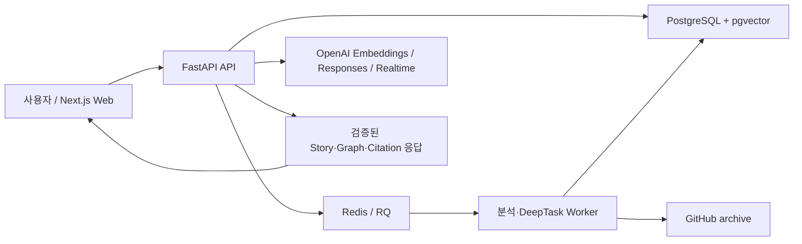

# RepoWise AI 프로젝트 종합 현황

- 기준일: 2026-08-30
- 문서 역할: 현재 구현, 구조, 기술 스택, 남은 계획을 통합한 단일 기준 문서
- 제품 단계: 로컬 개발 환경에서 핵심 vertical slice 구현 완료, 품질·복구·운영 기능 강화 단계
- 갱신 원칙: 기능 구현 완료와 같은 변경에서 이 문서를 반드시 함께 갱신한다.

## 1. 프로젝트 개요

RepoWise AI는 GitHub 저장소를 고정된 commit snapshot으로 분석하고, 실제 코드 line 근거를 이용해 저장소의 목적·구조·기능 흐름·변경 영향을 설명하는 인터랙티브 코드 학습 도구다. 단순 코드 요약이 아니라 다음 경험을 하나의 흐름으로 연결하는 것이 핵심이다.

1. 저장소를 안전하게 수집하고 AST·심볼·관계·계층형 chunk로 분석한다.
2. 비전공자도 파일명보다 역할과 시스템 목적을 먼저 이해하도록 Repository Story와 구조도를 보여 준다.
3. 기능 흐름, 관련 코드와 변경 영향을 같은 문맥에서 탐색한다.
4. 질문에 현재 snapshot의 검증된 evidence와 citation으로 답한다.
5. 진단, curriculum, activity, 선수 개념 보충을 통해 사용자 수준에 맞춰 학습 경로를 조정한다.

핵심 제품 원칙은 다음과 같다.

- 모델이 파일 경로·라인·URL을 임의 생성하지 않고, 서버가 검증된 ID를 실제 근거에 결합한다.
- 분석 결과는 branch 이름이 아니라 commit SHA로 고정해 서로 다른 버전의 근거가 섞이지 않게 한다.
- 구조 탐색이 기본 진입점이며 학습, 질문, Code Focus, Change Brief는 선택한 구조 문맥을 이어받는다.
- 결정론적 분석과 검증을 기본값으로 사용하고, LLM은 제한된 후보 선택과 자연어 개선에 사용한다.

## 2. 현재 시스템 구조



주요 실행 흐름은 다음과 같다.

### 2.1 저장소 분석

`GitHub URL 등록 → archive 안전 검사 → commit snapshot 생성 → TypeScript/JavaScript·Python 분석 → 파일·심볼·관계·chunk 저장 → embedding 생성 → navigation artifact 생성`

- symlink, 경로 탈출, 비밀 파일, 대용량 archive·파일을 필터링한다.
- Tree-sitter TypeScript 분석과 Python AST 분석으로 함수, 클래스, 컴포넌트, route, import, call 후보를 만든다.
- 관계는 confidence와 metadata를 보존하며 `semantic-ts-v2` parser version으로 snapshot에 고정한다.
- 분석 작업은 Redis/RQ worker에서 수행하고 API에서 단계와 진행 상태를 조회한다.

### 2.2 탐색과 설명

`Repository Story → Role Graph → Implementation Graph → Feature Flow → Code Focus → Change Brief`

- Repository Story는 저장소 목적과 핵심 역할을 자연어로 설명한다.
- Role Graph는 파일보다 사용자·시스템 역할을 먼저 보여 주고, 필요할 때 구현 파일로 펼친다.
- Feature Flow는 정상·실패 경로를 실제 관계와 code evidence에 연결한다.
- Code Focus는 선택한 기능이나 역할을 이해하는 데 필요한 최소 코드 범위를 제공한다.
- Change Brief는 변경 대상에서 직접·가능 영향 범위를 추적하고 구조도에 투영한다.
- Architecture/Story 결과는 versioned `NavigationArtifact`로 cache하고 validator로 응답 계약을 검사한다.

### 2.3 검색과 근거 기반 답변

`질문·선택 범위·학습 문맥 → query 분석 → exact/lexical/vector/selection 검색 → RRF 융합·경량 rerank → evidence allowlist → 구조화 답변 → 서버 citation 조립`

- PostgreSQL full-text search와 pgvector를 함께 사용한다.
- `OPENAI_API_KEY`가 없을 때는 deterministic local hash vector와 로컬 답변 fallback으로 기본 흐름을 검증할 수 있다.
- 키가 있으면 `text-embedding-3-small` 768차원 embedding과 설정된 generation model을 사용한다.
- retrieval run과 후보 순위를 저장해 실패 원인을 추적할 수 있다.

### 2.4 적응형 학습

`learner profile → 6~7문항 진단 또는 skip → 최대 40단계 curriculum → lesson/activity → mastery event → 보충 학습 또는 재계획`

- Concept Graph는 현재 TypeScript·웹 핵심 개념 17개와 prerequisite edge 20개를 versioned seed로 관리한다.
- 현재 lesson과 숙련도의 차이에서 가장 가까운 선수 개념을 최대 3개 선택한다.
- 실제 `throw`, `return`, resolved `CALLS`·`IMPORTS` 근거로 checkpoint activity를 만든다.
- 진단, lesson feedback, activity 결과를 점수·confidence·code evidence가 있는 mastery event로 저장한다.
- 완료 lesson은 보존하고 미완료 경로만 revision으로 다시 만든다.

### 2.5 음성·장시간 작업

- 브라우저는 WebRTC unified offer로 OpenAI Realtime에 연결하며 push-to-talk가 기본이고 VAD는 사용자가 명시적으로 켠다.
- 동일 call ID의 서버 sideband가 세 가지 제한형 tool을 처리한다. 결정적 한국어 학습 명령은 모델 호출 전에 실행하며, barge-in·중복 call guard·최대 3회 재연결을 적용한다.
- `VoiceSession`과 `VoiceTurn`이 session lifecycle, 최종 transcript, 당시 학습 context, route/tool과 지연시간을 저장한다. 원본 음성은 저장하지 않고 transcript 원문은 기본 30일 뒤 maintenance에서 만료한다.
- 영향 분석·공식 자료 탐색 같은 긴 작업은 DB-backed DeepTask, 전용 RQ queue, SSE 상태 스트림, 취소·재접속 UI를 사용하며 음성 tool도 같은 생성 service와 멱등키를 재사용한다.
- 로드맵 변경은 proposal preview·diff·검증 뒤 명시적 apply/reject로만 반영하며 완료 lesson과 revision lock을 보존한다.

## 3. 저장소 구조

```text
RepoWiseAI/
├─ apps/
│  ├─ api/
│  │  ├─ app/api/          REST·SSE·Realtime endpoint
│  │  ├─ app/analysis/     TypeScript/Python 분석, tree, chunking
│  │  ├─ app/navigation/   Project Map, Flow, Code Focus, Change Brief, Story
│  │  ├─ app/retrieval/    hybrid retrieval, query, evidence
│  │  ├─ app/learning/     curriculum, concept, mastery, activity, resource
│  │  ├─ app/services/     GitHub, grounded chat, research material
│  │  ├─ app/voice/        OpenAI Realtime 연결
│  │  ├─ app/workers/      repository analysis와 deep task worker
│  │  ├─ app/evaluation/   retrieval/navigation/architecture/story 평가
│  │  ├─ migrations/       Alembic 0001~0022
│  │  └─ tests/            API unit·integration·evaluation test
│  └─ web/
│     └─ src/
│        ├─ app/           Next.js App Router 진입점과 전역 스타일
│        ├─ components/    Story, graph, code, learning, voice UI
│        ├─ hooks/         realtime voice와 DeepTask 상태
│        └─ lib/           API client, tree와 routing utility
├─ docs/
│  ├─ PROJECT_OVERVIEW.md  현재 상태의 단일 기준 문서
│  ├─ README.md            문서 인덱스
│  └─ plans/               시간순 과거 기획·구현 계획
├─ evals/                  retrieval·routing 평가 fixture
├─ scripts/                문서 생성 등 개발 보조 스크립트
├─ output/                 생성된 PDF artifact
├─ docker-compose.yml      PostgreSQL/pgvector, Redis
└─ package.json            workspace 실행·검증 명령
```

## 4. 기술 스택

| 영역 | 기술 | 현재 용도 |
| --- | --- | --- |
| Frontend | Next.js 16, React 19, TypeScript 5 | 단일 웹 애플리케이션과 상태 orchestration |
| Code UI | Monaco Editor | 코드 표시, line highlight, citation warp |
| Graph UI | React Flow, ELK.js | Repository/Architecture graph layout과 상호작용 |
| Styling/Test | CSS Modules, Tailwind PostCSS, Vitest, Testing Library | 반응형 UI와 component 회귀 테스트 |
| Backend | Python 3.12, FastAPI, Pydantic | API 계약, validation, SSE·Realtime 연결 |
| Persistence | PostgreSQL 17, SQLAlchemy 2, Alembic | snapshot, 분석 결과, 학습·채팅·작업 상태 |
| Vector Search | pgvector | semantic chunk 검색 |
| Queue | Redis 7, RQ | durable repository analysis와 DeepTask |
| Code Analysis | Tree-sitter TypeScript, Python AST | symbol, import, call, route와 statement 추출 |
| AI | OpenAI Responses/Structured Outputs, Embeddings, Realtime | 근거 답변, 제한형 label, embedding, 음성 |
| Tooling | pnpm workspace, uv, Ruff, ESLint | 의존성·실행·lint·test 관리 |

기본 모델과 provider는 코드에 고정하지 않고 `.env`에서 바꾼다. 현재 기본값은 embedding `text-embedding-3-small`, generation `gpt-5.4-mini`, realtime `gpt-realtime-2.1-mini`, deep task `gpt-5.6-terra`다.

## 5. 구현 현황

상태 정의:

- **완료**: 코드, 계약과 자동 테스트가 존재하며 기본 제품 흐름에 연결됨
- **부분 완료**: 핵심 기반은 있으나 계획한 사용자 흐름이나 운영 조건 일부가 없음
- **진행 중**: 현재 작업 트리에 구현이 있으며 통합·검증·정리가 진행 중임
- **미구현**: 계획 문서에만 있고 대응 코드가 확인되지 않음

| 영역 | 상태 | 구체적 구현 | 근거 위치 |
| --- | --- | --- | --- |
| 저장소 등록·snapshot | 완료 | public GitHub URL, branch/SHA 고정, archive 안전 필터, 분석 job | `app/services/github.py`, `app/workers/repository_analysis.py` |
| 코드 분석·저장 | 완료 | TS/JS·Python symbol, 관계, 계층형 chunk, graph metadata | `app/analysis/`, migrations `0001`~`0002`, `0008` |
| Hybrid RAG·citation | 완료 | exact/lexical/vector/selection, RRF, evidence hash/line 검증, Structured Outputs | `app/retrieval/`, `app/services/grounded_chat.py`, `app/ai/answers.py` |
| 기본 코드 탐색 | 완료 | 파일 트리, Monaco, import graph, Start Here, code selection 질문 | `apps/web/src/components/` |
| 진단·Learning Journey | 완료 | profile, assessment, curriculum, session, remediation, mastery, replan과 최근 답변·activity·active remediation·return stack 복구 | migrations 0003~0006, app/learning/, app/api/learning.py, app/api/chat.py |
| 학습 activity | 완료 | mastery·직전 결과 기반 난이도 적응, return/throw/call/import, trace_value, select_error_path, 직접 영향 activity와 채점 | app/learning/activities.py, migration 0019 |
| Project Map·Feature Flow | 완료 | 기능 catalog/detail, normal/failure path, code 이동 | `app/navigation/project_map.py`, `feature_flow.py` |
| Code Focus·Change Brief | 완료 | 최소 코드 설명, 직접·가능 영향 분석, DeepTask 연계 | `app/navigation/code_focus.py`, `change_brief.py`, migration `0009` |
| Architecture Graph | 완료 | 결정론적 graph, validator/cache, diff, 제한형 label, PNG·Mermaid export | `app/navigation/architecture_*`, web `ArchitectureMapPanel*` |
| Repository Story UI | 완료 | purpose/role graph, validator/evaluator, Structure-first UI와 RepoWiseAI·p-map·Python API·중형 저장소·빈약한 README를 포함한 5-fixture 다양성 gate | `app/navigation/repository_story*`, `evaluation/fixtures/repository_story_*`, web `RepositoryStoryPage*` |
| 실시간 음성 | 완료 | WebRTC offer, push-to-talk·VAD, 영속 session/turn, 동일-call sideband, 세 제한형 tool, 결정적 명령, barge-in, duplicate guard, 서버 stop과 CORS metadata | `app/voice/`, `app/api/voice.py`, migration `0022`, web `useRealtimeLearningSession.ts`·`VoiceSessionDock.tsx` |
| DeepTask | 완료 | DB task, 전용 queue, SSE, 취소, idempotency, tray, research/impact task | migration `0007`, `app/api/deep_tasks.py`, `app/workers/deep_tasks.py` |
| 공식 학습자료 | 완료 | curated URL, 공식 domain allowlist·research, 일일 URL freshness 검증, 마지막 정상본 유지와 상태 UI | app/learning/resources.py, app/services/research_materials.py, migration 0017 |
| 품질 평가 | 완료 | retrieval/navigation/architecture/story/learning gate, 100개 한국어 voice routing gate와 실제 Playwright assessment→remediation→reload→return E2E 통과 | `app/evaluation/`, `apps/api/evaluation/fixtures/`, `apps/web/e2e/`, `output/evaluations/` |
| 운영·배포 | 부분 완료 | 인증·tenant 경계, 패키징·복구, 공통 trace, Voice metrics endpoint, transcript retention, sideband failure injection과 alias/snapshot 모델 정책 완료; private repository·실제 production rollout·외부 APM/부하·보안 검수는 남음 | migrations `0010`~`0022`, `app/api/admin.py`, `app/workers/maintenance.py`, `core/model_routing.py`, `docs/operations/` |

## 6. 데이터와 API 경계

### 6.1 핵심 데이터 그룹

- 저장소: `Repository`, `RepositorySnapshot`, `AnalysisJob`, `FileRecord`, `Symbol`, `SymbolEdge`, `CodeChunk`
- 탐색 artifact: `NavigationArtifact`
- 학습: `LearnerProfile`, `AssessmentSession/Response`, `LearningPath/Module/Lesson/Step`, `LearningSession`, `JourneyEvent`, `RemediationBranch`
- 활동·숙련도: `LearningActivity`, `ActivityAttempt`, `MasteryEvent`, `Concept`, `ConceptEdge`
- 대화·검색: `ChatSession`, `ChatMessage`, `RetrievalRun`, `RetrievalCandidate`
- 장시간 작업: `DeepTask`
- 음성·로드맵: `VoiceSession`, `VoiceTurn`, `RoadmapProposal`

### 6.2 API 기능군

- `/api/repositories`, `/api/snapshots/...`: 등록, 분석 상태, 파일·심볼·graph, Project Map, Feature Flow, Code Focus, Change Brief, Story
- `/api/learner-profiles`, `/api/assessment-sessions`: 사용자 진단
- `/api/learning-paths`, `/api/learning-sessions`: curriculum, lesson event, activity, 보충 학습, mastery와 replan
- `/api/chat`: 세션과 grounded message
- `/api/deep-tasks`: 장시간 작업 생성, 상태·event stream, 취소
- `/api/learning-sessions/{id}/voice/offer`, `/api/voice-sessions/{id}`: Realtime WebRTC bootstrap, 상태와 종료
- `/api/roadmap-proposals`: 경로 변경 preview, apply, reject와 revision conflict
- `/api/admin/voice/metrics`: 조직별 Voice 성공률, route/tool, p95 latency와 사용량 집계
- `/api/retrieval-runs`: 개발·평가용 retrieval trace

호환성 원칙은 기존 endpoint를 즉시 제거하지 않고 새 탐색 경험이 안정화될 때까지 fallback으로 유지하는 것이다. Guided Code Tour API도 유지하지만 기본 UI는 Adaptive Learning Journey를 사용한다.

## 7. 남은 구현 계획

현재 코드와 자동 gate 기준으로 핵심 vertical slice와 Voice 계획 Phase 0~6은 구현됐다. 남은 작업은 외부 운영 조건과 품질 표본 확대다.

### P0 — 운영 출시 검증

1. 실제 OpenAI Realtime mini/full을 동일 100개 한국어 발화로 유료 A/B 실행하고 route 정확도·무근거 직접 답변·latency·비용으로 기본 모델을 확정한다. 현재 gate는 재현 가능한 fake provider 계약 평가다.
2. staging에서 동시 Voice session·Sideband 단절·Redis/worker 장애를 포함한 부하 테스트와 외부 APM alert를 검증한다.
3. 접근성 수동 검수, Safari/모바일 브라우저 WebRTC 호환성, 보안 점검과 transcript 삭제 정책 승인을 완료한다.

### P1 — 제품 범위 확대

1. private GitHub repository OAuth/App 접근과 사용자별 credential lifecycle을 구현한다.
2. Python·TypeScript 외 언어와 추가 monorepo 유형은 실제 recall 실패 fixture가 생길 때 분석기를 확장한다.
3. hosted production rollout, secret rotation, DB backup·restore 및 migration rollback 훈련을 완료한다.

### 현재 범위 밖

- 임의 코드를 실행하는 sandbox와 자동 수정·PR 생성
- 모든 프로그래밍 언어에 대한 완전한 정적 분석
- 원본 음성 장기 저장과 학습 데이터 수집
- LLM이 검증되지 않은 파일·관계·외부 URL을 자유 생성하는 기능
## 8. 검증 기준

기본 검증 명령은 루트에서 실행한다.

```powershell
pnpm lint:api
pnpm test:api
pnpm lint:web
pnpm test:web
pnpm build:web
pnpm eval:retrieval --fixture evals/retrieval/p-map.json
pnpm eval:navigation
pnpm eval:architecture
pnpm eval:story
pnpm eval:learning
pnpm eval:voice
pnpm test:e2e
```

기능 완료로 기록하려면 다음을 만족해야 한다.

- 새 동작의 unit 또는 integration test가 있다.
- 관련 기존 test, lint와 TypeScript/production build가 통과한다.
- API schema와 frontend type이 함께 갱신된다.
- migration이 필요하면 upgrade 경로와 기존 데이터 호환성을 확인한다.
- evidence를 사용하는 기능은 snapshot/hash/line 검증을 우회하지 않는다.
- 사용자 흐름과 남은 제한을 이 문서의 구현 현황·백로그·변경 이력에 반영한다.

## 9. 문서 갱신 절차

기능 구현을 완료할 때 같은 PR 또는 commit에서 아래 순서를 수행한다.

1. `5. 구현 현황`의 상태, 설명과 근거 위치를 갱신한다.
2. 완료된 항목을 `7. 남은 구현 계획`에서 제거하거나 다음 단계로 구체화한다.
3. 구조, API, 데이터 모델 또는 기술 선택이 바뀌면 `2`~`6`절을 함께 수정한다.
4. 실제 수행한 검증과 중요한 제한을 `10. 변경 이력`에 기록한다.
5. 과거 판단을 설명해야 할 때만 `plans/` 문서에 링크하고, 과거 문서 자체를 현재 상태표로 사용하지 않는다.

변경 이력 항목은 다음 형식을 사용한다.

```markdown
### YYYY-MM-DD — 기능명

- 상태: 완료 | 부분 완료 | 보류
- 구현: 사용자에게 보이는 결과와 핵심 내부 변경
- 근거: 주요 코드·migration·API
- 검증: 실행한 test, lint, build, eval
- 남은 일: 알려진 제한 또는 후속 작업. 없으면 `없음`
```

## 10. 변경 이력

### 2026-08-30 — 로그인 진입점과 계정 메뉴

- 상태: 완료
- 구현: 기존 `/login`·`/signup`·`/forgot-password`·`/account`와 Supabase proxy 보호 흐름을 Workbench 헤더의 로그인/계정/로그아웃 메뉴에 연결했다. Supabase 미설정 개발 환경은 로컬 모드로 명시하고 로그인·callback의 `next` redirect는 내부 경로만 허용한다.
- 근거: `components/AuthUserMenu.tsx`, `components/AuthForm.tsx`, `lib/auth.ts`, `proxy.ts`
- 검증: redirect 보안·세션 표시·로그아웃 component tests, Web ESLint, 전체 Vitest, Next.js production build.
- 남은 일: 소셜 로그인 provider와 조직 전환 UI는 별도 제품 선택 사항이다.

### 2026-08-30 — Voice Phase 2·Roadmap proposal·운영 강화

- 상태: 완료
- 구현: 영속 Voice session/turn, 동일 call sideband, 세 제한형 tool, 결정적 한국어 명령, VAD opt-in, barge-in, browser/server stop, DeepTask 공용 service, Roadmap proposal preview/apply/reject·revision lock을 연결했다. Voice transcript retention, 관리자 metrics, sideband failure injection, 중앙 alias/snapshot 모델 정책을 추가했다.
- 근거: `app/voice/`, `app/services/deep_tasks.py`, `app/learning/roadmap_proposals.py`, migrations `0021`~`0022`, web `VoiceSessionDock.tsx`·`LearningJourneyPanel.tsx`
- 검증: API Ruff와 220 tests, Web ESLint와 105 tests, Next.js production build, 100개 한국어 voice routing mini/full offline fake-provider gate 1.0, Roadmap 실제 PostgreSQL apply/reject/conflict, Voice DB lifecycle를 통과했다.
- 남은 일: 실제 OpenAI mini/full 유료 A/B, staging 부하·브라우저 호환성·외부 APM 검증은 운영 출시 단계로 남는다.

### 2026-08-30 — Repository Story 다양성 gate와 실제 Learning E2E

- 상태: 완료
- 구현: Python API·중형 저장소·README가 빈약한 저장소까지 Story gold를 확장하고, assessment timeout→질문→remediation→새로고침 복구→원래 lesson 복귀를 실제 Chromium E2E로 고정했다. repository analysis의 빈 chunk template 충돌도 수정했다.
- 근거: `evaluation/fixtures/repository_story_*`, `apps/web/e2e/learning-journey.spec.ts`, `app/workers/repository_analysis.py`
- 검증: Story 5 fixture threshold 통과, Playwright E2E 통과, 관련 API/Web 회귀 통과.
- 남은 일: 운영 저장소 표본은 실제 recall 실패가 발견될 때 계속 추가한다.

### 2026-08-30 — 기본 관측성·복구 trace

- 상태: 완료
- 구현: HTTP request ID를 RQ와 DB의 analysis job, deep task, retrieval run, activity attempt에 공통 trace로 저장하고 generation/retrieval/activity latency, provider fallback reason, worker failure code를 같은 흐름에서 조회할 수 있게 했다. Redis 유실 후 재등록에도 원 trace를 보존하며 심층 작업 오류 화면에는 지원 ID를 표시한다.
- 근거: core/logging.py, queue.py, grounded_chat.py, workers/queue_recovery.py, migration 0020, Web DeepTaskTray.tsx
- 검증: API Ruff, API 183 passed, Alembic 0020 단일 head와 offline SQL, Web ESLint, Web Vitest 103 passed, Next.js production build. queue stale reset·Redis recovery·worker failure·SSE polling fallback·idempotent retry 테스트를 포함한다.
- 남은 일: 외부 APM dashboard·alert·retention/SLO 승인은 Phase 7 운영 환경 작업으로 남는다. 앱 내 브라우저 실행은 Windows ACL로 시작되지 않아 실제 브라우저 E2E 증거는 별도 후속이다.

### 2026-08-30 — 학습 품질 평가 gate

- 상태: 완료
- 구현: curriculum module·lesson evidence·activity 유형/근거·statement span·공식 source 정책/개념 coverage·learning-context retrieval을 한 보고서로 평가하는 CLI와 RepoWiseAI gold fixture를 추가했다.
- 근거: app/evaluation/learning.py, learning_repowise_gold_v1.json, test_learning_evaluation.py, output/evaluations/learning-latest.json
- 검증: deterministic materialization으로 50 activity와 28 explanation을 준비한 뒤 6 modules, 28 lessons, 55 activities, 1,368 segments를 평가했고 모든 threshold를 통과했다. materialize 없는 재실행도 통과했다.
- 남은 일: Python API와 중형 monorepo fixture를 추가하고 browser E2E 결과를 동일 release report에 연결한다.
### 2026-08-30 — Assessment timeout과 Adaptive activity

- 상태: 완료
- 구현: assessment 15분 deadline, partial profile timeout 확정, late submit idempotency, late answer stable 409를 추가했다. Activity는 mastery와 직전 결과로 난이도를 조정하고 trace_value와 심화 직접 영향 유형을 생성한다.
- 근거: app/api/assessment.py, app/learning/activities.py, migrations 0018~0019, Web LearningJourneyPanel.tsx
- 검증: API Ruff, API 180 passed, Alembic 0019 단일 head와 offline SQL, Web ESLint, Web Vitest 102 passed, Next.js production build
- 남은 일: 실제 브라우저에서 timeout polling, 새로고침, remediation return을 묶은 E2E를 추가한다.
### 2026-08-30 — Learning Journey 상태 복구

- 상태: 부분 완료
- 구현: 기존 학습 세션 재사용 시 최근 grounded 답변 목록과 active remediation을 조회하고, 기존 latest activity attempt와 return stack을 Web 상태로 복구한다.
- 근거: app/api/chat.py, app/api/learning.py, web RepositoryWorkbench.tsx, test_learning_session_restore.py
- 검증: 신규 복구 테스트 3개, API Ruff, API 전체 회귀, Web ESLint/Vitest/production build
- 남은 일: assessment timeout, late submit, 새로고침/return 실제 browser E2E를 추가한다.
### 2026-08-30 — 공식 학습자료 freshness

- 상태: 완료
- 구현: curated 공식 URL의 주기적 상태 확인, 마지막 정상 verified_at 보존, 실패 상태 기록, maintenance summary와 학습자료 카드 상태 표시를 추가했다.
- 근거: app/learning/resources.py, app/workers/maintenance.py, migration 0017, web LearningJourneyPanel.tsx
- 검증: API Ruff, API 170 passed, freshness migration 단일 head와 offline SQL, Web ESLint, Web Vitest 102 passed, Next.js production build
- 남은 일: 공식 corpus 본문 색인과 source recommendation 평가 확대는 별도 P1 품질 작업으로 유지한다.
### 2026-08-02 — 문서 체계 통합

- 상태: 완료
- 구현: 루트의 기획·구현 계획서를 `docs/plans/`에 최초 작성일 순으로 정리하고, 현재 코드 기준 종합 현황과 유지 규칙을 추가했다.
- 근거: `docs/README.md`, `docs/PROJECT_OVERVIEW.md`, 루트 `README.md`, `scripts/generate_project_plan_pdf.py`
- 검증: Markdown 내부 링크와 `git diff --check`, API Ruff, API `131 passed`, Web ESLint, Web Vitest `102 passed`, Next.js production build, Repository Story gold 평가 통과
- 남은 일: 이후 기능 구현과 같은 변경에서 이 문서를 지속 갱신

## 11. 과거 계획과 의사결정 이력

시간순 원문과 각 문서의 현재 해석은 [문서 인덱스](README.md)에서 확인한다. 과거 문서와 이 문서가 충돌하면 현재 코드로 검증한 뒤 `PROJECT_OVERVIEW.md`를 갱신하는 것을 우선한다.
