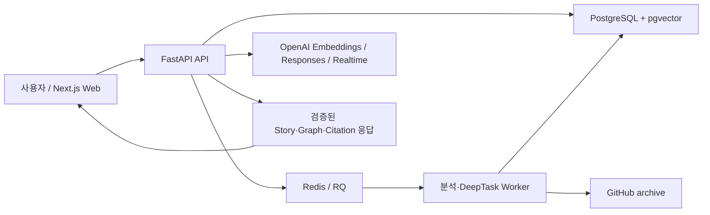

# RepoWise AI 프로젝트 종합 현황

- 기준일: 2026-08-02
- 문서 역할: 현재 구현, 구조, 기술 스택, 남은 계획을 통합한 단일 기준 문서
- 제품 단계: 로컬 개발 환경에서 핵심 vertical slice 구현 완료, 품질·복구·운영 기능 강화 단계
- 갱신 원칙: 기능 구현 완료와 같은 변경에서 이 문서를 반드시 함께 갱신한다.

## 1. 프로젝트 개요

RepoWise AI는 GitHub 저장소를 고정된 commit snapshot으로 분석하고, 실제 코드 line 근거를 이용해 저장소의 목적·구조·기능 흐름·변경 영향을 설명하는 인터랙티브 코드 학습 도구다. 단순 코드 요약이 아니라 다음 경험을 하나의 흐름으로 연결하는 것이 핵심이다.

1. 저장소를 안전하게 수집하고 AST·심볼·관계·계층형 chunk로 분석한다.
2. 비전공자도 파일명보다 역할과 시스템 목적을 먼저 이해하도록 Repository Story와 구조도를 보여 준다.
3. 기능 흐름, 관련 코드와 변경 영향을 같은 문맥에서 탐색한다.
4. 질문에 현재 snapshot의 검증된 evidence와 citation으로 답한다.
5. 진단, curriculum, activity, 선수 개념 보충을 통해 사용자 수준에 맞춰 학습 경로를 조정한다.

핵심 제품 원칙은 다음과 같다.

- 모델이 파일 경로·라인·URL을 임의 생성하지 않고, 서버가 검증된 ID를 실제 근거에 결합한다.
- 분석 결과는 branch 이름이 아니라 commit SHA로 고정해 서로 다른 버전의 근거가 섞이지 않게 한다.
- 구조 탐색이 기본 진입점이며 학습, 질문, Code Focus, Change Brief는 선택한 구조 문맥을 이어받는다.
- 결정론적 분석과 검증을 기본값으로 사용하고, LLM은 제한된 후보 선택과 자연어 개선에 사용한다.

## 2. 현재 시스템 구조



주요 실행 흐름은 다음과 같다.

### 2.1 저장소 분석

`GitHub URL 등록 → archive 안전 검사 → commit snapshot 생성 → TypeScript/JavaScript·Python 분석 → 파일·심볼·관계·chunk 저장 → embedding 생성 → navigation artifact 생성`

- symlink, 경로 탈출, 비밀 파일, 대용량 archive·파일을 필터링한다.
- Tree-sitter TypeScript 분석과 Python AST 분석으로 함수, 클래스, 컴포넌트, route, import, call 후보를 만든다.
- 관계는 confidence와 metadata를 보존하며 `semantic-ts-v2` parser version으로 snapshot에 고정한다.
- 분석 작업은 Redis/RQ worker에서 수행하고 API에서 단계와 진행 상태를 조회한다.

### 2.2 탐색과 설명

`Repository Story → Role Graph → Implementation Graph → Feature Flow → Code Focus → Change Brief`

- Repository Story는 저장소 목적과 핵심 역할을 자연어로 설명한다.
- Role Graph는 파일보다 사용자·시스템 역할을 먼저 보여 주고, 필요할 때 구현 파일로 펼친다.
- Feature Flow는 정상·실패 경로를 실제 관계와 code evidence에 연결한다.
- Code Focus는 선택한 기능이나 역할을 이해하는 데 필요한 최소 코드 범위를 제공한다.
- Change Brief는 변경 대상에서 직접·가능 영향 범위를 추적하고 구조도에 투영한다.
- Architecture/Story 결과는 versioned `NavigationArtifact`로 cache하고 validator로 응답 계약을 검사한다.

### 2.3 검색과 근거 기반 답변

`질문·선택 범위·학습 문맥 → query 분석 → exact/lexical/vector/selection 검색 → RRF 융합·경량 rerank → evidence allowlist → 구조화 답변 → 서버 citation 조립`

- PostgreSQL full-text search와 pgvector를 함께 사용한다.
- `OPENAI_API_KEY`가 없을 때는 deterministic local hash vector와 로컬 답변 fallback으로 기본 흐름을 검증할 수 있다.
- 키가 있으면 `text-embedding-3-small` 768차원 embedding과 설정된 generation model을 사용한다.
- retrieval run과 후보 순위를 저장해 실패 원인을 추적할 수 있다.

### 2.4 적응형 학습

`learner profile → 6~7문항 진단 또는 skip → 최대 40단계 curriculum → lesson/activity → mastery event → 보충 학습 또는 재계획`

- Concept Graph는 현재 TypeScript·웹 핵심 개념 17개와 prerequisite edge 20개를 versioned seed로 관리한다.
- 현재 lesson과 숙련도의 차이에서 가장 가까운 선수 개념을 최대 3개 선택한다.
- 실제 `throw`, `return`, resolved `CALLS`·`IMPORTS` 근거로 checkpoint activity를 만든다.
- 진단, lesson feedback, activity 결과를 점수·confidence·code evidence가 있는 mastery event로 저장한다.
- 완료 lesson은 보존하고 미완료 경로만 revision으로 다시 만든다.

### 2.5 음성·장시간 작업

- WebRTC offer endpoint, realtime 설정, push-to-talk UI와 현재 학습 세션에 연결되는 음성 기반이 있다.
- Grounded chat 로직은 음성과 텍스트가 재사용할 수 있는 service로 분리되어 있다.
- 영향 분석·공식 자료 탐색 같은 긴 작업은 DB-backed DeepTask, 전용 RQ queue, SSE 상태 스트림, 취소·재접속 UI를 사용한다.
- 음성 tool routing, 학습 명령의 완전한 sideband 처리와 voice session 영속화는 아직 후속 범위다.

## 3. 저장소 구조

```text
RepoWiseAI/
├─ apps/
│  ├─ api/
│  │  ├─ app/api/          REST·SSE·Realtime endpoint
│  │  ├─ app/analysis/     TypeScript/Python 분석, tree, chunking
│  │  ├─ app/navigation/   Project Map, Flow, Code Focus, Change Brief, Story
│  │  ├─ app/retrieval/    hybrid retrieval, query, evidence
│  │  ├─ app/learning/     curriculum, concept, mastery, activity, resource
│  │  ├─ app/services/     GitHub, grounded chat, research material
│  │  ├─ app/voice/        OpenAI Realtime 연결
│  │  ├─ app/workers/      repository analysis와 deep task worker
│  │  ├─ app/evaluation/   retrieval/navigation/architecture/story 평가
│  │  ├─ migrations/       Alembic 0001~0009
│  │  └─ tests/            API unit·integration·evaluation test
│  └─ web/
│     └─ src/
│        ├─ app/           Next.js App Router 진입점과 전역 스타일
│        ├─ components/    Story, graph, code, learning, voice UI
│        ├─ hooks/         realtime voice와 DeepTask 상태
│        └─ lib/           API client, tree와 routing utility
├─ docs/
│  ├─ PROJECT_OVERVIEW.md  현재 상태의 단일 기준 문서
│  ├─ README.md            문서 인덱스
│  └─ plans/               시간순 과거 기획·구현 계획
├─ evals/                  retrieval·routing 평가 fixture
├─ scripts/                문서 생성 등 개발 보조 스크립트
├─ output/                 생성된 PDF artifact
├─ docker-compose.yml      PostgreSQL/pgvector, Redis
└─ package.json            workspace 실행·검증 명령
```

## 4. 기술 스택

| 영역 | 기술 | 현재 용도 |
| --- | --- | --- |
| Frontend | Next.js 16, React 19, TypeScript 5 | 단일 웹 애플리케이션과 상태 orchestration |
| Code UI | Monaco Editor | 코드 표시, line highlight, citation warp |
| Graph UI | React Flow, ELK.js | Repository/Architecture graph layout과 상호작용 |
| Styling/Test | CSS Modules, Tailwind PostCSS, Vitest, Testing Library | 반응형 UI와 component 회귀 테스트 |
| Backend | Python 3.12, FastAPI, Pydantic | API 계약, validation, SSE·Realtime 연결 |
| Persistence | PostgreSQL 17, SQLAlchemy 2, Alembic | snapshot, 분석 결과, 학습·채팅·작업 상태 |
| Vector Search | pgvector | semantic chunk 검색 |
| Queue | Redis 7, RQ | durable repository analysis와 DeepTask |
| Code Analysis | Tree-sitter TypeScript, Python AST | symbol, import, call, route와 statement 추출 |
| AI | OpenAI Responses/Structured Outputs, Embeddings, Realtime | 근거 답변, 제한형 label, embedding, 음성 |
| Tooling | pnpm workspace, uv, Ruff, ESLint | 의존성·실행·lint·test 관리 |

기본 모델과 provider는 코드에 고정하지 않고 `.env`에서 바꾼다. 현재 기본값은 embedding `text-embedding-3-small`, generation `gpt-5.4-mini`, realtime `gpt-realtime-2.1-mini`, deep task `gpt-5.6-terra`다.

## 5. 구현 현황

상태 정의:

- **완료**: 코드, 계약과 자동 테스트가 존재하며 기본 제품 흐름에 연결됨
- **부분 완료**: 핵심 기반은 있으나 계획한 사용자 흐름이나 운영 조건 일부가 없음
- **진행 중**: 현재 작업 트리에 구현이 있으며 통합·검증·정리가 진행 중임
- **미구현**: 계획 문서에만 있고 대응 코드가 확인되지 않음

| 영역 | 상태 | 구체적 구현 | 근거 위치 |
| --- | --- | --- | --- |
| 저장소 등록·snapshot | 완료 | public GitHub URL, branch/SHA 고정, archive 안전 필터, 분석 job | `app/services/github.py`, `app/workers/repository_analysis.py` |
| 코드 분석·저장 | 완료 | TS/JS·Python symbol, 관계, 계층형 chunk, graph metadata | `app/analysis/`, migrations `0001`~`0002`, `0008` |
| Hybrid RAG·citation | 완료 | exact/lexical/vector/selection, RRF, evidence hash/line 검증, Structured Outputs | `app/retrieval/`, `app/services/grounded_chat.py`, `app/ai/answers.py` |
| 기본 코드 탐색 | 완료 | 파일 트리, Monaco, import graph, Start Here, code selection 질문 | `apps/web/src/components/` |
| 진단·Learning Journey | 완료 | profile, assessment, curriculum, session, remediation, mastery, replan | migrations `0003`~`0006`, `app/learning/`, `app/api/learning.py` |
| 학습 activity | 부분 완료 | return/throw/call/import 기반 activity와 채점 구현; 난이도 적응과 추가 유형은 남음 | `app/learning/activities.py` |
| Project Map·Feature Flow | 완료 | 기능 catalog/detail, normal/failure path, code 이동 | `app/navigation/project_map.py`, `feature_flow.py` |
| Code Focus·Change Brief | 완료 | 최소 코드 설명, 직접·가능 영향 분석, DeepTask 연계 | `app/navigation/code_focus.py`, `change_brief.py`, migration `0009` |
| Architecture Graph | 완료 | 결정론적 graph, validator/cache, diff, 제한형 label, PNG·Mermaid export | `app/navigation/architecture_*`, web `ArchitectureMapPanel*` |
| Repository Story UI | 완료 | purpose/role graph, story validator/evaluator, 기본 Structure-first 화면과 반응형 inspector 구현; 대표 저장소 외 운영 gate 확대는 후속 | `app/navigation/repository_story*`, web `RepositoryStoryPage*` |
| 실시간 음성 | 부분 완료 | WebRTC offer, push-to-talk dock와 학습 세션 연결; sideband tool routing·영속 voice turn은 없음 | `app/voice/realtime.py`, `app/api/voice.py`, `useRealtimeLearningSession.ts` |
| DeepTask | 완료 | DB task, 전용 queue, SSE, 취소, idempotency, tray, research/impact task | migration `0007`, `app/api/deep_tasks.py`, `app/workers/deep_tasks.py` |
| 공식 학습자료 | 부분 완료 | curated URL과 domain allowlist·research 경로는 존재; freshness job과 상태 UI는 없음 | `app/learning/resources.py`, `app/services/research_materials.py` |
| 품질 평가 | 부분 완료 | retrieval/navigation/architecture/story fixture와 CLI 존재; learning·browser E2E fixture는 부족 | `app/evaluation/`, `apps/api/evaluation/fixtures/`, `evals/` |
| 운영·배포 | 미구현 | 사용자 인증, private repository, hosted 배포, 비용·지연 dashboard, retention job이 없음 | 후속 계획 |

## 6. 데이터와 API 경계

### 6.1 핵심 데이터 그룹

- 저장소: `Repository`, `RepositorySnapshot`, `AnalysisJob`, `FileRecord`, `Symbol`, `SymbolEdge`, `CodeChunk`
- 탐색 artifact: `NavigationArtifact`
- 학습: `LearnerProfile`, `AssessmentSession/Response`, `LearningPath/Module/Lesson/Step`, `LearningSession`, `JourneyEvent`, `RemediationBranch`
- 활동·숙련도: `LearningActivity`, `ActivityAttempt`, `MasteryEvent`, `Concept`, `ConceptEdge`
- 대화·검색: `ChatSession`, `ChatMessage`, `RetrievalRun`, `RetrievalCandidate`
- 장시간 작업: `DeepTask`

### 6.2 API 기능군

- `/api/repositories`, `/api/snapshots/...`: 등록, 분석 상태, 파일·심볼·graph, Project Map, Feature Flow, Code Focus, Change Brief, Story
- `/api/learner-profiles`, `/api/assessment-sessions`: 사용자 진단
- `/api/learning-paths`, `/api/learning-sessions`: curriculum, lesson event, activity, 보충 학습, mastery와 replan
- `/api/chat`: 세션과 grounded message
- `/api/deep-tasks`: 장시간 작업 생성, 상태·event stream, 취소
- `/api/voice`: Realtime WebRTC offer
- `/api/retrieval-runs`: 개발·평가용 retrieval trace

호환성 원칙은 기존 endpoint를 즉시 제거하지 않고 새 탐색 경험이 안정화될 때까지 fallback으로 유지하는 것이다. Guided Code Tour API도 유지하지만 기본 UI는 Adaptive Learning Journey를 사용한다.

## 7. 남은 구현 계획

과거 계획서의 미완료 항목을 현재 코드와 대조해 아래 순서로 재정리한다.

### P0 — 현재 vertical slice 안정화

1. **Repository Story 운영 gate 확대**
   - RepoWiseAI·p-map 외에 Python API, 중형 monorepo, README가 빈약한 저장소를 수동 검수한다.
   - Story와 기존 Architecture fallback 사이의 상태·선택 문맥 회귀를 확인한다.
2. **Learning Journey 완전 복구**
   - 새로고침 후 최근 AI 답변, 최근 activity, active remediation과 return stack을 복구한다.
   - assessment timeout, late submit, 새로고침과 return 동작의 browser E2E를 추가한다.
3. **공식 자료 freshness**
   - canonical URL 상태, `verified_at`, source tier를 갱신하는 worker job을 추가한다.
   - 장애 시 마지막 검증본 유지 정책과 UI 상태 표시를 구현한다.
4. **학습 품질 평가**
   - curriculum coverage, statement span, source recommendation, learning-context retrieval fixture를 만든다.
   - 평가 결과를 변경 전후 비교 가능한 report로 남긴다.
5. **기본 관측성·복구**
   - retrieval, generation, worker, activity의 latency·fallback·실패 이유를 동일 trace로 연결한다.
   - queue retry, timeout, reconnect와 사용자 오류 화면을 failure injection으로 검증한다.

### P1 — 계획된 기능 확장

1. **음성 Phase 2 완성**: sideband session manager, deterministic 학습 명령, voice session/turn 영속화, barge-in, VAD opt-in, duplicate tool guard, mini/full routing eval.
2. **Adaptive activity 확장**: 직전 결과와 mastery에 따른 난이도 조절, `trace_value`, `select_error_path`, 심화 영향 분석 유형.
3. **로드맵 proposal**: deterministic 후보, coverage/prerequisite verifier, preview/apply/reject, revision conflict와 path diff UI. 기존 deterministic replan과 구분한다.
4. **분석 범위와 평가 확대**: 실제 recall 실패를 근거로 Python·TS 관계 분석을 보강하고 다양한 저장소 gold set을 늘린다.

### P2 — 제품 운영 준비

1. 인증, 사용자별 데이터 경계와 private GitHub repository 접근.
2. hosted 배포, secret 관리, DB backup·migration·rollback 절차.
3. 비용·token·지연 dashboard, rate limit, 보존 기간과 삭제 job.
4. 접근성 수동 검수, 브라우저 호환성, 부하 테스트와 보안 점검.

### 현재 범위 밖

- 임의 코드를 실행하는 sandbox와 자동 수정·PR 생성
- 모든 프로그래밍 언어에 대한 완전한 정적 분석
- 원본 음성 장기 저장과 학습 데이터 수집
- LLM이 검증되지 않은 파일·관계·외부 URL을 자유 생성하는 기능

## 8. 검증 기준

기본 검증 명령은 루트에서 실행한다.

```powershell
pnpm lint:api
pnpm test:api
pnpm lint:web
pnpm test:web
pnpm build:web
pnpm eval:retrieval --fixture evals/retrieval/p-map.json
pnpm eval:navigation
pnpm eval:architecture
pnpm eval:story
```

기능 완료로 기록하려면 다음을 만족해야 한다.

- 새 동작의 unit 또는 integration test가 있다.
- 관련 기존 test, lint와 TypeScript/production build가 통과한다.
- API schema와 frontend type이 함께 갱신된다.
- migration이 필요하면 upgrade 경로와 기존 데이터 호환성을 확인한다.
- evidence를 사용하는 기능은 snapshot/hash/line 검증을 우회하지 않는다.
- 사용자 흐름과 남은 제한을 이 문서의 구현 현황·백로그·변경 이력에 반영한다.

## 9. 문서 갱신 절차

기능 구현을 완료할 때 같은 PR 또는 commit에서 아래 순서를 수행한다.

1. `5. 구현 현황`의 상태, 설명과 근거 위치를 갱신한다.
2. 완료된 항목을 `7. 남은 구현 계획`에서 제거하거나 다음 단계로 구체화한다.
3. 구조, API, 데이터 모델 또는 기술 선택이 바뀌면 `2`~`6`절을 함께 수정한다.
4. 실제 수행한 검증과 중요한 제한을 `10. 변경 이력`에 기록한다.
5. 과거 판단을 설명해야 할 때만 `plans/` 문서에 링크하고, 과거 문서 자체를 현재 상태표로 사용하지 않는다.

변경 이력 항목은 다음 형식을 사용한다.

```markdown
### YYYY-MM-DD — 기능명

- 상태: 완료 | 부분 완료 | 보류
- 구현: 사용자에게 보이는 결과와 핵심 내부 변경
- 근거: 주요 코드·migration·API
- 검증: 실행한 test, lint, build, eval
- 남은 일: 알려진 제한 또는 후속 작업. 없으면 `없음`
```

## 10. 변경 이력

### 2026-08-02 — 문서 체계 통합

- 상태: 완료
- 구현: 루트의 기획·구현 계획서를 `docs/plans/`에 최초 작성일 순으로 정리하고, 현재 코드 기준 종합 현황과 유지 규칙을 추가했다.
- 근거: `docs/README.md`, `docs/PROJECT_OVERVIEW.md`, 루트 `README.md`, `scripts/generate_project_plan_pdf.py`
- 검증: Markdown 내부 링크와 `git diff --check`, API Ruff, API `131 passed`, Web ESLint, Web Vitest `102 passed`, Next.js production build, Repository Story gold 평가 통과
- 남은 일: 이후 기능 구현과 같은 변경에서 이 문서를 지속 갱신

## 11. 과거 계획과 의사결정 이력

시간순 원문과 각 문서의 현재 해석은 [문서 인덱스](README.md)에서 확인한다. 과거 문서와 이 문서가 충돌하면 현재 코드로 검증한 뒤 `PROJECT_OVERVIEW.md`를 갱신하는 것을 우선한다.
