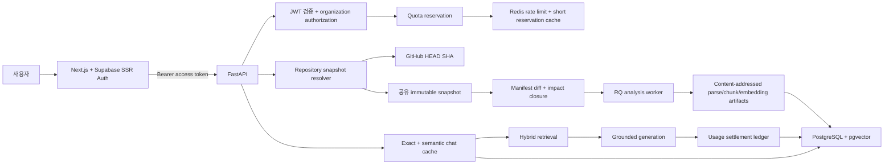

# RepoWise AI 분석 재사용·시맨틱 캐시·인증·사용량 관리 구현 계획

- 기준일: 2026-08-16
- 상태: 구현 전 승인된 상세 계획
- 범위: 저장소 분석 재사용, 증분 분석, 채팅 시맨틱 캐시, Supabase Auth, 조직·권한, 월간 한도, 기능별 hard limit, 관리자 보너스 크레딧
- 전제: 현재 PostgreSQL/pgvector, Redis/RQ, FastAPI, Next.js 구조를 유지한다.

## 1. 결정 사항

1. 인증은 Supabase Auth를 사용한다.
2. `User + Organization + Membership`을 처음부터 모델링한다. 가입 시 개인 organization을 자동 생성하고, 초기 UI는 개인 workspace 중심으로 제공한다.
3. 공개 저장소의 commit 단위 분석 결과는 사용자 간 공유한다.
4. 동일 snapshot의 결정론적 검색 결과는 공유할 수 있다.
5. 생성 답변 캐시는 사용자 또는 organization 범위에서만 공유한다.
6. 대화, 학습 상태, 코드 선택 문맥은 사용자 전용으로 유지한다.
7. 초기 비용 정책은 월간 한도, 기능별 hard limit, 관리자 보너스 크레딧으로 운영한다.
8. 동일 commit은 즉시 재사용하고, 변경 commit은 파일·의존 관계 단위로 증분 분석한다.
9. 분석 설정이 달라졌거나 영향 범위가 전체의 30%를 넘으면 전체 분석으로 자동 전환한다.

## 2. 현재 구현에서 확인된 문제

### 2.1 저장소 등록과 분석

현재 `POST /repositories`는 같은 `owner/name`의 `Repository`를 찾더라도 매번 새 `RepositorySnapshot`과 `AnalysisJob`을 만들고 RQ 작업을 등록한다. commit SHA는 worker가 archive를 내려받기 직전에야 기록한다.

그 결과 다음 최적화를 할 수 없다.

- 원격 branch HEAD가 이미 분석한 commit인지 API 단계에서 판단
- 동일 요청이 동시에 들어왔을 때 단일 분석 작업으로 합치기
- 분석기·청킹·임베딩 설정이 같은 기존 결과 선택
- 새 commit과 직전 commit의 파일 hash 차이를 이용한 증분 처리

또한 분석 worker는 실행할 때 기존 snapshot의 `NavigationArtifact`, `GuidedPath`, `CodeChunk`, `SymbolEdge`, `Symbol`, `FileRecord`를 모두 삭제하고 전 파일을 다시 파싱·청킹·임베딩한다.

### 2.2 채팅

현재 한 번의 일반 채팅 요청은 다음 과정을 항상 새로 수행한다.

1. 사용자 메시지 저장
2. query 분석
3. exact/lexical/selection/vector retrieval
4. retrieval run과 모든 후보 저장
5. evidence resolve
6. OpenAI Responses 생성 또는 로컬 fallback
7. 답변과 citation 저장

`RetrievalRun.token_usage` 필드는 있지만 실제 사용량은 기록되지 않고, 검색 또는 생성 결과를 재사용하는 cache 계층도 없다. query embedding과 생성 응답의 usage도 도메인 원장으로 전달되지 않는다.

### 2.3 인증·소유권·비용

현재 API에는 사용자 인증 dependency가 없고 주요 row에 `user_id` 또는 `organization_id`가 없다. snapshot ID나 session ID를 아는 요청은 자원에 접근할 수 있다. `health`뿐 아니라 repository, chat, learning, deep task, voice, debug endpoint도 동일한 인증 경계를 사용한다.

OpenAI 비용 발생 지점은 최소 다음과 같다.

- repository chunk embedding
- chat query embedding
- 일반 grounded answer 생성
- deep explanation/roadmap 생성
- 공식 자료 web search 및 생성
- architecture label 개선
- Realtime voice와 transcription

현재 공통 계측 wrapper, 요청 전 quota 예약, 요청 후 실제 usage 정산, 사용자별 집계가 없다.

## 3. 목표와 성공 기준

### 3.1 기능 목표

- 같은 repository/branch의 HEAD SHA와 분석 fingerprint가 같으면 새 분석 없이 기존 ready snapshot을 반환한다.
- 같은 commit의 분석이 진행 중이면 중복 job을 만들지 않고 기존 job을 반환한다.
- 변경 commit은 추가·수정·삭제·rename 파일과 영향 dependency closure만 다시 처리한다.
- unchanged 파일의 parse artifact, chunk embedding, 결정론적 navigation 결과를 재사용한다.
- 동일 또는 의미적으로 유사한 채팅 query에서 검색 결과와 안전한 생성 결과를 재사용한다.
- 모든 사용자 작업에 인증 주체와 organization이 연결된다.
- 비용 발생 작업은 실행 전에 한도를 검사·예약하고 완료 후 실제 사용량으로 정산한다.
- 한도 초과 시 외부 API 호출 전에 일관된 오류를 반환한다.

### 3.2 운영 지표

초기 운영 목표는 다음과 같이 둔다. 실제 traffic 2~4주 후 조정한다.

| 지표 | 초기 목표 |
| --- | --- |
| 동일 SHA snapshot reuse 비율 | 95% 이상 |
| 동일 SHA 재요청 응답 시간 | p95 1초 이내 |
| 변경 파일 10% 이하 commit의 재임베딩 감소 | 80% 이상 |
| 일반 채팅 exact/semantic retrieval cache hit | 30% 이상 |
| 생성 답변 cache hit | 15% 이상 |
| cache hit의 citation 검증 실패 | 0건 |
| 비용 원장과 provider 집계 오차 | 일 단위 2% 이하 |
| quota 초과 후 발생한 신규 외부 API 비용 | 0원 |
| 다른 organization 데이터 접근 성공 | 0건 |

## 4. 목표 아키텍처



## 5. 인증과 authorization 설계

### 5.1 Supabase의 역할

Supabase는 인증 전용 identity provider로 사용한다. 기존 application PostgreSQL과 SQLAlchemy/Alembic은 계속 RepoWise AI 데이터의 source of truth로 유지한다.

- Supabase Auth: 가입, 로그인, 이메일 검증, 비밀번호 재설정, OAuth, access/refresh token 발급
- Next.js: `@supabase/ssr`를 이용한 cookie 기반 PKCE session 유지
- FastAPI: `Authorization: Bearer <access_token>`의 JWT를 JWKS로 검증
- Application DB: user profile, organization, membership, repository 접근권한, quota, usage 저장
- Supabase service/secret key: 브라우저에 절대 노출하지 않으며 1차 구현에서는 필요하지 않게 한다.

Supabase 공식 문서는 SSR에서 `@supabase/ssr`를 사용해 cookie와 refresh-token rotation을 처리하도록 안내한다. FastAPI는 asymmetric signing key를 사용하고 issuer의 `/.well-known/jwks.json`을 통해 `iss`, `exp`, `sub`, `aud` 및 signature를 검증한다. JWKS는 key rotation을 고려해 장기 고정하지 않는다.

참고:

- [Supabase server package 선택](https://supabase.com/docs/guides/auth/choosing-a-server-package)
- [Supabase JWT와 JWKS 검증](https://supabase.com/docs/guides/auth/jwts)
- [Supabase Auth architecture](https://supabase.com/docs/guides/auth/architecture)

### 5.2 Application identity 모델

추가 테이블:

| 테이블 | 주요 필드 | 목적 |
| --- | --- | --- |
| `users` | `id=auth.sub`, `email`, `display_name`, `status`, timestamps | Supabase identity의 로컬 projection |
| `organizations` | `id`, `name`, `slug`, `kind=personal/team`, `owner_user_id` | quota 및 자원 소유 단위 |
| `organization_memberships` | `organization_id`, `user_id`, `role=owner/admin/member`, `status` | 역할 기반 접근 제어 |
| `organization_repositories` | `organization_id`, `repository_id`, `added_by`, `visibility`, timestamps | 공유 repository 분석과 사용자 workspace 연결 |
| `user_preferences` | `user_id`, 학습/언어/알림 설정 | profile과 인증 identity 분리 |

가입 후 첫 인증 요청에서 transaction으로 user와 personal organization을 idempotent하게 bootstrap한다. 이후 모든 사용자 요청은 `AuthContext(user_id, organization_id, role)`를 dependency로 받는다.

### 5.3 접근 규칙

- `health`: 인증 없이 허용
- 로그인 callback/page: 인증 없이 허용
- repository 등록·snapshot 조회·chat·learning·deep task·voice: 인증 필수
- debug/admin endpoint: production 비활성 또는 admin role 필수
- snapshot 분석 row는 전역 공유 가능하지만 응답 전에 `organization_repositories` 접근권한을 검사
- chat, message, learning session, assessment, mastery, deep task는 organization 및 user ownership 검사
- SSE deep-task stream과 Realtime offer도 최초 연결 시 동일 JWT와 ownership 검사
- URL의 ID만으로 authorization하지 않고 항상 parent organization까지 join하여 검사

### 5.4 프런트엔드 흐름

추가 화면과 모듈:

- `/login`, `/signup`, `/auth/callback`, `/forgot-password`
- `src/lib/supabase/client.ts`, `server.ts`
- Next.js 16의 `proxy.ts`에서 session refresh 및 보호 route 처리
- `AuthProvider` 또는 server layout에서 초기 user/workspace 전달
- `api.ts`의 모든 request에 최신 access token을 Bearer header로 추가
- 401은 session refresh 1회 후 재시도, 다시 실패하면 login으로 이동
- organization switcher의 내부 모델은 준비하되 초기에는 personal organization 하나만 노출

## 6. 저장소 snapshot 재사용

### 6.1 cache identity

snapshot을 고유하게 만드는 키를 다음으로 정의한다.

```text
snapshot_identity = (
  provider,
  owner,
  repository_name,
  commit_sha,
  analysis_fingerprint
)
```

`analysis_fingerprint`는 다음을 canonical JSON으로 만든 뒤 SHA-256을 계산한다.

- file filter version 및 관련 limit
- parser/semantic graph version
- 지원 언어와 analyzer version
- chunker version, max lines, overlap
- embedding provider, model, dimensions, embedding prompt version
- retrieval index schema version
- navigation artifact version 묶음

단순히 `parser_version`이나 `embedding_model` 한 필드만 비교하지 않는다. 설정 일부가 바뀌어 잘못된 cache를 재사용하는 일을 막는다.

### 6.2 등록 API 변경

`POST /repositories` 흐름을 다음으로 바꾼다.

1. JWT와 active organization을 확인한다.
2. GitHub URL을 canonicalize한다.
3. repository를 upsert하고 organization 접근 row를 upsert한다.
4. GitHub API로 요청 branch의 실제 branch와 HEAD commit SHA를 먼저 resolve한다.
5. 동일 `repository_id + commit_sha + analysis_fingerprint` snapshot을 찾는다.
6. ready이면 새 job 없이 즉시 반환한다.
7. pending/analyzing이면 기존 snapshot/job을 반환한다.
8. 없으면 snapshot과 job을 하나의 transaction으로 생성한다.
9. unique constraint 충돌 시 winner row를 다시 읽어 반환한다.
10. commit 단위 advisory lock 또는 RQ `job_id` 고정을 적용해 worker 중복 실행을 막는다.

응답에 다음 필드를 추가한다.

```json
{
  "reuse": {
    "mode": "exact_snapshot | incremental | full",
    "cache_hit": true,
    "base_snapshot_id": "snap_...",
    "reason": "same_commit_and_analysis_fingerprint"
  }
}
```

ready snapshot의 재사용 응답은 HTTP 200, 새 분석 접수는 202로 구분하거나, 기존 클라이언트 호환을 위해 모두 202를 유지하고 response body의 `reuse.mode`를 기준으로 처리한다. 1차 구현은 호환성을 위해 후자를 택한다.

### 6.3 DB 변경

`repository_snapshots`에 추가:

- `analysis_fingerprint`
- `base_snapshot_id`
- `reuse_mode`: `full`, `incremental`, `exact`
- `manifest_hash`
- `change_summary` JSONB
- `resolved_at`, `ready_at`

인덱스:

- unique `(repository_id, commit_sha, analysis_fingerprint)`; commit SHA가 null인 legacy row는 부분 인덱스 제외
- `(repository_id, branch, created_at desc)`
- `(base_snapshot_id)`

`analysis_jobs`에 추가:

- `requested_by_user_id`, `organization_id`
- `base_snapshot_id`
- `reuse_metrics` JSONB
- `cost_reservation_id`

## 7. content-addressed artifact와 증분 분석

### 7.1 단계별 재사용 단위

| 단계 | cache key | 재사용 내용 |
| --- | --- | --- |
| source blob | `content_hash` | 파일 원문, 크기, line count |
| parse artifact | `content_hash + language + parser_version` | 심볼 span, import/call 후보, AST 기반 metadata |
| chunk template | `content_hash + chunker_fingerprint` | snapshot 독립 chunk 범위·text·hash |
| embedding | `embedding_model + dimensions + embedding_prompt_version + text_hash` | vector |
| resolved edge | stable source/target key + graph version | 영향 밖의 검증된 관계 |
| navigation artifact | artifact version + dependency fingerprint | project map/story/flow 등 |

권장 추가 테이블:

- `source_blobs`
- `file_parse_artifacts`
- `chunk_templates`
- `embedding_cache`
- `snapshot_manifests`
- `snapshot_file_lineage`

snapshot별 `FileRecord`, `Symbol`, `CodeChunk` row는 현재 API 및 citation 호환성을 위해 유지한다. 다만 큰 content와 계산 산출물은 content-addressed table을 참조하고, snapshot row는 stable mapping 역할을 한다. 이 방식은 한 번에 모든 FK를 재설계하는 것보다 migration 위험이 낮다.

### 7.2 manifest diff

새 commit archive를 안전 필터링한 뒤 `path, content_hash, language, byte_size` manifest를 만든다.

- unchanged: path와 content hash가 동일
- modified: path는 같고 hash가 다름
- added/deleted: 한쪽에만 존재
- renamed: deleted와 added 중 content hash가 같은 파일; 여러 후보이면 path similarity로 보조하되 확정할 수 없으면 add/delete 처리

다음 수치를 `change_summary`에 기록한다.

- 파일 수 기준 변경률
- byte 기준 변경률
- language별 변경 수
- added/modified/deleted/renamed 수
- 직접 변경 파일 수
- dependency closure 파일 수
- 재사용한 parse/chunk/embedding 수
- 새로 생성한 parse/chunk/embedding 수

### 7.3 영향 범위 계산

1. 변경·추가·삭제 파일을 direct dirty set으로 둔다.
2. 이전 snapshot의 import/call/request relation에서 reverse dependency를 찾는다.
3. 경로 resolve에 영향을 주는 package manifest, tsconfig, Python package init, route/config 변경은 해당 package boundary를 dirty로 확장한다.
4. 동일 이름 symbol의 global resolution이 달라질 수 있는 경우 관련 unresolved/low-confidence edge를 재검증한다.
5. dirty closure에 포함된 파일의 symbol/edge/chunk만 재생성한다.
6. 영향 밖 row는 stable key로 새 snapshot에 복제하고 content-addressed artifact 및 embedding을 그대로 참조한다.

### 7.4 전체 분석 전환 조건

다음 중 하나면 full analysis로 전환한다.

- base snapshot 없음
- analysis fingerprint의 parser/filter/chunker/index 호환성 변경
- 영향 closure가 전체 파일의 30% 초과
- 변경 byte 비율 30% 초과
- package/monorepo root 구조를 신뢰성 있게 diff할 수 없음
- base snapshot이 failed 또는 validation 불합격
- incremental 결과 validator가 count, FK, evidence hash 불일치를 발견

30%는 설정값으로 두고 telemetry로 조정한다. 단순 파일 변경률보다 dependency closure와 byte 비율 중 큰 값을 사용한다.

### 7.5 navigation artifact invalidation

기존 `NavigationArtifact` cache를 snapshot ID에만 묶지 않고 artifact별 dependency fingerprint를 저장한다.

- project map: manifest와 top-level/config 관련 file hash
- architecture graph: 관련 symbol/edge stable hash
- feature flow: flow가 참조하는 symbol/edge/evidence hash
- repository story: project map + architecture graph + feature catalog fingerprint
- code explanation: selection content hash + 관계 fingerprint + explanation version

fingerprint가 같으면 payload를 새 snapshot으로 remap하고, evidence ID는 새 snapshot의 chunk ID로 검증해 교체한다. 일부 dependency만 바뀐 feature catalog는 해당 flow만 재생성한다.

### 7.6 원자성과 실패 복구

- 새 snapshot은 준비 중 별도 row로 유지하며 기존 ready snapshot을 수정하지 않는다.
- stage별 산출물은 임시 상태로 쓰고 모든 validator 통과 후 snapshot을 ready로 전환한다.
- 실패하면 base snapshot은 그대로 이용 가능하다.
- worker retry는 같은 snapshot ID와 deterministic artifact key를 사용한다.
- embedding batch는 batch별 checkpoint를 저장해 완료된 vector를 다시 요청하지 않는다.
- cleanup job은 참조되지 않는 artifact만 grace period 후 삭제한다.

## 8. 채팅 exact·semantic cache

### 8.1 cache 계층

두 계층을 분리한다.

1. Retrieval cache: 검색 계획과 선택된 evidence stable key를 저장한다.
2. Generation cache: 검증된 답변 payload, citation stable key, 생성 조건을 저장한다.

검색 cache는 공개 snapshot에서 organization 간 공유할 수 있다. 생성 cache는 동일 user 또는 organization 범위에서만 조회한다.

### 8.2 canonical context fingerprint

query만 유사하다고 답변을 재사용하면 안 된다. 다음 전체 조건을 fingerprint에 포함한다.

- snapshot identity 또는 호환되는 evidence set fingerprint
- normalized query
- query intent
- selection의 file content hash와 line range hash
- current feature/flow/lesson/concept context
- preferred teaching style
- modality와 deep task kind
- retriever/index/reranker version
- generation model, reasoning effort, prompt version
- 답변 locale

### 8.3 exact cache

`SHA-256(canonical JSON)` unique key로 조회한다.

- exact retrieval hit: vector 검색과 후보 생성을 생략하고 새 `RetrievalRun`에는 `cache_source_run_id`를 남긴다.
- exact generation hit: OpenAI 호출을 생략하되 현재 session의 새 assistant message는 생성한다.
- 원본 message ID를 그대로 반환하지 않는다.
- 재사용 답변의 citation은 매번 `EvidenceRegistry`로 content hash와 line 범위를 재검증한다.

### 8.4 semantic cache

exact miss일 때 normalized question embedding으로 pgvector 검색한다. query embedding은 hybrid retrieval에서도 동일하게 재사용해 embedding API를 두 번 호출하지 않는다.

초기 threshold:

- retrieval cache: cosine similarity `>= 0.92`
- generation cache: cosine similarity `>= 0.96`
- intent는 반드시 동일
- selection/learning/deep-task context fingerprint는 반드시 동일
- generation model/prompt/style은 반드시 동일
- 모든 cited evidence content hash가 유효해야 함

threshold는 설정값으로 두며 offline paraphrase/negative fixture로 조정한다. similarity만으로 생성 답변을 재사용하지 않는다.

### 8.5 변경 snapshot 간 재사용

새 snapshot에서도 다음 조건을 모두 만족하면 cache를 재사용할 수 있다.

- cache가 인용한 각 evidence stable key가 새 snapshot에 존재
- content hash와 의미 있는 parent relation fingerprint가 동일
- 질문이 변경 파일이나 삭제된 symbol을 직접 가리키지 않음
- retrieval/index/prompt version이 호환됨

evidence ID는 새 snapshot chunk로 remap한다. 하나라도 실패하면 retrieval부터 새로 수행한다.

### 8.6 cache schema

추가 테이블 `semantic_cache_entries`:

- `id`, `cache_kind=retrieval/generation`
- `scope=public/organization/user`
- `scope_id`
- `snapshot_id`, `compatible_evidence_fingerprint`
- `exact_key`, `normalized_query`, `query_embedding`
- `intent`, `context_fingerprint`
- `payload_json`, `evidence_manifest`
- `model`, `prompt_version`, `index_version`
- `source_run_id`, `source_message_id`
- `hit_count`, `last_hit_at`, `expires_at`, `invalidated_at`
- `quality_status=active/quarantined/invalid`

인덱스:

- unique active exact key/scope
- HNSW query embedding
- scope/snapshot/intent/created_at
- expires_at 및 invalidated_at cleanup

### 8.7 TTL과 무효화

- 동일 immutable snapshot의 retrieval cache: 기본 90일
- generation cache: 기본 30일
- exact same snapshot 분석 결과: TTL 없이 version/fingerprint로 무효화
- prompt/model/index version 변경: lazy miss 처리
- citation validation 실패 또는 사용자 신고: 즉시 quarantine
- hit가 적고 만료된 cache는 scheduled cleanup

응답과 trace에 `cache_status=miss/exact_hit/semantic_hit`, similarity, scope, source ID, 절감한 외부 호출 종류를 기록한다.

## 9. 사용량·비용·quota 관리

### 9.1 과금 단위

quota owner는 organization이다. personal user도 personal organization을 통해 동일 로직을 사용한다.

내부 기준 단위는 변경 가능한 임의 점수가 아니라 `micro-USD`로 둔다. 화면에는 credits로 표시할 수 있지만 원장에는 다음을 함께 보존한다.

- provider
- model 및 price version
- input/cached-input/output/reasoning token
- embedding token
- audio input/output/transcription duration
- tool call 수
- estimated cost와 settled cost

정확한 단가는 코드에 상수로 박지 않고 effective date가 있는 `model_prices` 테이블로 관리한다. OpenAI 공식 모델 문서는 모델별 input, cached input, output 단가와 도구별 추가 과금 가능성을 명시하므로, price version을 요청 시점에 고정한다: [OpenAI API 모델 및 가격](https://developers.openai.com/api/docs/models).

### 9.2 테이블

| 테이블 | 역할 |
| --- | --- |
| `plans` | 월간 기본 한도와 기능별 정책 template |
| `organization_subscriptions` | organization의 현재 plan, period, 상태 |
| `quota_periods` | 월별 allowance, reserved, consumed, bonus 잔액 snapshot |
| `feature_limits` | 기능별 요청 수·token·duration·동시 작업 hard limit |
| `bonus_credit_grants` | 관리자 지급액, 사유, 지급자, 만료일, 잔액 |
| `usage_reservations` | 외부 호출 전 예상 최대 비용 예약 |
| `usage_events` | append-only 실제 사용량·비용 원장 |
| `model_prices` | provider/model/usage type별 단가와 유효 기간 |
| `usage_daily_rollups` | dashboard용 일별 집계 |

모든 mutation은 idempotency key와 unique constraint를 가진다. 원장 row는 수정하지 않고 보정 event를 추가한다.

### 9.3 기능 코드

- `repository_analysis_full`
- `repository_analysis_incremental`
- `repository_embedding`
- `chat_query_embedding`
- `chat_generation`
- `deep_explanation`
- `roadmap_proposal`
- `research_web_search`
- `architecture_label_generation`
- `realtime_voice`
- `realtime_transcription`

cache hit는 AI 비용을 차감하지 않는다. 다만 abuse 방지를 위한 요청 rate limit과 월간 요청 count에는 포함할 수 있으며, 초기에는 별도 `cached_request` count만 기록한다.

### 9.4 예약과 정산

```text
request
  -> 인증/authorization
  -> 기능 hard limit 검사
  -> 예상 최대 비용 원자적 예약
  -> 외부 API 호출
  -> provider usage 수집
  -> 실제 비용 정산
  -> 미사용 예약 해제
```

- reservation은 DB transaction에서 `available >= estimate` 조건부 update로 확보한다.
- 동시 요청이 잔액을 초과해 통과하지 못하게 한다.
- worker 작업은 reservation ID를 payload에 포함한다.
- 호출 전 실패/cancel은 전액 해제한다.
- provider가 실제 처리한 뒤 응답 전달이 실패했다면 관측 가능한 실제 usage는 정산한다.
- timeout으로 usage를 모르면 `pending_reconciliation`으로 두고 보수적 예약을 유지한 뒤 reconciliation job이 해결한다.
- stale reservation은 TTL job으로 해제하되 provider request ID가 있으면 먼저 확인한다.

### 9.5 실제 usage 수집

현재 OpenAI 호출부가 response usage를 버리므로 공통 gateway를 둔다.

- `MeteredEmbeddingClient`
- `MeteredResponsesClient`
- `MeteredRealtimeSession`
- `UsageRecorder`

각 gateway는 `organization_id`, `user_id`, `feature`, `request_id`, `reservation_id`, `model`, `cache status`를 요구한다. 일반 채팅·deep task·research·label·voice가 직접 OpenAI SDK를 생성하지 못하도록 정적 검색 테스트 또는 lint 규칙을 추가한다.

일 단위 reconciliation은 내부 원장과 provider usage 집계를 비교한다. provider 집계는 공유 API key 비용의 검증 수단이고, 사용자 귀속의 source of truth는 요청 시 생성한 내부 원장이다.

### 9.6 hard limit 정책

초기 plan 예시는 수치가 아니라 구조만 먼저 배포하고 운영자가 설정한다.

- 월간 총 비용 한도
- 저장소 full analysis 횟수
- incremental analysis 횟수
- repository 최대 파일/byte
- 일반 생성 답변 횟수
- deep task 횟수 및 동시 실행 수
- research tool 횟수
- Realtime 일/월 duration
- 요청당 입력 크기와 예상 output token

한도 초과 응답은 `429`와 구조화 code를 사용한다.

```json
{
  "detail": {
    "code": "monthly_quota_exceeded",
    "feature": "chat_generation",
    "period_end": "...",
    "usage": 0,
    "limit": 0,
    "bonus_available": 0
  }
}
```

### 9.7 보너스 크레딧

- admin만 지급·취소 가능
- 지급 사유와 ticket/reference 필수
- 만료가 빠른 grant부터 사용
- 사용된 grant는 삭제하지 않고 ledger로 추적
- 취소는 미사용 잔액만 가능
- 월간 기본 allowance를 먼저 사용할지 bonus를 먼저 사용할지는 정책화한다. 초기 권장안은 만료 임박 bonus 우선, 이후 월간 allowance다.

## 10. API 변경

### 10.1 신규 endpoint

- `GET /api/me`
- `GET /api/organizations`
- `GET /api/organizations/{id}/usage/current`
- `GET /api/organizations/{id}/usage/events`
- `GET /api/organizations/{id}/limits`
- `POST /api/admin/organizations/{id}/bonus-credits`
- `GET /api/admin/usage/reconciliation`

### 10.2 기존 endpoint 공통 변경

- Bearer JWT 요구
- `X-Organization-Id` 또는 server-side active organization 선택
- response에 `X-Request-Id`
- AI 관련 response에 `usage`, `quota`, `cache` summary 추가
- repository create response에 `reuse` 추가
- snapshot response에 base snapshot, reuse mode, change summary 추가

캐시 여부를 알리는 header도 추가한다.

- `X-Analysis-Reuse`
- `X-Retrieval-Cache`
- `X-Generation-Cache`
- `X-Quota-Remaining`

민감한 내부 원가와 다른 organization의 source cache ID는 일반 사용자에게 노출하지 않는다.

## 11. 코드 변경 지도

### 11.1 백엔드 신규 모듈

- `apps/api/app/core/auth.py`: JWT/JWKS 검증, `AuthContext`
- `apps/api/app/core/authorization.py`: organization/resource 권한 dependency
- `apps/api/app/services/identity.py`: user/personal organization bootstrap
- `apps/api/app/services/snapshot_resolver.py`: HEAD resolve, fingerprint, exact reuse
- `apps/api/app/analysis/manifest.py`: manifest와 diff
- `apps/api/app/analysis/incremental.py`: dirty closure와 fallback 결정
- `apps/api/app/analysis/artifact_cache.py`: parse/chunk/embedding cache
- `apps/api/app/services/semantic_cache.py`: exact/semantic lookup 및 citation 재검증
- `apps/api/app/services/usage.py`: reservation, settlement, limits, bonus
- `apps/api/app/ai/gateway.py`: metered OpenAI client facade
- `apps/api/app/api/account.py`, `usage.py`, `admin.py`
- `apps/api/app/workers/maintenance.py`: cache cleanup, stale reservation, reconciliation

### 11.2 주요 수정 파일

- `models.py`: identity, ownership, lineage, artifact cache, semantic cache, quota/ledger 모델
- `schemas.py`: auth context와 reuse/cache/usage response
- `api/repositories.py`: worker enqueue 전 SHA resolve 및 exact reuse
- `workers/repository_analysis.py`: full/incremental orchestration 분리
- `services/github.py`: lightweight ref resolution과 conditional request metadata
- `retrieval/hybrid.py`: 사전 계산 query embedding과 cached run 지원
- `services/grounded_chat.py`: cache lookup, cache write, usage reservation/settlement
- `ai/embeddings.py`, `ai/answers.py`: 공통 metered gateway 사용
- `workers/deep_tasks.py`, `voice/realtime.py`, `services/research_materials.py`: quota와 usage 계측
- `api/router.py`, `main.py`, `core/config.py`: 신규 router, CORS/auth 설정, cache/limit 설정
- `.env.example`: Supabase URL, issuer, audience, publishable key, JWKS TTL, quota/cache 설정

### 11.3 프런트엔드

- Supabase client/server helper와 auth callback
- login/signup/reset UI
- protected layout와 `proxy.ts`
- `api.ts` Bearer token 및 organization context injection
- 저장소 등록 결과에 “기존 분석 사용/증분 분석/전체 분석” 표시
- 분석 진행 화면에 변경 파일·재사용 artifact 수 표시
- 계정/사용량 dashboard: 월간 사용, 기능별 잔여량, bonus, cache 절감량
- 401/403/429 오류별 사용자 안내

## 12. Migration 계획

한 번의 대형 migration 대신 아래 순서로 나눈다.

1. `0010_identity_and_organizations`
2. `0011_resource_ownership`
3. `0012_snapshot_lineage_and_fingerprint`
4. `0013_analysis_artifact_cache`
5. `0014_semantic_cache`
6. `0015_usage_quota_ledger`
7. `0016_backfill_and_constraints`

legacy 데이터 처리:

- 시스템 migration organization과 legacy owner user를 만든다.
- 기존 repository를 migration organization에 연결한다.
- 기존 snapshot은 현재 version/settings로 best-effort fingerprint를 backfill한다.
- commit SHA가 있는 ready snapshot 중 중복은 즉시 삭제하지 않고 canonical snapshot mapping을 만든다.
- 기존 chat/learning row는 legacy organization에 연결한다.
- backfill 검증 후에만 non-null FK와 unique constraint를 활성화한다.

## 13. 구현 단계

### Phase 0. 기준선과 관측성

- request ID와 feature code 전파
- 모든 OpenAI 호출 위치 inventory 및 공통 usage DTO
- 현재 분석 시간, embedding 수, 모델 호출 수 baseline 수집
- cache/usage feature flag 추가

완료 조건: 비용 발생 호출이 누락 없이 분류되고 기존 기능 회귀가 없다.

### Phase 1. Supabase Auth와 ownership

- Supabase 프로젝트, asymmetric signing key, redirect URL 구성
- Next.js SSR auth와 FastAPI JWT 검증
- user/org/membership/bootstrap migration
- 모든 endpoint authorization 적용
- 기존 anonymous profile을 로그인 사용자에 claim하는 1회 migration endpoint 또는 폐기 정책 적용

완료 조건: 인증 없는 보호 API는 401, 다른 organization 자원은 403/404, 기존 개인 workflow는 로그인 후 동작한다.

### Phase 2. exact snapshot reuse와 single-flight

- API에서 HEAD SHA 선확인
- analysis fingerprint와 unique constraint
- ready/analyzing snapshot 재사용
- RQ job single-flight와 UI reuse 표시

완료 조건: 같은 branch/SHA를 20회 동시에 등록해 snapshot/job이 하나만 생성된다.

### Phase 3. artifact cache와 증분 분석

- manifest/diff/lineage
- parse/chunk/embedding content cache
- dependency dirty closure
- navigation dependency fingerprint
- 30% full fallback 및 validator

완료 조건: fixture repository의 1파일 수정에서 unchanged embedding API 호출이 발생하지 않고, full 분석과 결과 동등성이 검증된다.

### Phase 4. chat semantic cache

- exact retrieval/generation cache
- query embedding 공유
- semantic lookup과 conservative threshold
- snapshot 간 evidence remap
- cache trace/TTL/quarantine

완료 조건: paraphrase positive fixture는 hit하고, intent/context가 다른 negative fixture는 miss하며, 모든 hit citation hash가 유효하다.

### Phase 5. quota와 비용 원장

- price catalog, reservation, settlement, bonus
- 모든 AI gateway 통합
- deep task/research/realtime의 비동기 예약 전파
- usage dashboard와 admin 지급
- daily reconciliation

완료 조건: 병렬 요청에서도 allowance 초과 지출이 없고, failure/cancel/retry가 이중 과금되지 않는다.

### Phase 6. 점진 배포와 튜닝

- shadow cache: hit 후보를 기록하지만 실제 응답은 재사용하지 않음
- organization 단위 feature flag rollout
- threshold, 30% fallback, TTL 조정
- legacy anonymous 흐름 종료

## 14. 테스트 계획

### 14.1 인증·권한

- expired/wrong issuer/wrong audience/unknown key JWT 거부
- signing key rotation과 JWKS refresh
- personal organization idempotent bootstrap
- owner/admin/member 권한 matrix
- IDOR: snapshot, file, chat, learning, deep task, SSE, voice
- service/secret key가 client bundle에 포함되지 않는지 build 검사

### 14.2 snapshot reuse

- same URL/branch/SHA/fingerprint exact hit
- same SHA/different fingerprint miss 또는 호환 단계만 재사용
- 동시 create race와 queue 장애
- failed snapshot 이후 재시도
- branch HEAD 이동

### 14.3 증분 분석

- add/modify/delete/rename
- import target 변경, symbol rename, route/config 변경
- deleted evidence와 citation remap 실패
- 29% incremental / 31% full fallback
- incremental과 clean full 분석의 file/symbol/edge/chunk 의미 동등성
- embedding batch 중단 후 재시작

### 14.4 semantic cache

- 동일 query exact hit
- 한국어 paraphrase semantic hit
- 부정문, 다른 symbol, 다른 selection, 다른 lesson/style은 miss
- 동일 공개 snapshot retrieval 공유
- 다른 organization generation cache 격리
- prompt/model/index 변경 후 miss
- expired/quarantined entry miss
- cached answer의 새 message/run audit row 생성

### 14.5 quota·비용

- allowance 경계와 병렬 reservation
- bonus expiry/priority/cancel
- cache hit 미과금
- provider success + DB failure retry idempotency
- timeout/pending reconciliation
- deep task cancel과 RQ retry
- Realtime 최대 duration과 강제 종료
- price version 변경 전후 정산

## 15. 보안·개인정보 원칙

- Supabase secret/service key와 OpenAI key는 server/worker 환경에만 둔다.
- 브라우저에는 Supabase publishable key만 제공한다.
- cache payload에 email, access token, raw user profile을 저장하지 않는다.
- semantic cache query는 개인정보 가능성이 있으므로 organization/user scope generation entry에 retention과 삭제 경로를 둔다.
- 계정 삭제 시 개인 대화·학습·user-scoped cache를 삭제하거나 익명화한다.
- 공개 repository 분석 artifact는 계정 삭제와 분리할 수 있지만 organization linkage는 제거한다.
- 로그에는 JWT, API key, 전체 prompt, source code 원문을 기본 기록하지 않는다.
- admin bonus 지급과 quota 변경은 audit event를 남긴다.

## 16. 운영 dashboard와 알림

사용자 dashboard:

- 이번 달 기본 allowance/bonus/사용/예약/잔여량
- 기능별 요청 수와 hard limit
- 분석 재사용·채팅 cache로 절감한 추정 비용과 시간
- period reset 시점

관리자 dashboard:

- 일별 provider/model/feature/org 비용
- cache hit/miss/invalid 비율
- full 대비 incremental 비율과 재사용 artifact 수
- pending reconciliation/stale reservation
- quota reject와 abuse rate limit
- 특정 organization bonus 지급/회수 이력

알림:

- 70%, 90%, 100% 사용 시 in-app 알림
- 예상 단일 작업이 잔여량의 20% 이상이면 실행 전 경고
- reconciliation 오차 2% 초과 또는 cache citation validation 실패 즉시 운영 알림

## 17. 배포·rollback 전략

- `AUTH_REQUIRED`, `EXACT_SNAPSHOT_REUSE_ENABLED`, `INCREMENTAL_ANALYSIS_ENABLED`, `SEMANTIC_CACHE_READ_ENABLED`, `SEMANTIC_CACHE_WRITE_ENABLED`, `QUOTA_ENFORCEMENT_MODE=off/shadow/enforce` feature flag를 둔다.
- 먼저 cache write와 shadow read를 배포하고 정확도를 관찰한 후 read를 활성화한다.
- quota는 record-only, shadow reject, enforce 순으로 전환한다.
- incremental 분석 실패 시 해당 snapshot만 full job으로 재등록한다.
- 기존 full worker path는 최소 한 release 동안 fallback으로 유지한다.
- migration은 expand/backfill/contract 순으로 적용해 이전 API version과 동시 운영 가능하게 한다.

## 18. 완료 정의

다음이 모두 충족되어야 전체 작업을 완료로 본다.

- 모든 보호 API에 Supabase identity와 organization authorization이 적용됨
- 동일 SHA 중복 분석과 동시 중복 job이 방지됨
- 작은 변경에서 실제 parse/chunk/embedding 재사용이 관측됨
- incremental 결과가 full 분석과 동등성 test를 통과함
- chat exact/semantic cache가 context 및 tenant 경계를 지킴
- cache answer citation이 매 요청 재검증됨
- 모든 OpenAI 비용 발생 경로가 usage 원장에 기록됨
- 월간 한도, 기능별 hard limit, bonus가 원자적으로 동작함
- 실패/취소/retry/cache hit에 이중 과금이 없음
- 사용자·관리자 usage UI와 운영 지표가 제공됨
- 문서, `.env.example`, migration, API schema, backend/web test가 함께 갱신됨

## 19. 구현 우선순위 결론

인증과 usage owner가 없는 상태에서 cache·quota부터 추가하면 이후 모든 row의 소유권과 cache scope를 다시 migration해야 한다. 따라서 구현 순서는 반드시 다음을 따른다.

1. Supabase Auth + organization ownership
2. 공통 request/usage context
3. exact snapshot reuse
4. content-addressed 증분 분석
5. chat exact/semantic cache
6. quota enforcement와 admin bonus
7. shadow rollout, reconciliation, threshold 튜닝

이 순서에서는 Phase 2부터 즉시 동일 저장소 재분석 비용을 줄일 수 있고, Phase 3~4가 추가 절감을 만들며, Phase 5가 모든 외부 비용을 체계적으로 제한한다.
